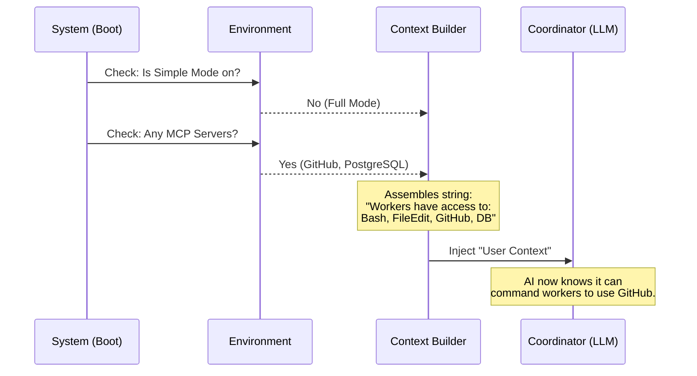

# Chapter 4: Dynamic Context Injection

Welcome to Chapter 4! In the previous chapter, [Task Notification Protocol](03_task_notification_protocol.md), we learned how workers report their results back to the Coordinator using XML envelopes.

We know *how* they communicate. But how do the Coordinator and its workers know **what tools** they are allowed to use? Does every worker have access to the database? Does the Coordinator know about your local file system?

In this chapter, we will explore **Dynamic Context Injection**, the mechanism that builds the "Employee Handbook" and "Toolbelt" for our agents at the exact moment they start working.

## The Motivation: The "Briefcase" Analogy

Imagine you are sending a repairman (a Worker) to fix a sink. Before they leave, you need to hand them a briefcase.

1.  **The Scenario**: You are in a secure building.
2.  **The Problem**: If you give them a hammer, they can fix the sink. If you *don't* give them a hammer, they will stare at the sink and say "I can't do this."
3.  **The Dynamic Part**: Sometimes you want to give them a **Master Key** (Full Mode), and sometimes you only want to give them a **Guest Pass** (Safe/Simple Mode).

We cannot hardcode these tools. We need a system that checks the environment (Are we in Safe Mode? Are there extra plugins connected?) and **injects** the correct list of capabilities into the AI's brain.

### Central Use Case: "MCP Servers"
You might have an **MCP Server** (Model Context Protocol) connected that allows the AI to talk to GitHub.
*   **Without Injection**: The Coordinator doesn't know GitHub exists. It won't try to use it.
*   **With Injection**: The system detects the GitHub server and adds: *"Workers have access to GitHub tools"* to the prompt.

## Core Concepts

### 1. The Coordinator Flag (`isCoordinatorMode`)
First, we need to know if we are even playing the role of the Manager. This is determined by a "Feature Flag" or an environment variable.

### 2. The Context Builder
This is a function that looks at the world and constructs a string of text. It asks:
*   Is "Simple Mode" on? (Only allow basic file reading).
*   Are there MCP servers? (Allow external tools).
*   Is there a "Scratchpad"? (Allow shared memory files).

### 3. The Injection
Finally, we take that constructed string and paste it into the **System Prompt** (for the Coordinator's identity) or the **User Context** (for the Coordinator's knowledge of its workers).

## Implementation: Under the Hood

Let's visualize how the system assembles the Coordinator's brain before the first message is even sent.



### The Code: Building the Toolbelt

The logic lives in `coordinatorMode.ts`. Let's look at how it builds the list of tools available to workers.

#### Step 1: Selecting the Core Tools

The Coordinator doesn't use `Bash` directly; it delegates `Bash` tasks to workers. Here, we decide which tools the workers get.

```typescript
// From coordinatorMode.ts
const workerTools = isEnvTruthy(process.env.CLAUDE_CODE_SIMPLE)
  // If Simple Mode: restrict to basic reading/editing
  ? [BASH_TOOL_NAME, FILE_READ_TOOL_NAME, FILE_EDIT_TOOL_NAME].join(', ')
  // If Full Mode: give them everything (Bash, etc.)
  : Array.from(ASYNC_AGENT_ALLOWED_TOOLS).join(', ')
```

*Explanation*: We check the environment variable. If it's "Simple," the briefcase contains only basic tools. If not, it contains the full set.

#### Step 2: Injecting MCP Tools

If the user has connected external tools (like a database connector), we append them here.

```typescript
// From coordinatorMode.ts
if (mcpClients.length > 0) {
  const serverNames = mcpClients.map(c => c.name).join(', ')
  // Tell the Coordinator that its workers can use these servers
  content += `\n\nWorkers also have access to MCP tools: ${serverNames}`
}
```

*Explanation*: This dynamically adds capabilities. The Coordinator reads this line and thinks: *"Oh, my workers can talk to the database! I can plan tasks that involve SQL queries."*

#### Step 3: The Scratchpad (Shared Memory)

Workers are separate instances. To share large files or notes, they need a "Scratchpad" (a specific folder on the disk).

```typescript
// From coordinatorMode.ts
if (scratchpadDir && isScratchpadGateEnabled()) {
  content += `\n\nScratchpad directory: ${scratchpadDir}`
  content += `\nWorkers can read/write here without permission prompts.`
}
```

*Explanation*: This tells the Coordinator: *"If Worker A learns something, tell them to write it to this folder so Worker B can read it."*

### The Result: The `UserContext`

All of these pieces are combined into one object returned by `getCoordinatorUserContext`.

```typescript
export function getCoordinatorUserContext(...): { [k: string]: string } {
  // ... (logic from above) ...
  
  return { 
    // This key is injected into the prompt context
    workerToolsContext: content 
  }
}
```

## Putting It Together

When the Coordinator starts, it receives a prompt that might look like this (generated dynamically):

> "Workers spawned via the AgentTool have access to these tools: Bash, FileRead, FileEdit.
> Workers also have access to MCP tools from connected MCP servers: GitHub, Postgres.
> Scratchpad directory: /tmp/tengu_scratch/..."

### How the Coordinator Uses This

Because of this text, if you ask: *"Check the database for user 123,"* the Coordinator follows this logic:

1.  **Check Capability**: "Do my workers have a database tool?"
2.  **Verify Injection**: "Yes, the context says `Postgres` is available."
3.  **Action**: Spawn a worker with the prompt: "Use the Postgres tool to select * from users..."

If the injection had failed (or if the MCP server wasn't connected), the Coordinator would say: "I don't have tools to access the database."

## Summary

In this chapter, we learned:
1.  **Dynamic Context**: We don't hardcode capabilities; we assemble them at runtime based on the environment.
2.  **Tool Injection**: We explicitly tell the Coordinator what tools its workers have (Bash, MCP, etc.) so it can plan accordingly.
3.  **Environment Awareness**: Features like "Simple Mode" or "Scratchpads" change the shape of the context provided to the AI.

Now the Coordinator knows **who** it is (Chapter 1), **how** to hire workers (Chapter 2), **how** to listen to them (Chapter 3), and **what** tools they have (Chapter 4).

But wait—if we have 3 workers running at once, and the user asks a new question, how do we prevent chaos? How do we keep the "Project Plan" up to date?

[Next Chapter: Session State Synchronization](05_session_state_synchronization.md)

---

Generated by [Code IQ](https://github.com/adityasoni99/Code-IQ)