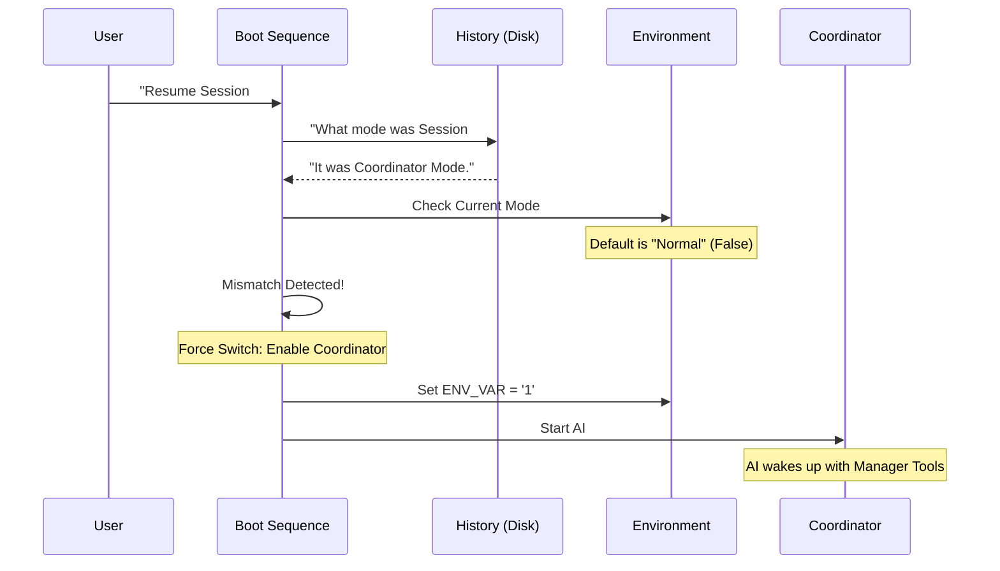

# Chapter 5: Session State Synchronization

Welcome to the final chapter of our Coordinator tutorial!

In the previous chapter, [Dynamic Context Injection](04_dynamic_context_injection.md), we learned how to build the "Manager's Handbook" (the context) at the exact moment the application starts. We learned how to inject tools based on the environment.

But there is one final, critical challenge: **Time Travel**.

When you close the application and open it again later to resume a conversation, the system needs to remember not just *what* was said, but *who* the AI was acting as.

In this chapter, we will explore **Session State Synchronization**, the logic that ensures the AI wakes up wearing the right uniform.

## The Problem: The Manager with Amnesia

Imagine this scenario:
1.  **Monday**: You start a session in **Coordinator Mode**. The AI acts as a Project Manager, spawning workers and creating plans.
2.  **Monday Night**: You close your laptop. The environment variables (flags) that enabled Coordinator Mode are cleared from memory.
3.  **Tuesday**: You run `claude resume` to finish the job.

**The Danger:**
If the application starts up in "Default Mode" (Solo Developer) but loads a conversation history full of "Manager" talk, the AI will be confused.
*   It sees history where it used `AgentTool`.
*   But in the new session, it *doesn't have* `AgentTool`.
*   **Result**: The AI might hallucinate, try to write code itself (poorly), or crash because it lacks the tools it used yesterday.

## The Solution: The Uniform Check

To fix this, we need a mechanism that runs **before** the AI says a single word.

We call this `matchSessionMode`. It compares two things:
1.  **The Persistent State**: What mode was this session in when it was saved to disk? (The History).
2.  **The Current Environment**: What mode is the application trying to start in right now? (The Runtime).

If they don't match, the system **forces** the runtime to change, ensuring consistency.

### Central Use Case: Resuming a Debugging Session

You are debugging a complex issue. The Coordinator has 3 workers running. You have to leave for a meeting. When you come back, you want the Coordinator to pick up exactly where it left off, still acting as the Manager.

## Internal Implementation: How It Works

Let's visualize the boot process when you resume a session.



## The Code: `matchSessionMode`

The logic for this lives in `coordinatorMode.ts`. It acts as a gatekeeper during the startup phase.

### Step 1: Check the Saved State

First, the function accepts the `sessionMode` retrieved from the database or file system.

```typescript
// From coordinatorMode.ts
export function matchSessionMode(
  sessionMode: 'coordinator' | 'normal' | undefined,
): string | undefined {
  // If this is an old session with no mode data, do nothing.
  if (!sessionMode) {
    return undefined
  }
```

*Explanation*: If the session is ancient (created before this feature existed), we skip the check to avoid breaking things.

### Step 2: Compare with Current Reality

Next, we check if the current environment matches the saved session.

```typescript
  const currentIsCoordinator = isCoordinatorMode()
  const sessionIsCoordinator = sessionMode === 'coordinator'

  // If they already match, we are good to go!
  if (currentIsCoordinator === sessionIsCoordinator) {
    return undefined
  }
```

*Explanation*: `isCoordinatorMode()` checks the current environment variable. If `current == saved`, no action is needed.

### Step 3: The "Force Switch"

If there is a mismatch, we modify the global environment variable `process.env` immediately.

```typescript
  // Flip the env var directly
  if (sessionIsCoordinator) {
    process.env.CLAUDE_CODE_COORDINATOR_MODE = '1'
  } else {
    delete process.env.CLAUDE_CODE_COORDINATOR_MODE
  }
```

*Explanation*: This is the critical line. By setting `process.env`, any future calls to `isCoordinatorMode()` (like those used in [Dynamic Context Injection](04_dynamic_context_injection.md)) will now return `true`. We have successfully put the "Manager Uniform" back on.

### Step 4: Reporting the Switch

Finally, the function returns a message. This is often logged so the developer knows an automatic switch happened.

```typescript
  return sessionIsCoordinator
    ? 'Entered coordinator mode to match resumed session.'
    : 'Exited coordinator mode to match resumed session.'
}
```

## Why This Matters for the User

Without this synchronization, the user would have to manually remember to add flags like `--coordinator` every time they resumed a specific session.

*   **Without Sync**:
    *   User: `claude resume`
    *   AI: "I see I spawned workers yesterday, but I don't know how to talk to them anymore. Sorry."
    
*   **With Sync**:
    *   User: `claude resume`
    *   System: *Silently switches to Coordinator Mode*
    *   AI: "Welcome back. Worker A finished the research while you were away. Shall I deploy the fix?"

## Summary of the Series

Congratulations! You have completed the **Coordinator** project tutorial. Let's recap what we've built:

1.  **[Coordinator Role](01_coordinator_role.md)**: We defined the "Project Manager" persona that delegates tasks instead of doing them alone.
2.  **[Worker Lifecycle Management](02_worker_lifecycle_management.md)**: We gave the Coordinator tools (`AgentTool`) to Spawn, Continue, and Stop workers.
3.  **[Task Notification Protocol](03_task_notification_protocol.md)**: We created a standard way (`<task-notification>`) for workers to report back without confusing the AI.
4.  **[Dynamic Context Injection](04_dynamic_context_injection.md)**: We learned to assemble the "Employee Handbook" (tools and permissions) dynamically at runtime.
5.  **[Session State Synchronization](05_session_state_synchronization.md)**: We ensured that when a session resumes, the AI remembers its role.

You now understand the architecture of an agentic system that can manage parallel work, maintain context hygiene, and persist across sessions.

**End of Tutorial.**

---

Generated by [Code IQ](https://github.com/adityasoni99/Code-IQ)