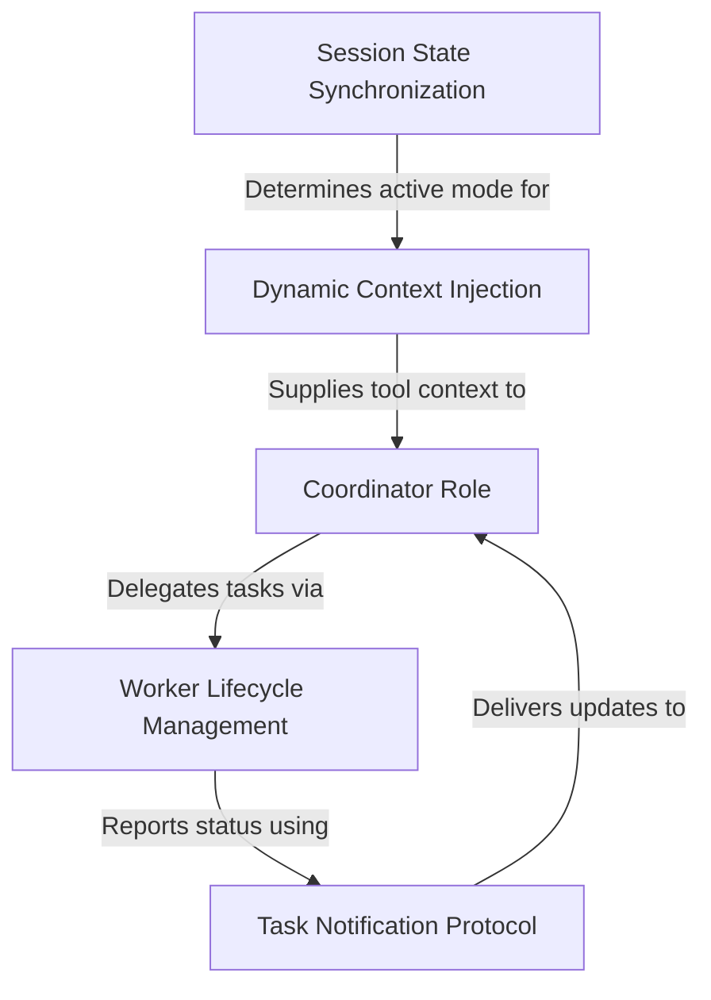

# Tutorial: coordinator

This project transforms the AI into a **Coordinator**, a high-level manager that orchestrates software tasks by delegating them to independent, asynchronous *workers* instead of executing them directly. It handles the complete **lifecycle** of these sub-agents (spawning, messaging, stopping) and interprets their results through a structured **XML notification protocol**, while dynamically managing the environment and tool availability based on the session's state.

## Chapters

1. [Coordinator Role](01_coordinator_role.md)
2. [Worker Lifecycle Management](02_worker_lifecycle_management.md)
3. [Task Notification Protocol](03_task_notification_protocol.md)
4. [Dynamic Context Injection](04_dynamic_context_injection.md)
5. [Session State Synchronization](05_session_state_synchronization.md)

---

Generated by [Code IQ](https://github.com/adityasoni99/Code-IQ)