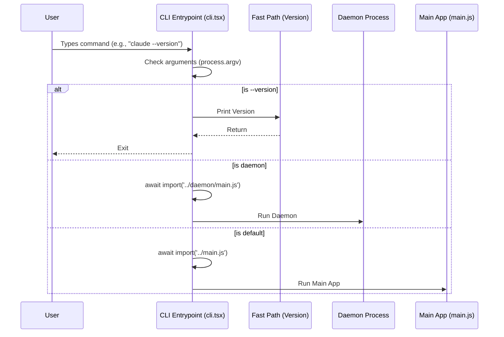

# Chapter 1: CLI Entrypoint & Dispatch

Welcome to the **Entrypoints** project! This is where our journey begins.

Every command-line application needs a "front door." In this chapter, we will explore the **CLI Entrypoint**, the very first piece of code that runs when a user types `claude` in their terminal.

## The Motivation: Why do we need a Dispatcher?

Imagine you are walking into a massive corporate headquarters.
*   If you just need to deliver a package, you hand it to the receptionist at the front desk and leave.
*   If you have a meeting with the CEO, the receptionist guides you to the elevators, you go up 50 floors, pass security, and enter a conference room.

**The Problem:**
Modern AI applications are heavy. They need to load configuration files, connect to databases, and initialize complex logic (the "CEO"). If a user just wants to check the version number (drop off a package), they shouldn't have to wait for the entire AI brain to load. It would be slow and wasteful.

**The Solution:**
We use a **Dispatcher**. This is a lightweight script that runs instantly. It looks at what the user wants to do and decides whether to handle it quickly right there, or if it needs to wake up the heavy machinery.

## Concept: The Traffic Cop

The `cli.tsx` file acts like a traffic cop. It inspects the **Arguments** (flags like `--version`, `--daemon`, or just a prompt) and routes the traffic to the correct destination.

### Key Concept: Dynamic Imports
To keep things fast, we use **Dynamic Imports**.
*   **Static Import:** `import X from 'Y'` (Loads 'Y' immediately, even if you don't use it).
*   **Dynamic Import:** `await import('Y')` (Loads 'Y' *only* when this line is reached).

This ensures that if we are doing a fast task, we never waste time loading the code for the slow tasks.

## Solving the Use Case: Routing Commands

Let's look at how the code handles three different scenarios: a fast check, a background task, and the main application.

### 1. The Fast Path (Version Check)
When the user types `claude --version`, we want an instant response.

```typescript
async function main(): Promise<void> {
  // Get the arguments the user typed (skipping node and script path)
  const args = process.argv.slice(2);

  // Check if the user asked for version
  if (args.length === 1 && (args[0] === '--version' || args[0] === '-v')) {
    // Print version and exit immediately
    console.log(`1.0.0 (Claude Code)`);
    return;
  }
```
**Explanation:**
This code runs in milliseconds. It detects the `-v` flag, prints text, and returns. Crucially, it has **zero imports** here. It hasn't loaded any other files yet.

### 2. The Special Mode (Daemon)
Sometimes the CLI needs to start a background process (a daemon) to keep running tasks alive.

```typescript
  // Fast-path for `claude daemon`: long-running supervisor.
  if (feature('DAEMON') && args[0] === 'daemon') {
    // Load config tools only now
    const { enableConfigs } = await import('../utils/config.js');
    enableConfigs();

    // Dynamically import the daemon logic
    const { daemonMain } = await import('../daemon/main.js');
    await daemonMain(args.slice(1));
    return;
  }
```
**Explanation:**
If the command is `daemon`, we perform a **Dynamic Import**. We pull in the configuration tools and the daemon code *on demand*. We still haven't loaded the heavy AI chat logic.

### 3. The Main Application
If the user didn't ask for a fast path (e.g., they just typed `claude "Write me a poem"`), we load the full application.

```typescript
  // No special flags detected? Load the full CLI!
  
  // Start recording what the user types while we load
  const { startCapturingEarlyInput } = await import('../utils/earlyInput.js');
  startCapturingEarlyInput();

  // Import the main entry point
  const { main: cliMain } = await import('../main.js');
  
  // Run the full app
  await cliMain();
}
```
**Explanation:**
This is the "Default" path. If no specific flags matched earlier, we assume the user wants the main chat experience. We load `main.js` (which is heavy) and hand over control.

## Internal Implementation: Under the Hood

How does the Dispatcher make decisions? Let's visualize the flow.



### Deep Dive: Profiling & Gates

The entrypoint also performs some invisible housekeeping duties.

**1. Profiling:**
You might notice lines like `profileCheckpoint('cli_entry')`. Since startup speed is critical, the entrypoint places markers to measure exactly how long each step takes.

**2. Feature Flags:**
The code frequently checks `feature('NAME')`. This allows the team to turn specific paths (like the Daemon or Bridge mode) on or off for different builds of the application without changing the code structure.

**3. Environment Setup:**
Before `main()` even runs, the file tweaks the environment:

```typescript
// Fix issues with package managers
process.env.COREPACK_ENABLE_AUTO_PIN = '0';

// Give more memory to the process if running remotely
if (process.env.CLAUDE_CODE_REMOTE === 'true') {
  const existing = process.env.NODE_OPTIONS || '';
  process.env.NODE_OPTIONS = `${existing} --max-old-space-size=8192`;
}
```
**Explanation:**
This code ensures that when the "Main App" finally loads, it has enough memory (RAM) and the correct settings to run smoothly.

## Conclusion

In this chapter, we learned that **CLI Entrypoint & Dispatch** is the intelligent receptionist of our application. It prioritizes speed by checking the user's intent (`argv`) and only loading the necessary code (`await import`) for that specific task.

Now that we know how the application starts, we need to understand how it sets up its internal configuration, logging, and error handling.

[Next Chapter: System Initialization](02_system_initialization.md)

---

Generated by [Code IQ](https://github.com/adityasoni99/Code-IQ)