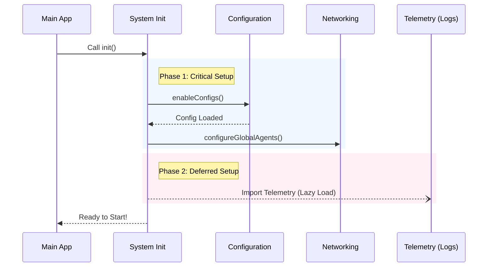

# Chapter 2: System Initialization

In the previous chapter, [CLI Entrypoint & Dispatch](01_cli_entrypoint___dispatch.md), we met the "Traffic Cop." It looked at the user's command and decided to send them to the main application.

Now, we have arrived at the main application. But before we can let the AI start coding or answering questions, we need to make sure the plane is actually safe to fly.

## The Motivation: The Pilot's Checklist

Imagine you are a pilot stepping into a cockpit. You don't just press "Start" and takeoff immediately. You have a **Pre-flight Checklist**:
1.  Is there fuel?
2.  Do the radios work?
3.  Do we have a flight plan?
4.  Is the Black Box (flight recorder) running?

**The Problem:**
If our application starts trying to talk to an AI model before it has loaded your API keys (Fuel) or set up the internet proxy (Radios), it will crash immediately.

**The Solution:**
We use a **System Initialization** layer. This is a specific function called `init()` that runs strictly *after* the CLI entrypoint but *before* the Agent starts working. It guarantees the environment is valid.

## Core Concept: The `init()` Function

The heart of this system is the `init` function found in `src/init.ts`. It runs a series of synchronous and asynchronous checks.

Let's walk through the checklist to see how to solve the use case of **Preparing the Environment**.

### Step 1: Loading the Flight Plan (Configuration)

The very first thing we do is load the configuration files. These tell the agent how to behave.

```typescript
// src/init.ts

// 1. Load the configuration system
enableConfigs();

// 2. Apply environment variables based on config
// (e.g., setting API Keys safely)
applySafeConfigEnvironmentVariables();

// 3. Fix security certificates if the user added custom ones
applyExtraCACertsFromConfig();
```

**Explanation:**
*   `enableConfigs()`: Reads settings from your hard drive.
*   `applySafeConfigEnvironmentVariables()`: Takes settings and puts them into the system environment so other parts of the app can find them.
*   **Result:** The application now knows *who* you are and *how* you want it to run.

### Step 2: The Eject Button (Graceful Shutdown)

What happens if the user presses `Ctrl+C` to quit? We don't want the application to freeze or corrupt files.

```typescript
// Setup handlers for when the user wants to quit
setupGracefulShutdown();

// Make sure we clean up temporary files (like scratchpads) on exit
registerCleanup(shutdownLspServerManager);
```

**Explanation:**
*   `setupGracefulShutdown()`: Listens for exit signals. It ensures that if the plane goes down, it goes down safely, saving data first.

### Step 3: Checking the Radio (Networking)

Many corporate environments use Proxies (gateways to the internet) or mTLS (secure certificates). The agent cannot talk to the outside world without configuring these first.

```typescript
// Configure mTLS (Mutual TLS) for secure connections
configureGlobalMTLS();

// Configure HTTP Proxies if the user is behind a corporate firewall
configureGlobalAgents();

// Start connecting to the AI provider early to save time
preconnectAnthropicApi();
```

**Explanation:**
*   `configureGlobalAgents()`: Tells the application "If you want to reach the internet, go through this specific door."
*   `preconnectAnthropicApi()`: This is a performance trick. It starts the "handshake" with the server while the rest of the app is still loading, making the first chat message feel faster.

## Internal Implementation: Under the Hood

How does this flow look visually? It is a linear sequence of dependencies. We cannot move to Step 3 before Step 1 is done.



### Deep Dive: Lazy Loading Telemetry

You might notice in the diagram that **Telemetry** (the system that records metrics and logs, like a Black Box) is treated differently.

Telemetry libraries (like OpenTelemetry) are huge files. If we loaded them immediately, the app would start slowly. Instead, we use a concept called **Deferred Initialization**.

```typescript
// We keep a flag to make sure we don't start this twice
let telemetryInitialized = false;

export async function initializeTelemetryAfterTrust(): Promise<void> {
  // Only run if not already running
  if (telemetryInitialized) return;
  telemetryInitialized = true;

  // DYNAMIC IMPORT: Load the heavy files ONLY now
  const { initializeTelemetry } = await import(
    '../utils/telemetry/instrumentation.js'
  );
  
  // Turn on the recorder
  await initializeTelemetry();
}
```

**Why do we do this?**
1.  **Speed:** The user gets to the interactive prompt faster.
2.  **Consent:** We often wait until the user accepts a "Trust" dialog before we start recording any data.

### Handling "Bad Weather" (Errors)

What if the configuration file is broken (e.g., a typo in a JSON file)? The `init` function catches this.

```typescript
} catch (error) {
  if (error instanceof ConfigParseError) {
    // Show a nice, friendly dialog box instead of a crash
    await showInvalidConfigDialog({ error });
  } else {
    // If it's a real crash, stop everything
    throw error;
  }
}
```

This ensures that even when things go wrong, the user gets a helpful message telling them how to fix their settings, rather than a scary screen of code errors.

## Conclusion

In this chapter, we learned that **System Initialization** is the responsible pilot of our application. It runs through a strict checklist—loading configs, securing the network, and preparing for shutdown—before the fun part begins.

By ensuring the environment is valid `init()`, we prevent weird bugs from happening later when the AI is trying to work.

Now that the plane is in the air and the systems are green, we are ready to look at the pilot itself.

[Next Chapter: Agent SDK](03_agent_sdk.md)

---

Generated by [Code IQ](https://github.com/adityasoni99/Code-IQ)