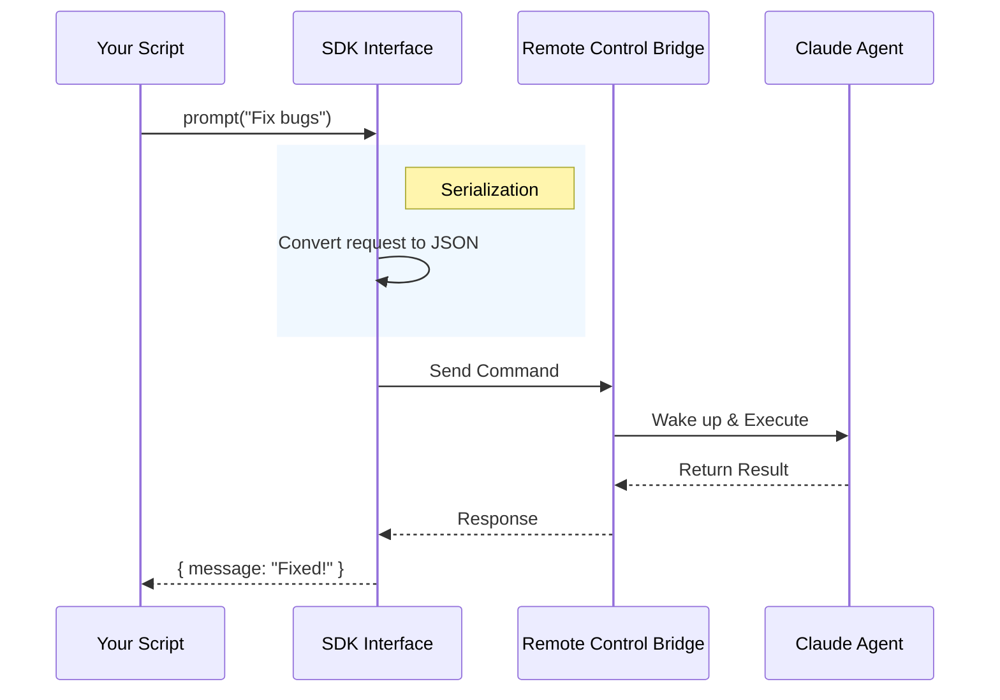

# Chapter 3: Agent SDK

Welcome back! In the previous chapter, [System Initialization](02_system_initialization.md), we went through the pilot's checklist to ensure our application environment was safe and ready.

Now that the engine is running, how do we steer?

In the standard application, a human types into a terminal. But what if **another program** wants to talk to Claude? What if you want to build a Slack bot, a VS Code extension, or a nightly script that asks Claude to check your code for bugs?

You can't easily make a script "type" into a terminal. You need a **Remote Control**. In this chapter, we explore the **Agent SDK**, the programmatic bridge between your code and the Claude Code agent.

## The Motivation: Why do we need an SDK?

Imagine you have a smart home system.
*   **The CLI (Terminal):** This is like walking up to the wall thermostat and pressing buttons with your finger. It works, but you have to physically be there.
*   **The SDK (Software Development Kit):** This is the mobile app on your phone. You can turn on the heat from your car, set schedules, or have the lights turn on automatically when you open the garage.

**The Problem:**
Developers want to build tools *on top* of Claude Code. They need to start conversations, send prompts, and read responses using code (TypeScript/JavaScript), not by manually typing commands.

**The Solution:**
The **Agent SDK** exposes the internal logic of the agent as a set of functions. Instead of a black box, the agent becomes a library you can import and control.

## Concept: The "Public Interface"

The file `agentSdkTypes.ts` acts as the **Public Interface**. Think of it as a restaurant menu. It lists everything you can order (commands), even though the cooking happens in the kitchen (internal logic).

### Use Case: The Nightly Bug Reporter

Let's solve a specific case. We want to write a script that runs every night, opens a project, and asks Claude: *"Are there any obvious bugs in the last commit?"*

Here is how the SDK handles this using three core concepts: **Sessions**, **Queries**, and **Forks**.

### 1. The Prompt (Asking Questions)

The simplest interaction is sending a single message and getting a result.

```typescript
import { unstable_v2_prompt } from '@claude-code/sdk';

// Ask a quick question without maintaining history
const result = await unstable_v2_prompt(
  "Check this directory for syntax errors",
  { 
    model: 'claude-3-5-sonnet',
    dir: '/path/to/project' 
  }
);

console.log(result); 
```
**Explanation:**
`unstable_v2_prompt` is a "One-Shot" function. It spins up the agent, looks at the code in `dir`, answers the question, and shuts down. It's perfect for quick tasks.

### 2. The Session (Holding a Conversation)

Real coding tasks involve back-and-forth conversation. For this, we use a **Session**. A Session is a container for message history (the "Context").

```typescript
import { unstable_v2_createSession } from '@claude-code/sdk';

// 1. Create a persistent session
const session = unstable_v2_createSession({
  dir: '/path/to/project'
});

// 2. The session has an ID we can save for later
console.log(`Chat started: ${session.sessionId}`);
```
**Explanation:**
Unlike the one-shot prompt, this creates a generic `SDKSession` object. We can save the `sessionId` to a database. If our script crashes and restarts, we can use `unstable_v2_resumeSession(id)` to pick up exactly where we left off.

### 3. The Fork (The Multiverse)

This is a superpower of the SDK. Imagine you are writing a game. You want to see what happens if the character goes Left, and also what happens if they go Right.

The SDK allows you to **Fork** a session.

```typescript
import { forkSession } from '@claude-code/sdk';

// Create a copy of the conversation at this exact moment
const branchB = await forkSession(originalSessionId, {
  title: "Experiment: Refactor Database"
});

// Now we have two independent timelines!
console.log(`New Branch ID: ${branchB.sessionId}`);
```
**Explanation:**
`forkSession` copies the entire conversation history into a new file with a new ID. You can try a risky code refactor in the fork. If it fails, the original session is untouched.

## Internal Implementation: Under the Hood

How does the SDK actually talk to the heavy machinery we initialized in the previous chapter?

The file `agentSdkTypes.ts` is fascinating because it is largely a **Definition File**. If you look at the source code, you see a lot of this:

```typescript
export function query(): Query {
  throw new Error('query is not implemented in the SDK')
}
```

**Wait, why does it throw errors?**

This file defines the **Types** and the **API Shape**. When the actual application runs, these functions are swapped out (injected) with the real logic from the internal `assistant` module. This decoupling allows the SDK interface to remain stable even if the internal engine changes completely.

Let's visualize the flow of a command through the SDK:



### Deep Dive: The Remote Control Handle

One of the most complex parts of the SDK is `connectRemoteControl`. This is used by the **Daemon** (a background process).

When you run `claude` in your terminal, it might actually be talking to a Daemon running in the background. The Daemon uses the SDK to hold the connection open.

```typescript
export type RemoteControlHandle = {
  // The URL to the web interface
  sessionUrl: string,
  
  // Send a message to the agent
  write(msg: SDKMessage): void,
  
  // Listen for when the user types on claude.ai
  inboundPrompts(): AsyncGenerator<InboundPrompt>
}
```

**Explanation:**
*   `write`: This is the input. It sends data *to* the agent.
*   `inboundPrompts`: This is an **Async Generator**. It allows the SDK to "listen" for messages coming from the web interface (e.g., if you are controlling your local agent via the browser).

### Managing Cron Tasks (Scheduled Jobs)

The SDK also handles scheduled tasks via `watchScheduledTasks`.

```typescript
export function watchScheduledTasks(opts: { dir: string }): ScheduledTasksHandle {
  // logic to watch .claude/scheduled_tasks.json
}
```

This functions like an alarm clock. It watches a specific JSON file in your project. If a task is due (e.g., "Run tests every Tuesday"), it wakes up the agent to perform the work.

## Conclusion

In this chapter, we learned that the **Agent SDK** is the remote control for Claude Code. It allows developers to:
1.  **Prompt** the agent for quick answers.
2.  Create **Sessions** for long conversations.
3.  **Fork** conversations to experiment safely.
4.  Connect via **Remote Control** to handle background processes and web-based interactions.

The SDK defines *what* we can do, but it relies on tools to actually perform the work. One of the most important tools the agent uses is the capability to connect to external data and systems.

Next, we will look at how the agent extends its own capabilities using a standard protocol.

[Next Chapter: Model Context Protocol (MCP) Server](04_model_context_protocol__mcp__server.md)

---

Generated by [Code IQ](https://github.com/adityasoni99/Code-IQ)