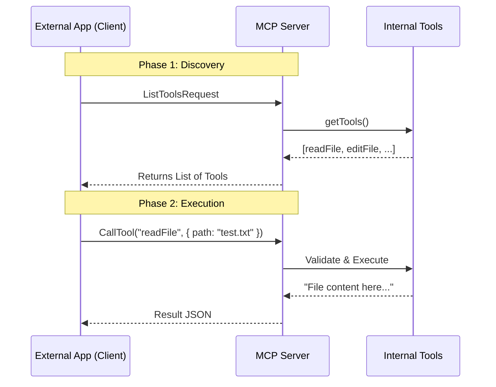

# Chapter 4: Model Context Protocol (MCP) Server

Welcome back! In the previous chapter, [Agent SDK](03_agent_sdk.md), we learned how to control the agent programmatically using a remote control.

Now, we are going to look at one of the most powerful modern concepts in AI integration: the **Model Context Protocol (MCP) Server**.

## The Motivation: The Universal Translator

Imagine you have a Nintendo Switch, a PlayStation, and an Xbox. If you want to use the same controller for all of them, you usually can't. Each one speaks a different language.

**The Problem:**
Our agent has amazing tools (it can edit files, run terminal commands, and check syntax). Other software—like IDEs (VS Code) or other AI models—might want to use those tools. But they don't know how to call our specific TypeScript functions.

**The Solution:**
We use **MCP**. Think of MCP as a "Universal USB Standard" for AI tools. By turning our agent into an **MCP Server**, we wrap all our internal capabilities in a standard package. Now, *any* software that speaks "MCP" (the Client) can plug into our agent and use its tools without knowing how they work internally.

## Concept: The Server & The Transport

To solve the use case of **"Letting others use our tools,"** we need to understand the setup in `src/mcp.ts`.

### 1. The Server
This is the program that listens for requests. It says, "Hello, I am Claude Code. Here is a list of tools I have. Tell me which one to run."

### 2. The Transport (Stdio)
How do the Server and the Client talk? In this implementation, we use **Stdio** (Standard Input/Output).
*   **Input:** The Client sends a JSON message into our `stdin`.
*   **Output:** We print the result as a JSON message to `stdout`.

## Solving the Use Case: Starting the Server

Starting the server is surprisingly simple. We don't need to manually write JSON parsers. We use the official MCP SDK to handle the heavy lifting.

```typescript
// src/mcp.ts
import { Server } from '@modelcontextprotocol/sdk/server/index.js'
import { StdioServerTransport } from '@modelcontextprotocol/sdk/server/stdio.js'

export async function startMCPServer(cwd: string): Promise<void> {
  // 1. Create the Server instance
  const server = new Server(
    { name: 'claude/tengu', version: '1.0.0' },
    { capabilities: { tools: {} } }
  )
  
  // (We will add handlers here later...)

  // 2. Connect to Standard Input/Output
  const transport = new StdioServerTransport()
  await server.connect(transport)
}
```

**Explanation:**
This function initializes the server with a name (`claude/tengu`) and tells it to communicate via the command line (`StdioServerTransport`). Once connected, it sits and waits for messages.

## Internal Implementation: Under the Hood

What happens when an external client (like VS Code) wants our agent to list files?

1.  **Handshake:** The Client asks, "What can you do?"
2.  **List Tools:** The Server replies, "I can `readFile`, `editFile`, and `runCommand`."
3.  **Call Tool:** The Client sends, "Execute `readFile` on `test.txt`."
4.  **Execute:** The Server runs the internal function and sends back the content.

Let's visualize this flow:



### Deep Dive: Handling Requests

The `startMCPServer` function sets up two main "Event Handlers."

#### 1. Listing Tools (`ListToolsRequestSchema`)

First, we need to translate our internal tools into the MCP format. Our internal tools use a library called `Zod` to define inputs, but MCP expects `JSON Schema`.

```typescript
server.setRequestHandler(ListToolsRequestSchema, async () => {
  // Get all internal tools
  const tools = getTools(getEmptyToolPermissionContext())
  
  // Convert them to MCP format
  return {
    tools: tools.map(tool => ({
      name: tool.name,
      description: "...", // Generated description
      inputSchema: zodToJsonSchema(tool.inputSchema) 
    }))
  }
})
```
**Explanation:**
We loop through every tool our agent has. We convert the `inputSchema` (which describes arguments like "filename") from our internal format to the universal JSON format so the Client understands what arguments to send.

#### 2. Calling Tools (`CallToolRequestSchema`)

This is where the action happens. When the client asks to run a tool, we have to find it and execute it.

```typescript
server.setRequestHandler(CallToolRequestSchema, async ({ params }) => {
  const { name, arguments: args } = params
  
  // 1. Find the tool inside our agent
  const tool = findToolByName(getTools(context), name)
  if (!tool) throw new Error(`Tool ${name} not found`)

  // 2. Execute the tool
  const result = await tool.call(
    args, 
    toolUseContext, // <--- Important!
    hasPermissionsToUseTool,
    assistantMessage
  )

  // 3. Return the result as text
  return { content: [{ type: 'text', text: JSON.stringify(result) }] }
})
```

**Explanation:**
*   **Params:** We get the `name` (e.g., "readFile") and `arguments` (e.g., `{ path: "main.ts" }`).
*   **Execution:** We call `tool.call()`.
*   **The Bridge:** Crucially, we pass a `toolUseContext`.

### The Context Problem

Internal tools usually expect to run inside a full chat session (knowing history, file state, etc.). But an MCP request is isolated—it's just a single API call.

To make the tools work, we have to "mock" (simulate) the environment.

```typescript
// We create a fake context so the tool thinks it's in a normal session
const toolUseContext: ToolUseContext = {
  abortController: createAbortController(),
  options: {
    // We turn off "thinking" and "verbose" logs for the API
    thinkingConfig: { type: 'disabled' },
    isNonInteractiveSession: true,
    // ... other required settings
  },
  // We provide a cache so reading files doesn't crash memory
  readFileState: createFileStateCacheWithSizeLimit(100),
  // ... dummy functions for things we don't need
  setAppState: () => {}, 
}
```

**Explanation:**
This massive object is a "Stage Prop." The tool needs a `readFileState` to work, so we give it one. It needs to check permissions, so we provide `hasPermissionsToUseTool`. This allows the tool to run successfully even though there is no human user directly typing in a terminal.

## Conclusion

In this chapter, we learned that the **MCP Server** acts as a universal adapter. It takes the agent's internal capabilities and exposes them over a standard protocol (`Stdio`).

By doing this, we allow our agent to be "headless"—it can serve as the backend brain for *other* applications, providing file editing and command execution services on demand.

Now that we understand how the agent talks to the outside world, we need to understand the language it speaks internally. How does it structure data? How do components talk to each other?

[Next Chapter: Data Model & Communication Protocol](05_data_model___communication_protocol.md)

---

Generated by [Code IQ](https://github.com/adityasoni99/Code-IQ)