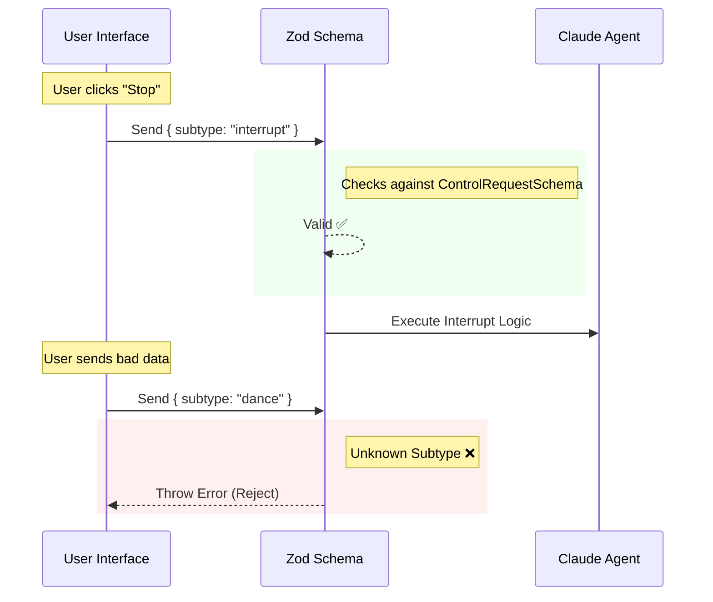

# Chapter 5: Data Model & Communication Protocol

Welcome back! In the previous chapter, [Model Context Protocol (MCP) Server](04_model_context_protocol__mcp__server.md), we built the "telephone line" that allows our agent to talk to the outside world.

But having a telephone line isn't enough. If you pick up the phone and speak French, but the person on the other end only speaks Japanese, you can't communicate.

In this chapter, we will define the **Language and Grammar** of our application. We call this the **Data Model**. It ensures that when the CLI, the Agent, and the UI talk to each other, they don't misunderstand the messages.

## The Motivation: avoiding the "Broken Telephone"

Imagine a team of three developers working on the same app:
1.  **Alice (CLI Team)** sends a message: `{ "text": "Hello" }`
2.  **Bob (Agent Team)** expects a message: `{ "content": "Hello" }`
3.  **Charlie (UI Team)** tries to read: `{ "msg": "Hello" }`

**The Problem:**
The application crashes because everyone is using different names for the same data.

**The Solution:**
We create **Strict Schemas** (Blueprints). We agree on a single "Source of Truth." If the blueprint says the field is named `message`, everyone *must* use `message`. If someone tries to send `text`, the system rejects it immediately.

## Key Concept: The Validator (`Zod`)

To enforce these rules, we use a library called **Zod**. Think of Zod as a strict border control officer.

*   **The Blueprint:** You define what valid data looks like (e.g., "Must be an object with a `uuid` string").
*   **The Check:** When data arrives, Zod scans it. If it matches the blueprint, it passes. If not, it throws an error.

## Solving the Use Case: The "Interrupt" Button

Let's solve a real problem. The user is running a long, complex task, and they want to click a "Stop" button in the UI to interrupt the AI.

How do we define this "Stop" signal so the Agent understands it instantly?

### 1. Defining the Blueprint

We define this in `sdk/controlSchemas.ts`. We want a specific command called `interrupt`.

```typescript
import { z } from 'zod'; // Import the validator

// Define the blueprint for an Interrupt Request
export const InterruptRequestSchema = z.object({
  // The "subtype" acts like a stamp identifying the message type
  subtype: z.literal('interrupt'),
});
```

**Explanation:**
This code says: "A valid Interrupt Request is an object that has exactly one property: `subtype`, and its value *must* be the word `'interrupt'`."

### 2. Grouping the Commands

The agent needs to understand many commands (Interrupt, Set Model, Get Settings). We group them into a "Union" (a list of allowed options).

```typescript
// A control request can be ONE of these things
export const ControlRequestSchema = z.union([
  InterruptRequestSchema,
  SetModelRequestSchema,
  GetSettingsRequestSchema,
]);
```

**Explanation:**
This tells the system: "If a control message comes in, it must be an Interrupt OR a Set Model command OR a Get Settings command. Anything else is garbage."

### 3. Validating the Input

When a message arrives from the UI, we check it against our blueprint.

```typescript
// Incoming data from the network (we don't trust it yet)
const incomingData = { subtype: "interrupt" };

try {
  // Zod checks the data against the blueprint
  const validCommand = ControlRequestSchema.parse(incomingData);
  console.log("Valid command received!");
} catch (error) {
  console.error("Invalid data format!");
}
```

**Explanation:**
If `incomingData` was `{ subtype: "dance" }`, the `parse` function would explode with an error because "dance" is not in our approved list of commands.

## Internal Implementation: Under the Hood

How does the data flow through the system? Let's visualize the "Border Control" process.



### Deep Dive: Lazy Schemas

If you look at `sdk/coreSchemas.ts`, you will see something peculiar called `lazySchema`.

```typescript
import { lazySchema } from '../../utils/lazySchema.js';

// We wrap the schema in a function
export const SDKUserMessageSchema = lazySchema(() =>
  z.object({
    type: z.literal('user'),
    message: z.string(),
    uuid: z.string(),
  })
);
```

**Why do we do this?**
Recall **Chapter 1** [CLI Entrypoint & Dispatch](01_cli_entrypoint___dispatch.md). We care deeply about **Startup Speed**.

Standard schemas run code the moment the file is loaded. If we have 500 definitions, defining them all takes time (CPU cycles), even if we only need one.
*   **Standard Zod:** Defines everything immediately (Slow startup).
*   **Lazy Schema:** Defines nothing until you actually try to use it (Fast startup).

### The "Universal" Message Type

The project defines a massive "Union" type called `SDKMessageSchema` in `sdk/coreSchemas.ts`. This is the dictionary of *every possible thing* the Agent can say.

```typescript
export const SDKMessageSchema = lazySchema(() =>
  z.union([
    SDKAssistantMessageSchema(), // The AI talking
    SDKUserMessageSchema(),      // The User talking
    SDKResultSuccessSchema(),    // A tool finished successfully
    SDKResultErrorSchema(),      // A tool failed
    SDKStatusMessageSchema(),    // "I am thinking..."
  ])
);
```

This ensures that the **Agent SDK** (which we built in [Chapter 3](03_agent_sdk.md)) can safely type-check every message history.

## Generating Types from Schemas

We don't want to write the Zod blueprint *and* the TypeScript interface separately. That violates "Don't Repeat Yourself."

Zod allows us to infer the TypeScript type directly from the blueprint.

```typescript
// coreTypes.ts

// Automatically create the TypeScript type from the Zod blueprint
export type SDKMessage = z.infer<typeof SDKMessageSchema>;
```

**The Result:**
When developers are writing code in the SDK, their IDE (VS Code) knows exactly what fields exist on a message. If they try to access `message.content` but the field is actually `message.text`, the editor highlights it in red.

## Conclusion

In this chapter, we learned that the **Data Model & Communication Protocol** is the dictionary and grammar book of our application.

1.  **Schemas (Zod)** act as the blueprints for valid data.
2.  **Validators** act as border control, rejecting bad data before it crashes the app.
3.  **Lazy Loading** ensures that defining these rules doesn't slow down the application startup.

By strictly defining what an "Interrupt" signal looks like, we ensure that when the user presses Stop, the Agent stops—every single time.

Now that our Agent can talk to the world and understands the language, we need to make sure it doesn't accidentally delete your entire hard drive while trying to help you.

[Next Chapter: Sandboxing & Security Configuration](06_sandboxing___security_configuration.md)

---

Generated by [Code IQ](https://github.com/adityasoni99/Code-IQ)