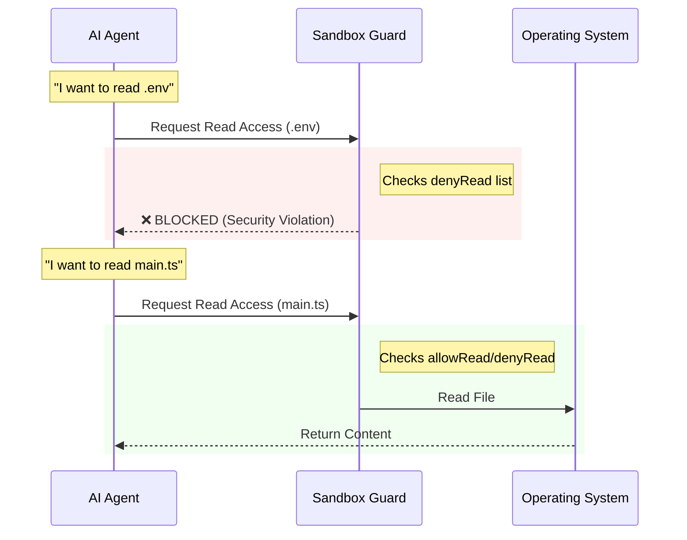

# Chapter 6: Sandboxing & Security Configuration

Welcome to the final chapter of our journey!

In the previous chapter, [Data Model & Communication Protocol](05_data_model___communication_protocol.md), we defined the language our agent speaks. We ensured that when components talk to each other, they use a strict grammar so nothing gets lost in translation.

Now, we face a more serious question: **Trust.**

We have built a powerful AI agent. It can edit files, run terminal commands, and browse the internet. But what if it makes a mistake? What if it tries to delete your operating system or upload your passwords to a random server?

In this chapter, we explore **Sandboxing & Security Configuration**, the safety harness that ensures our AI stays within the boundaries we set.

## The Motivation: The Digital Playpen

Imagine you are babysitting a toddler. You want them to have fun and play, but you don't want them to stick a fork in the electrical outlet or wander out into the street.

To solve this, you create a **Playpen**:
1.  **Toys only:** They can only play with safe objects.
2.  **Gated area:** They cannot leave the living room.
3.  **Supervision:** You watch what they are doing.

**The Problem:**
An AI agent running on your computer usually has the same permissions as *you*. If you can delete a file, the AI can delete that file. If you can access your banking website, the AI can access it too. This is dangerous.

**The Solution:**
We use a **Sandbox**. We wrap the agent in a digital bubble. We explicitly tell it: "You can only read *these* files," and "You can only talk to *these* websites."

## Core Concepts: The Security Rulebook

The definition of these rules lives in `sandboxTypes.ts`. It uses our trusty validator **Zod** (from the previous chapter) to define exactly what is allowed.

There are three main pillars of security configuration:

1.  **Network Isolation:** Who can we talk to?
2.  **Filesystem Access:** What can we touch?
3.  **Execution Policy:** What commands can we run?

## Solving the Use Case: Protecting Secrets

Let's say you are working on a project that contains a file called `.env` with your secret passwords. You want the AI to help you code, but you want to guarantee it **never** reads that file, and never sends data to `evil-hacker.com`.

Here is how we configure the sandbox to solve this.

### 1. Network Whitelisting

By default, we might want to block all internet access except for trusted documentation sites.

```typescript
// Define allowed network destinations
const networkConfig = {
  // Only allow talking to these domains
  allowedDomains: [
    'google.com', 
    'github.com', 
    'stackoverflow.com'
  ],
  // Block everything else not in the list
  allowManagedDomainsOnly: true 
};
```
**Explanation:**
This configuration creates a "Walled Garden." If the agent tries to fetch data from `evil-hacker.com`, the request will be blocked immediately because it isn't on the list.

### 2. Filesystem "No-Go" Zones

We can specifically deny access to sensitive files.

```typescript
// Define filesystem permissions
const fsConfig = {
  // The agent can write files in the current folder
  allowWrite: ['./src'],
  
  // BUT it cannot read this specific file
  denyRead: ['./.env', '/etc/passwd'] 
};
```
**Explanation:**
Even if the agent tries to run a command like `cat .env`, the sandbox intercepts the operation and says, "Permission Denied."

## Internal Implementation: Under the Hood

How does the system actually enforce these rules? It acts like a border guard. Every time the agent tries to do something "risky" (like opening a file or a socket), it must show its papers to the Sandbox Manager.

### The Flow of Control



### Deep Dive: The Configuration Code

Let's look at the actual code in `sandboxTypes.ts` that defines these structures.

#### 1. The Network Schema

This schema defines the shape of the network rules.

```typescript
export const SandboxNetworkConfigSchema = lazySchema(() =>
  z.object({
    // List of domains the agent can contact
    allowedDomains: z.array(z.string()).optional(),
    
    // macOS specific: Allow secure Unix sockets
    allowUnixSockets: z.array(z.string()).optional(),
    
    // Allow hosting a local server?
    allowLocalBinding: z.boolean().optional(),
  })
  .optional()
);
```
**Explanation:**
This defines the JSON structure for network rules. `allowLocalBinding` is interesting—it controls whether the agent is allowed to start a web server on your machine (which could be a security risk if exposed to the internet).

#### 2. The Filesystem Schema

This schema handles the complex logic of overlapping permissions (e.g., "Allow the whole folder, but deny this one file inside it").

```typescript
export const SandboxFilesystemConfigSchema = lazySchema(() =>
  z.object({
    // Explicitly allowed write paths
    allowWrite: z.array(z.string()).optional(),
    
    // Explicitly denied read paths (e.g., secrets)
    denyRead: z.array(z.string()).optional(),
    
    // Exceptions to the deny list
    allowRead: z.array(z.string()).optional(),
  })
  .optional()
);
```
**Explanation:**
*   `denyRead`: The blacklist.
*   `allowRead`: This is an override. You might deny reading `/User/home`, but allow reading `/User/home/project`.

#### 3. The Master Settings

Finally, we wrap everything in the main `SandboxSettingsSchema`. This controls the global state of the sandbox.

```typescript
export const SandboxSettingsSchema = lazySchema(() =>
  z.object({
    // Master switch to turn sandboxing on/off
    enabled: z.boolean().optional(),
    
    // If the sandbox can't start, should the app crash?
    failIfUnavailable: z.boolean().optional(),
    
    // Link to the schemas we defined above
    network: SandboxNetworkConfigSchema(),
    filesystem: SandboxFilesystemConfigSchema(),
  })
  .passthrough() // Allow extra keys for platform specific tweaks
);
```

**Key Concept: `failIfUnavailable`**
In high-security corporate environments, if the sandbox fails to initialize (maybe the OS doesn't support it), you want the application to **crash** immediately rather than running unsafely. Setting `failIfUnavailable: true` ensures safety is mandatory, not optional.

### Handling "Escape Hatches"

Sometimes, security gets in the way of getting work done. The configuration includes specific "Escape Hatches" for advanced users, though they are discouraged for beginners.

```typescript
// DANGEROUS: Allow specific commands to bypass the sandbox
allowUnsandboxedCommands: z.boolean().optional(),

// macOS specific: Weaken security to allow system certificate checks
enableWeakerNetworkIsolation: z.boolean().optional()
```
**Explanation:**
*   `allowUnsandboxedCommands`: If set to false, the dangerouslyDisableSandbox parameter (used in code) is ignored. It forces *everything* to stay in the playpen.
*   `enableWeakerNetworkIsolation`: Some tools (like `git` or `curl`) need access to macOS system certificates to verify HTTPS. Enabling this makes the tools work better but opens a small security hole.

## Conclusion

In this chapter, we learned that **Sandboxing & Security Configuration** is the responsible guardian of our application.

1.  **Network Rules** prevent data from leaking to the wrong servers.
2.  **Filesystem Rules** protect your sensitive secrets and system files from accidental deletion.
3.  **Strict Configuration** (via Zod schemas) ensures that these rules are validated before the agent even starts.

You have now completed the **Entrypoints** tutorial series! 

We started by walking through the **CLI Entrypoint**, initialized the system, built a programmable **Agent SDK**, connected it to the world via **MCP**, defined a strict **Data Model**, and finally secured it all with a **Sandbox**.

You now understand the complete architecture of a modern, secure, and high-performance AI agent application. Happy coding!

---

Generated by [Code IQ](https://github.com/adityasoni99/Code-IQ)