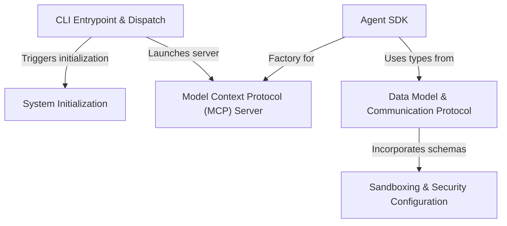

# Tutorial: entrypoints

This project implements **Claude Code**, an advanced AI agent accessible via a terminal interface. It serves as a comprehensive **CLI tool** that acts as a "receptionist" to route user commands, manages complex **initialization** routines to ensure a secure environment, and exposes an **Agent SDK** for programmatic control. Additionally, it integrates a **Model Context Protocol (MCP)** server to bridge the AI with external tools, all governed by strict **data models** and **sandboxing** rules to ensure safe and structured communication.

## Chapters

1. [CLI Entrypoint & Dispatch](01_cli_entrypoint___dispatch.md)
2. [System Initialization](02_system_initialization.md)
3. [Agent SDK](03_agent_sdk.md)
4. [Model Context Protocol (MCP) Server](04_model_context_protocol__mcp__server.md)
5. [Data Model & Communication Protocol](05_data_model___communication_protocol.md)
6. [Sandboxing & Security Configuration](06_sandboxing___security_configuration.md)

---

Generated by [Code IQ](https://github.com/adityasoni99/Code-IQ)