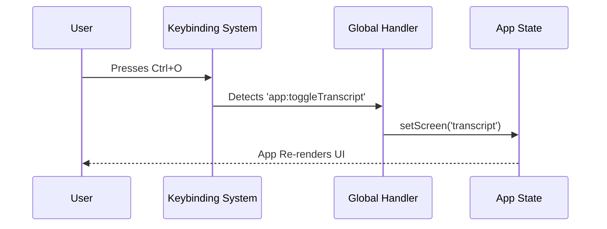

# Chapter 1: Global Configuration & Controls

Welcome to the **Hooks** project tutorial!

Imagine you are building a complex spaceship (our application). You need a central **Cockpit Dashboard** that tells you how fast you're going, controls the engine, and provides emergency buttons that work no matter what planet you are looking at.

In our application, this "Cockpit" is built using three specific concepts:
1.  **Settings:** The reactive preferences (like "Dark Mode").
2.  **Model Resolution:** Deciding which AI brain to use.
3.  **Global Keybindings:** Shortcuts that work everywhere (like "Toggle Fullscreen").

This chapter explains how we centralize this control so the app behaves consistently.

---

## 1. The Reactive Brain: `useSettings`

### The Problem
Users can change configuration files (like `config.json`) while the app is running. We don't want to restart the app every time a user changes a setting. We need the app to "react" instantly.

### The Solution
We use the `useSettings` hook. It connects a component directly to the application's state. If a file changes on the disk, this hook triggers an update, and your component re-renders with the new values.

### How to use it
Here is how you get the current configuration in any component:

```typescript
import { useSettings } from '../hooks/useSettings.js';

export function MyComponent() {
  // 1. Get the settings object
  const settings = useSettings();

  // 2. Read a value (e.g., the visual theme)
  return <Text>Current Theme: {settings.theme}</Text>;
}
```

**What happens here?**
*   **Input:** The component calls `useSettings()`.
*   **Output:** It receives a read-only object containing all user preferences.
*   **Reaction:** If the user edits their config file to change `theme` from "dark" to "light", this component automatically refreshes to show "light".

---

## 2. The Decision Maker: `useMainLoopModel`

### The Problem
Our application can use many different AI models (like GPT-4, Claude, or local models). Sometimes, we want to force the app to use a specific model for a single session, or a feature flag (a remote switch) might change which model is available. We need one place to decide "Which brain are we using right now?"

### The Solution
The `useMainLoopModel` hook handles this complexity. It checks:
1.  Session overrides (did the user force a model just for now?).
2.  User config (what is their default?).
3.  Feature flags (is the server telling us to use something else?).

### How to use it
```typescript
import { useMainLoopModel } from '../hooks/useMainLoopModel.js';

export function AIStatus() {
  // Get the resolved model name
  const modelName = useMainLoopModel();

  return <Text>Brain: {modelName}</Text>; // e.g., "gpt-4o"
}
```

**Why is this special?**
If a remote feature flag changes (e.g., an experiment starts), this hook forces the component to re-render immediately with the new model name. You don't have to write logic to check flags manually.

---

## 3. The Universal Remote: `useGlobalKeybindings`

### The Problem
Some shortcuts need to work **everywhere**. For example, `Ctrl+O` might switch the view from the Input Prompt to the Transcript. This should happen whether you are typing a command, searching history, or looking at a file.

### The Solution
We create a dedicated component called `GlobalKeybindingHandlers`. It renders nothing (it's invisible), but it registers "listeners" for specific keys.

### Scenario: The Transcript Toggle
Let's look at how we handle the `Ctrl+O` shortcut to toggle the Transcript view.

#### Step 1: Accessing Global State
First, we need to know what screen we are currently on (`prompt` vs `transcript`) and a function to change it.

```typescript
// Inside GlobalKeybindingHandlers...
const { screen, setScreen } = props;

// We also check if we are in a special "Brief" mode
const isBriefOnly = useAppState(s => s.isBriefOnly);
```

#### Step 2: Defining the Action
We define a function that runs when the key is pressed. It switches the screen variable.

```typescript
const handleToggleTranscript = useCallback(() => {
  // If currently on 'transcript', go to 'prompt', else go to 'transcript'
  setScreen(current => 
    current === 'transcript' ? 'prompt' : 'transcript'
  );
  
  // (Analytics logging omitted for brevity)
}, [screen, setScreen]);
```

#### Step 3: Registering the Key
Finally, we use the `useKeybinding` hook to attach the key combo to the action.

```typescript
useKeybinding('app:toggleTranscript', handleToggleTranscript, {
  context: 'Global' // This is the magic word!
});
```

**Context 'Global'** ensures this shortcut is always listening, unlike specific tools that only listen when they are active.

---

## Under the Hood: How Global Actions Work

When a user presses a key like `Ctrl+O`, the event flows through the system like this:

1.  **User** presses the key.
2.  **Keybinding System** detects the input.
3.  It checks active listeners. Since our listener is "Global", it matches.
4.  It executes `handleToggleTranscript`.
5.  **AppState** updates the `screen` variable.
6.  The **UI** re-renders to show the new screen.



### Deep Dive: Handling Conflicts
Sometimes, we *don't* want a global key to fire. For example, if a user is using a search bar inside the transcript, `Escape` should close the search bar, not exit the transcript entirely.

We handle this using the `isActive` property in `useKeybinding`.

```typescript
// Only allow exiting transcript if the search bar is CLOSED
useKeybinding('transcript:exit', handleExitTranscript, {
  context: 'Transcript',
  isActive: isInTranscript && !searchBarOpen 
});
```

*   **`isActive`**: This is a gate. If it evaluates to `false`, the key press is ignored by this handler, allowing other components to potentially catch it.

---

## Summary

In this chapter, we established the "nervous system" of our application:

1.  **`useSettings`** keeps our UI in sync with configuration files.
2.  **`useMainLoopModel`** acts as the brain, resolving complex logic to pick the right AI model.
3.  **`useGlobalKeybindings`** acts as the steering wheel, providing controls that work regardless of where the user is looking.

However, not all controls should be global. Sometimes, you need to ask the user a specific question, like "Are you sure?" or "Select a file." For that, we need to temporarily block global controls and focus on a specific task.

[Next Chapter: Modal Input Processing](02_modal_input_processing.md)

---

Generated by [Code IQ](https://github.com/adityasoni99/Code-IQ)