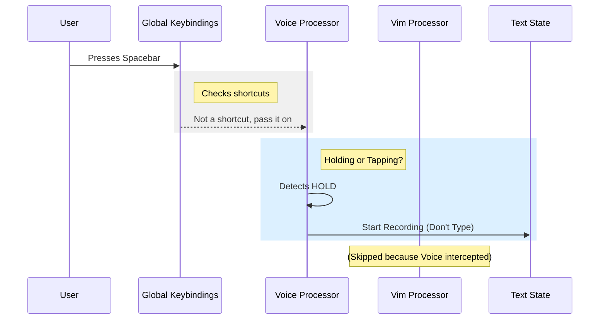

# Chapter 2: Modal Input Processing

Welcome back! In [Chapter 1: Global Configuration & Controls](01_global_configuration___controls.md), we built the dashboard and global steering of our application.

Now, we zoom in on the most important part of the cockpit: **The Input Field**.

In a standard web form, an input field is simple: you press `A`, and the letter `A` appears. But in our "Spaceship" (the Hooks application), the input field is a **sophisticated interpreter**. It needs to handle:
1.  **Vim Mode:** Where keys move the cursor instead of typing.
2.  **Voice Mode:** Where holding the spacebar records audio instead of typing spaces.

This chapter explains how we intercept user keystrokes to create "Modes."

---

## 1. The Concept: The Interceptor

Imagine you are holding a game controller.
*   In a menu screen, the `A` button selects an item.
*   In the game world, the `A` button makes the character jump.

The physical button didn't change, but the **Mode** did.

To achieve this in code, we cannot simply let the keystroke hit the text box directly. We must place a **Guard** (an Interceptor) in front of it.

### The Flow
1.  User presses a key.
2.  **Interceptor** catches it.
3.  **Interceptor** checks the current "Mode" (Normal, Insert, Recording).
4.  **Interceptor** decides:
    *   *Action A:* Update the text.
    *   *Action B:* Move the cursor.
    *   *Action C:* Start a microphone stream.

---

## 2. Case Study: Vim Emulation (`useVimInput`)

Let's look at how we handle Vim emulation. In Vim, there are two main modes:
*   **INSERT:** Typing works normally.
*   **NORMAL:** Keys are commands (e.g., `h` moves left, `x` deletes a character).

We use a hook called `useVimInput`. It wraps around a standard text input hook but adds a layer of logic.

### Step 1: Managing Mode State
First, we need to know which mode we are in.

```typescript
// Inside useVimInput.ts
export function useVimInput(props: UseVimInputProps) {
  // 1. Keep track of the current mode
  const [mode, setMode] = useState<VimMode>('INSERT');

  // 2. Setup the standard text input logic
  const textInput = useTextInput(props);

  // ...
}
```
**Explanation:** We create a state variable `mode`. By default, we are in `INSERT` mode (acting like a normal text box).

### Step 2: The Interception Function
This is the heart of the logic. We create a function `handleVimInput` that sits between the keyboard and the state.

```typescript
function handleVimInput(rawInput: string, key: Key): void {
  // 1. Check if we are in INSERT mode
  if (mode === 'INSERT') {
    // If user presses Escape, switch to NORMAL mode
    if (key.escape) {
      switchToNormalMode();
      return;
    }
    // Otherwise, just type the text normally
    textInput.onInput(rawInput, key);
    return;
  }
  
  // ... handle NORMAL mode below ...
}
```
**Explanation:** If we are typing (`INSERT`), we mostly let the text input do its job. But we watch specifically for the `Escape` key to change modes.

### Step 3: Handling Commands (Normal Mode)
If we are *not* in Insert mode, the keys become commands.

```typescript
// Inside handleVimInput, continued...

if (mode === 'NORMAL') {
  // 2. Map keys to actions
  let vimInput = rawInput;

  // Example: Left Arrow behaves like the 'h' key in Vim
  if (key.leftArrow) vimInput = 'h';
  
  // 3. Execute the command (move cursor, delete, etc.)
  // 'transition' calculates the new state based on the key
  const result = transition(currentCommand, vimInput, context);
  
  if (result.execute) {
    result.execute(); // Actually move the cursor or edit text
  }
}
```
**Explanation:** Here, pressing the `Left Arrow` doesn't type a character. It gets converted to a Vim command (`h`), processed by our logic, and results in a cursor movement.

---

## 3. Case Study: Voice Integration (`useVoiceIntegration`)

Voice input is even trickier. We want "Push-to-Talk" using the `Spacebar`.
*   **Tap Space:** Types a " " character.
*   **Hold Space:** Records audio.

How does the computer know if you are tapping or holding? It has to measure **Time**.

### The Timing Problem
If you press space, we can't type it immediately. We have to wait a tiny bit to see if you release it (a tap) or keep holding it.

### The Solution: The Warmup Threshold
We count rapid keyboard events. If the operating system sends "auto-repeat" events (which happens when you hold a key), we know it's a hold.

```typescript
// Inside useVoiceIntegration.tsx (Simplified)

const handleKeyDown = (e: KeyboardEvent) => {
  // 1. Check if the key is the "Voice Key" (e.g., Space)
  if (e.key !== ' ') return;

  // 2. Count how many times this event fired rapidly
  rapidCountRef.current += 1;

  // 3. If it fired more than 5 times quickly...
  if (rapidCountRef.current >= HOLD_THRESHOLD) {
    // Stop the space from being typed!
    e.stopImmediatePropagation();
    
    // Switch to Recording Mode
    startVoiceRecording();
  }
};
```

**Explanation:**
1.  The user holds Space.
2.  The OS fires keydown events repeatedly: `Hit... Hit... Hit... Hit... Hit...`
3.  The first few hits might type spaces (the "Warmup").
4.  Once we hit `HOLD_THRESHOLD` (e.g., 5 hits), we realize "Aha! They are holding it!"
5.  We stop typing spaces and start the microphone.
6.  Later, we clean up the extra spaces typed during the warmup.

---

## Under the Hood: The Input Pipeline

Let's visualize the journey of a keystroke in our application.

1.  **Raw Input:** User presses a key.
2.  **Global Listeners:** [Chapter 1](01_global_configuration___controls.md) listeners check for global hotkeys (like `Ctrl+C`).
3.  **Active Overlay Check:** If a popup is open, input goes there.
4.  **Modal Processor:** Our `useVimInput` or `useVoiceIntegration` logic runs.
5.  **Final Output:** The text buffer is updated.



### Complex Interactions: "Stripping" the Warmup
In the voice example, the first few milliseconds of holding space might actually type a few spaces into the input box before we realize you are holding it.

To fix this, `useVoiceIntegration` has a clever cleanup function:

```typescript
// Inside useVoiceIntegration.tsx

const stripTrailing = useCallback((amountToStrip) => {
  // 1. Get current text
  const prev = inputValueRef.current;
  
  // 2. Remove the last N characters (the accidental spaces)
  const cleaned = prev.slice(0, prev.length - amountToStrip);
  
  // 3. Update the text input instantly
  setInputValue(cleaned);
}, [inputValueRef]);
```
**Explanation:** This acts like a super-fast backspace. As soon as recording starts, we delete the "warmup" spaces so the user's prompt remains clean.

---

## Summary

In this chapter, we learned that input handling is a series of gates and decisions:

1.  **Interception:** We catch keys before they print.
2.  **Mode Switching:** We toggle between states (Insert vs. Normal, Idle vs. Recording).
3.  **Transformation:** We turn keys into commands (`h` -> Move Left) or actions (Space -> Record).

This creates a powerful, professional feel for the user. But what happens if the user wants to talk to something *outside* of our app? Like checking a database or reading a file?

For that, we need our application to reach out to the world.

[Next Chapter: External Context & Connectivity](03_external_context___connectivity.md)

---

Generated by [Code IQ](https://github.com/adityasoni99/Code-IQ)