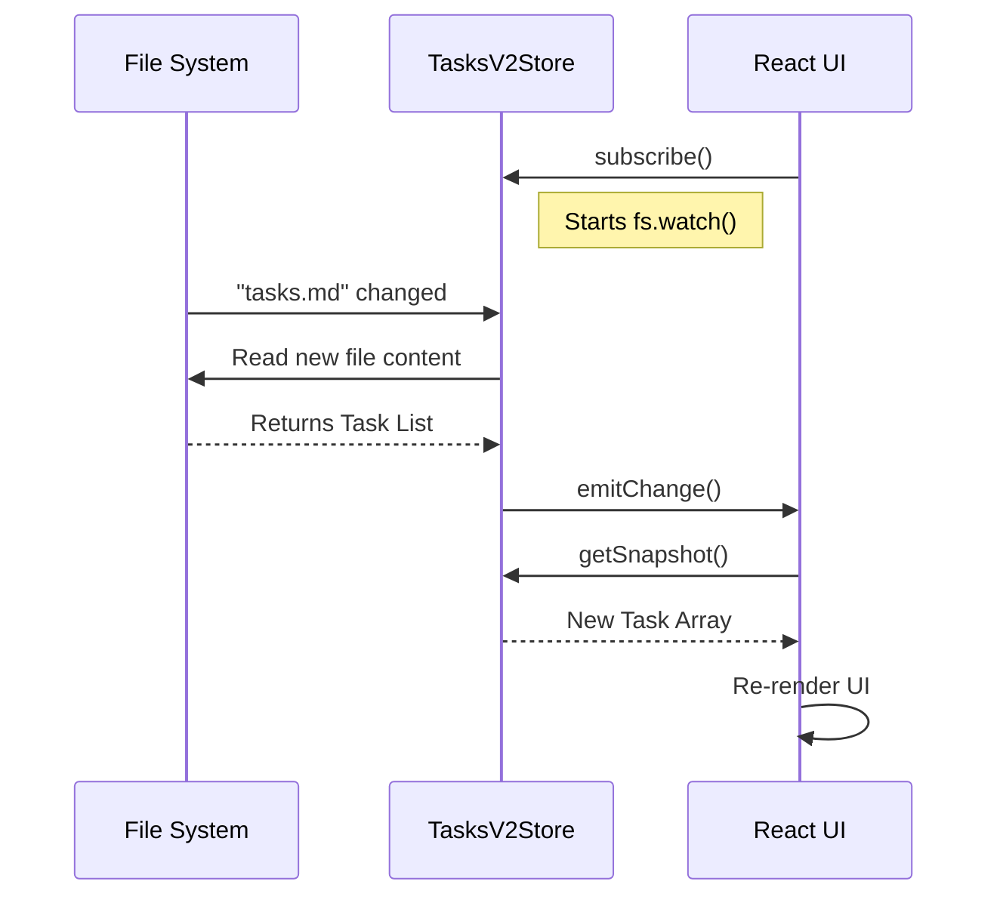

# Chapter 3: External Context & Connectivity

Welcome back! In [Chapter 2: Modal Input Processing](02_modal_input_processing.md), we built a sophisticated keyboard and voice interface for our "Spaceship" (the application). We can now send commands *into* the system.

But a spaceship flying blindly is useless. It needs **Sensors** and **Comms**.

This chapter is about **Connectivity**. Our application is not an island; it lives in a rich ecosystem:
1.  **The File System:** Users have files and to-do lists on their hard drives.
2.  **Remote Servers:** We might need to control a machine halfway across the world via SSH.
3.  **IDEs:** We might be running inside VS Code and need to know what file is currently open.

These concepts exist *outside* of React. This chapter explains how we build "Diplomatic Bridges" to keep our internal state synchronized with the outside world.

---

## 1. The Local Sensor: `useTasksV2`

### The Problem
Imagine you have a file called `TODO.md` on your desktop.
*   The App displays this list.
*   You open the file in Notepad and delete an item.
*   **The Problem:** React doesn't know you touched that file. The App still shows the deleted item.

We need a way to "watch" the file system and trigger a re-render the instant the file changes on the disk.

### The Solution: The Singleton Store
We cannot have every component set up its own file watcher (that would be inefficient). Instead, we create a single **Store** that watches the file.

We use the `useTasksV2` hook, which relies on a React feature called `useSyncExternalStore`. This allows React to subscribe to things that aren't React state.

### How to use it
```typescript
import { useTasksV2 } from '../hooks/useTasksV2.js';

export function TaskListDisplay() {
  // 1. Subscribe to the external file system
  const tasks = useTasksV2();

  if (!tasks) return <Text>No tasks found.</Text>;

  // 2. Render the live data
  return (
    <Box flexDirection="column">
      {tasks.map(task => <Text key={task.id}>- {task.title}</Text>)}
    </Box>
  );
}
```

**What happens here?**
1.  The component mounts.
2.  `useTasksV2` checks if the file watcher is running. If not, it starts one.
3.  If you save `TODO.md` in an external editor, the watcher fires.
4.  React is notified, and `TaskListDisplay` updates automatically.

---

## 2. The Long-Range Link: `useSSHSession`

### The Problem
Sometimes, we aren't running commands on our own computer. We are controlling a remote server via SSH. This isn't just a simple function call; it's a continuous **Session**. It can connect, disconnect, lag, or require passwords.

### The Solution
The `useSSHSession` hook acts as a lifecycle manager. It doesn't just send data; it manages the *health* of the connection.

### How to use it
This hook provides a `sendMessage` function that routes your text to the server instead of the local AI.

```typescript
import { useSSHSession } from '../hooks/useSSHSession.js';

export function RemoteConsole({ session, setMessages }) {
  // Initialize the bridge
  const { isRemoteMode, sendMessage } = useSSHSession({
    session,
    setMessages,
    // ... other props
  });

  // If we are connected, show a status indicator
  if (isRemoteMode) {
     return <Text color="green">Connected to Remote Server</Text>;
  }
}
```

**Key Concept: The Bridge**
When `isRemoteMode` is true, the main application loop stops processing your commands locally. Instead, it pipes them through `sendMessage`, which sends them over the SSH tunnel.

---

## 3. The Universal Translator: `useIDEIntegration`

### The Problem
If a developer is using our AI tool inside VS Code, the AI should be context-aware. If the developer highlights code in VS Code, our App should know about it. But VS Code and our App are two different programs.

### The Solution
We use the **Model Context Protocol (MCP)** via the `useIDEIntegration` hook. It tries to auto-connect to the IDE using Server-Sent Events (SSE).

### How to use it
This hook usually runs invisibly in the background of the main layout.

```typescript
// Inside a top-level component
useIDEIntegration({
  autoConnectIdeFlag: true,
  setDynamicMcpConfig: (config) => {
    // When IDE is found, update the config
    console.log("IDE Connected!"); 
  },
  // ... callbacks for installation status
});
```

**The Result:**
When this connects, the AI gains a "new sense." It can now "see" what files are open in your editor, effectively merging the command line tool with the graphical editor.

---

## Under the Hood: How `useTasksV2` Works

Connecting React to the File System is the most complex "External Context" challenge here because it involves threading. Let's trace the data flow using `useTasksV2` as an example.

### The Sequence
1.  **Store Initialization:** A Singleton (a global object) is created.
2.  **Subscription:** The UI component asks to be notified of changes.
3.  **Watcher:** The Node.js `fs.watch` function monitors the disk.
4.  **Event:** User saves a file.
5.  **Signal:** The Store alerts React to re-render.



### Deep Dive: The Singleton Store Code
The magic happens in `TasksV2Store` class (inside `useTasksV2.ts`). It ensures we don't read the disk 100 times if 100 components ask for tasks.

#### 1. The Snapshot Pattern
We keep a cached version of the tasks (`#tasks`) and only update it when the disk actually changes.

```typescript
// Simplified from useTasksV2.ts
class TasksV2Store {
  #tasks: Task[] | undefined = undefined;
  
  // This is what React calls to get data
  getSnapshot = () => {
    return this.#tasks;
  }
}
```

#### 2. The Fetch Logic
When the file system watcher detects a change, we fetch the data and notify subscribers. Notice the **Debounce**: we wait a tiny bit (`50ms`) because file systems often fire multiple events for a single save.

```typescript
// Simplified from useTasksV2.ts
#debouncedFetch = () => {
  // Clear existing timer to prevent double-fetching
  if (this.#debounceTimer) clearTimeout(this.#debounceTimer);
  
  // Wait 50ms, then fetch
  this.#debounceTimer = setTimeout(async () => {
     const newTasks = await listTasks();
     this.#tasks = newTasks; // Update cache
     this.#notify();         // Tell React to update
  }, 50);
}
```

#### 3. The Hook
Finally, the hook ties the Class to the Component using `useSyncExternalStore`.

```typescript
export function useTasksV2() {
  const store = getStore(); // Get the singleton instance

  return useSyncExternalStore(
    store.subscribe,   // How to listen
    store.getSnapshot  // How to get data
  );
}
```

This is the standard, modern way to connect React to *anything* that isn't React (databases, websockets, file systems).

---

## Summary

In this chapter, we learned how to give our AI access to the real world:

1.  **`useTasksV2`**: Uses the **Singleton Store** pattern to watch the file system efficiently without spamming the disk.
2.  **`useSSHSession`**: Manages the lifecycle of remote connections, acting as a pipe for commands.
3.  **`useIDEIntegration`**: Auto-discovers and connects to IDEs like VS Code to share context.

Now our Spaceship has sensors (File Watchers) and radios (SSH/IDE). It can see the world. But with great power comes great responsibility. If the AI decides to "delete all files," we need a security system to stop it.

[Next Chapter: Tool Permission Architecture](04_tool_permission_architecture.md)

---

Generated by [Code IQ](https://github.com/adityasoni99/Code-IQ)