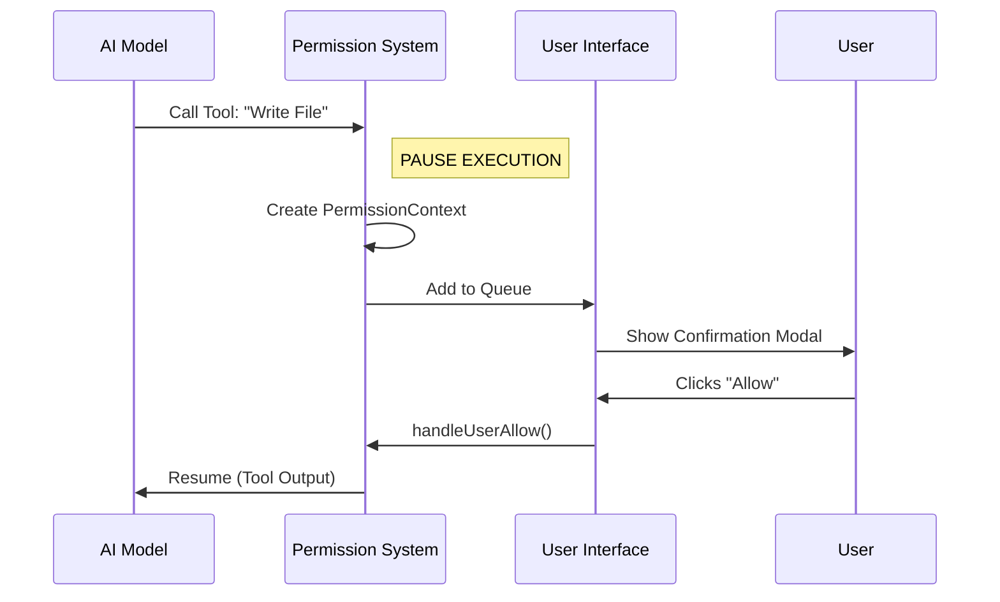

# Chapter 4: Tool Permission Architecture

Welcome back! In [Chapter 3: External Context & Connectivity](03_external_context___connectivity.md), we gave our AI "superpowers"—the ability to read files, connect via SSH, and see your IDE.

But with great power comes great risk. If the AI hallucinates and tries to run `rm -rf /` (delete everything), we need a way to stop it. We cannot let the AI execute powerful tools blindly.

This chapter introduces the **Tool Permission Architecture**, the "Border Control" agent that stands between the AI and your computer.

---

## 1. The Concept: The Security Checkpoint

Imagine you are trying to enter a secure building. You don't just walk in.
1.  You stop at the front desk.
2.  You hand over your ID (**The Context**).
3.  The guard checks if you are on the list (**Logic**).
4.  If not, they call the boss to ask for approval (**User Prompt**).

In our application, when the AI wants to use a tool (like `Bash` or `FileWrite`), we pause execution and create a **Permission Context**.

### The Flow
1.  **AI Request:** "I want to write code to `server.ts`."
2.  **Interception:** The app pauses. It does *not* write the file yet.
3.  **Context Creation:** We package the tool name, the arguments, and the message history into an object called `PermissionContext`.
4.  **User Decision:** You see a prompt: "Allow writing to server.ts?"
5.  **Execution:** If you click "Allow", the tool runs. If "Deny", the AI receives an error message.

---

## 2. The Permission Object: `createPermissionContext`

The core of this system is a function called `createPermissionContext`. It bundles everything we need to know to make a decision.

It acts as the "Passport" for the request.

### Step 1: Bundling the Data
When a request comes in, we wrap it up.

```typescript
// Inside PermissionContext.ts (Simplified)
function createPermissionContext(
  tool: ToolType,                // The tool (e.g., Bash)
  input: Record<string, unknown>, // Arguments (e.g., cmd: "ls -la")
  toolUseID: string,             // Unique ID for this specific request
  // ... other infrastructure args
) {
  // We return a read-only object representing this specific request
  return {
    tool,
    input,
    toolUseID,
    // Methods to approve/deny follow below...
  };
}
```

**Why is this needed?**
We need to freeze the state of the request. If the AI changes its mind while the user is thinking, this object remains the source of truth for *what specifically* is being approved.

---

## 3. Handling Decisions: Allow or Deny

The `PermissionContext` object provides methods to handle the user's choice. These methods resolve the "Promise" that is holding up the AI.

### Scenario A: The User Says "Yes"
When the user clicks "Approve", we call `handleUserAllow`.

```typescript
// Inside the PermissionContext object
async handleUserAllow(updatedInput, permissionUpdates) {
  
  // 1. Log that the user said yes (for analytics)
  this.logDecision({ decision: 'accept', source: { type: 'user' } });

  // 2. Return the "Allow" signal to the system
  return {
    behavior: 'allow',
    updatedInput: updatedInput // User might have edited the command!
  };
}
```

**Note:** Users can edit commands before running them! That's why we pass `updatedInput`. If the AI wanted to run `rm -rf /` and you changed it to `ls`, the `updatedInput` is what actually runs.

### Scenario B: The User Says "No"
If the user clicks "Reject", we abort the process.

```typescript
// Inside the PermissionContext object
cancelAndAbort(feedback?: string) {
  // 1. Construct a rejection message for the AI
  const message = feedback 
    ? `User rejected with reason: ${feedback}`
    : "User denied permission";

  // 2. Return the "Deny" signal
  return { behavior: 'deny', message };
}
```

**What happens next?**
The AI receives this "Deny" message just like a tool output. It essentially "hears": *I tried to run the command, but the user stopped me.* The AI can then apologize or try a different approach.

---

## 4. The Waiting Room: The Queue

Since the AI might generate multiple tool calls at once (e.g., "Write file A" AND "Write file B"), we need a place to hold these requests while the user reviews them.

We use a **Queue System**.

### The Code
We create a bridge between the logic and React state using `queueOps`.

```typescript
// Inside PermissionContext.ts
function createPermissionQueueOps(setQueue) {
  return {
    // Add a new request to the line
    push(item) {
      setQueue(prev => [...prev, item]);
    },
    
    // Remove a request (after approval/denial)
    remove(id) {
      setQueue(prev => prev.filter(item => item.toolUseID !== id));
    }
  };
}
```

**Analogy:**
This is the "Take a Number" system at the deli.
1.  **`push`**: A new customer (tool request) takes a number.
2.  **`remove`**: The customer is served (approved/denied) and leaves the line.

---

## Under the Hood: The Request Lifecycle

Let's visualize the journey of a dangerous command, like writing a file.

1.  **AI** generates a tool call.
2.  **System** catches it and builds the `PermissionContext`.
3.  **System** pushes it to the UI Queue.
4.  **User** sees a modal.
5.  **User** clicks "Allow".
6.  **System** runs the tool.



### Deep Dive: preventing "Race Conditions"

What happens if you click "Allow" and "Deny" at the exact same time (maybe via a keyboard shortcut and a mouse click)? We don't want to run the tool twice or crash the app.

We use a helper called `createResolveOnce`.

```typescript
// Inside PermissionContext.ts
function createResolveOnce<T>(resolve: (value: T) => void) {
  let claimed = false; // Has this been answered yet?

  return {
    claim() {
      // If already answered, return false
      if (claimed) return false;
      
      // Otherwise, mark as claimed and return true
      claimed = true;
      return true;
    },
    resolve(value) {
      resolve(value); // Actually unlock the promise
    }
  };
}
```

**Explanation:**
This is a "First Come, First Served" lock. The first click wins. Any subsequent clicks are ignored because `claimed` is already `true`.

---

## 5. Persistence: "Remember My Choice"

If you are editing a website, you don't want to click "Allow" for every single file save. You want to say "Allow all edits to this folder."

The `PermissionContext` handles this via `persistPermissions`.

```typescript
async persistPermissions(updates: PermissionUpdate[]) {
  // 1. Check if there are rules to save
  if (updates.length === 0) return false;

  // 2. Save to disk (e.g., a .permissions file)
  persistPermissionUpdates(updates);

  // 3. Update the live app state so it knows immediately
  setToolPermissionContext(prev => 
    applyPermissionUpdates(prev, updates)
  );
  
  return true;
}
```

**How it helps:**
The next time the AI tries to write to that folder, the **System** checks the saved permissions *before* creating a new `PermissionContext`. If a rule exists ("Always allow /src/"), the entire queuing process is skipped, and the tool runs immediately.

---

## Summary

In this chapter, we built the security layer of our application:

1.  **`createPermissionContext`**: Creates a frozen snapshot of a request (the Passport).
2.  **Queuing**: Holds multiple requests in a "Waiting Room" so the user isn't overwhelmed.
3.  **`handleUserAllow` / `cancelAndAbort`**: The methods that resolve the pause and let the AI continue (or fail).
4.  **`createResolveOnce`**: Ensures we don't accidentally approve the same thing twice.

Now that we have permissions sorted out, and the user has clicked "Allow", we need to actually *run* the command. If the user pasted a massive block of commands, how do we handle them in order without freezing the UI?

[Next Chapter: Command Execution Queue](05_command_execution_queue.md)

---

Generated by [Code IQ](https://github.com/adityasoni99/Code-IQ)