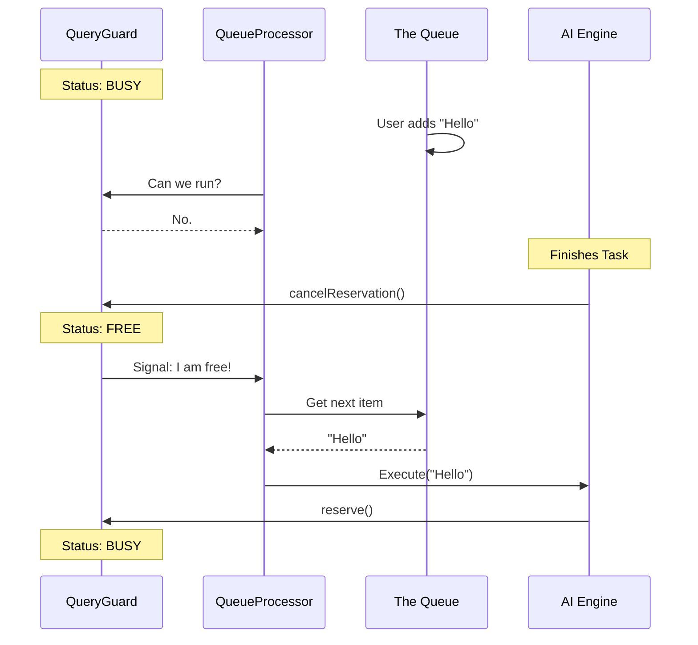

# Chapter 5: Command Execution Queue

Welcome to the final chapter! 

In [Chapter 4: Tool Permission Architecture](04_tool_permission_architecture.md), we built a security system to stop the AI from doing dangerous things without permission. We authorized the command.

But here is a new problem: **Traffic Control.**

Imagine this scenario:
1.  You paste a huge block of code into the app.
2.  At the exact same time, a background file-watcher notices a file changed.
3.  Simultaneously, the AI is already halfway through answering your previous question.

If all three of these things try to update the screen or run logic at the exact same moment, the application will crash or produce garbage output.

We need a **Queue System**. This chapter explains how we keep our application orderly using `useQueueProcessor`.

---

## 1. The Concept: The Deli Counter

Think of your application like a busy Deli Counter.

*   **The Customers:** These are "Commands." (User inputs, system notifications, AI tool calls).
*   **The Chef:** This is the AI/Logic Engine. It can only make one sandwich at a time.
*   **The Ticket Machine:** This is our **Command Queue**.
*   **The "Open/Closed" Sign:** This is our **QueryGuard**.

### The Rule
**"Take a ticket. Wait until the sign says OPEN."**

If the Chef is cooking (Guard = Active), nobody else gets served, no matter how much they yell. They must wait in line.

---

## 2. The Gatekeeper: `QueryGuard`

Before we look at the queue, we need to understand the lock mechanism. We call this the `QueryGuard`.

It is a simple reactive object that answers one question: **"Is the AI busy?"**

### How it works
The `QueryGuard` doesn't just return `true` or `false`. It allows components to **subscribe** to changes. This means if the AI finishes thinking, the guard instantly notifies the Queue Processor: *"Hey! The kitchen is free!"*

```typescript
// Conceptual usage of QueryGuard
if (queryGuard.isBusy()) {
  console.log("Wait your turn!");
} else {
  queryGuard.reserve(); // Lock the kitchen
  startCooking();
}
```

---

## 3. The Manager: `useQueueProcessor`

The star of this chapter is the `useQueueProcessor` hook. It is the manager standing between the Ticket Machine (Queue) and the Chef (Execution).

Its job is simple:
1.  Watch the **Queue**.
2.  Watch the **Guard**.
3.  If there is someone in line **AND** the guard is free... **Execute!**

### Step 1: Subscribing to the State
We use a special React hook called `useSyncExternalStore`. This is faster than standard State because it bypasses some of React's slowness. We want the queue to react *instantly*.

```typescript
// Inside useQueueProcessor.ts
export function useQueueProcessor({ queryGuard, ... }) {
  
  // 1. Listen to the "Open/Closed" sign
  const isQueryActive = useSyncExternalStore(
    queryGuard.subscribe,
    queryGuard.getSnapshot
  );

  // 2. Listen to the Ticket Machine (The Queue)
  const queueSnapshot = useSyncExternalStore(
    subscribeToCommandQueue,
    getCommandQueueSnapshot
  );
  
  // ... logic continues below
}
```

**Explanation:**
We are wiring our component directly to the global store. If a background task adds a command to the queue, `queueSnapshot` updates immediately.

### Step 2: The Decision Logic
Now we have a `useEffect` that runs every time the queue or guard changes.

```typescript
// Inside useQueueProcessor.ts

useEffect(() => {
  // Rule 1: If Chef is busy, do nothing.
  if (isQueryActive) return;

  // Rule 2: If the line is empty, do nothing.
  if (queueSnapshot.length === 0) return;

  // Rule 3: If a local modal (like a Permission check) is open, wait.
  if (hasActiveLocalJsxUI) return;

  // SUCCESS: Process the next item!
  processQueueIfReady({ executeInput: executeQueuedInput });

}, [queueSnapshot, isQueryActive]);
```

**Explanation:**
This is the "traffic light" of our app. It only turns Green if *all* conditions are met. This prevents **Race Conditions** (two processes trying to run at the same time).

---

## Under the Hood: The Processing Sequence

Let's visualize what happens when you type a command while the AI is busy.

1.  **AI** is processing a previous request (`QueryGuard` is **Busy**).
2.  **User** types "Hello".
3.  **System** sees the Guard is busy, so it puts "Hello" into the **Queue**.
4.  **AI** finishes. `QueryGuard` switches to **Free**.
5.  **`useQueueProcessor`** sees the Green Light.
6.  It pulls "Hello" from the Queue and executes it.



### Deep Dive: Priority Handling

Not all commands are equal.
*   **User Typing:** High Priority ("Next").
*   **Background Notification:** Low Priority ("Later").

The `processQueueIfReady` function (imported in our hook) is smart. It doesn't just take the oldest item; it takes the most *important* item.

```typescript
// Inside utils/queueProcessor.js (Simplified)
export function processQueueIfReady({ executeInput }) {
  // 1. Get the next item (handles priority logic internally)
  const nextCommand = dequeue(); 
  
  if (!nextCommand) return;

  // 2. Execute it
  executeInput([nextCommand]);
}
```

By abstracting this logic, our React component stays clean. It doesn't care *how* the queue is sorted, only that it needs to run the next thing.

---

## 4. Preventing "Context Lag"

You might notice we use `useSyncExternalStore` instead of `useContext` or `useState`.

**Why?**
In terminal applications (like Ink), React Context sometimes has a tiny delay as it bubbles down the tree. If the user types very fast, a "State" update might arrive 10ms too late, causing the app to miss a keystroke or process commands out of order.

`useSyncExternalStore` connects directly to the memory. It is the "Direct Line" to the data.

```typescript
// Code snippet from useQueueProcessor.ts
const queueSnapshot = useSyncExternalStore(
  subscribeToCommandQueue, // Function to listen for changes
  getCommandQueueSnapshot  // Function to get current data
);
```

This ensures that even if the UI is lagging, the Command Processor always has the absolute latest truth about what needs to be done.

---

## Summary

In this final chapter, we learned how to maintain order in a chaotic system:

1.  **`QueryGuard`**: The traffic light that prevents the AI from being overwhelmed.
2.  **`useQueueProcessor`**: The manager that watches the light and the line, ensuring commands run one by one.
3.  **Prioritization**: Ensuring user commands take precedence over background noise.

### Series Conclusion

Congratulations! You have toured the architectural pillars of the **Hooks** project.

1.  **[Chapter 1](01_global_configuration___controls.md)**: We built the Global Dashboard.
2.  **[Chapter 2](02_modal_input_processing.md)**: We created advanced Input Modes (Vim/Voice).
3.  **[Chapter 3](03_external_context___connectivity.md)**: We connected to the outside world (Files/SSH).
4.  **[Chapter 4](04_tool_permission_architecture.md)**: We secured the system with Permissions.
5.  **Chapter 5**: We coordinated it all with a unified Execution Queue.

You now understand how this complex spaceship flies. Happy coding!

---

Generated by [Code IQ](https://github.com/adityasoni99/Code-IQ)