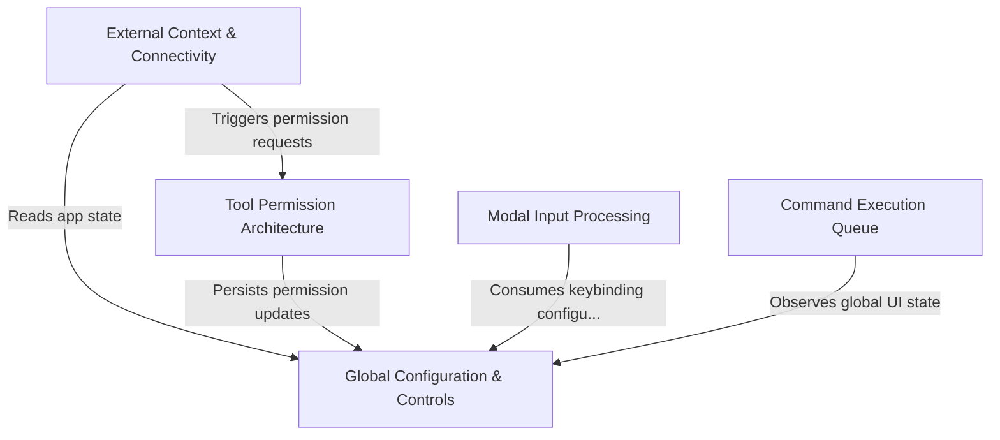

# Tutorial: hooks

This project is a sophisticated **terminal-based AI agent framework** that orchestrates complex user interactions and background processes. It features a robust **Permission Architecture** to secure tool usage, supports advanced *modal inputs* (like Vim and Voice), and manages **External Connectivity** to SSH sessions, IDEs, and the file system. A central **Command Execution Queue** ensures that user commands, AI thinking, and background task updates are processed in an orderly, race-condition-free manner.

## Chapters

1. [Global Configuration & Controls](01_global_configuration___controls.md)
2. [Modal Input Processing](02_modal_input_processing.md)
3. [External Context & Connectivity](03_external_context___connectivity.md)
4. [Tool Permission Architecture](04_tool_permission_architecture.md)
5. [Command Execution Queue](05_command_execution_queue.md)

---

Generated by [Code IQ](https://github.com/adityasoni99/Code-IQ)