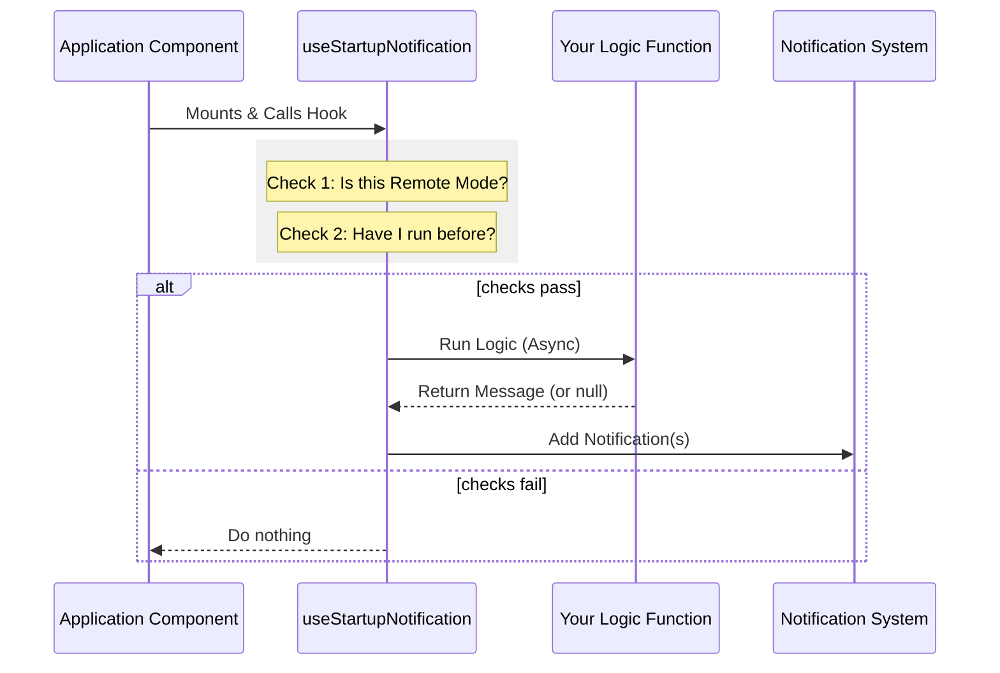

# Chapter 1: One-Time Startup Alerts

Welcome to the **notifs** project! In this first chapter, we are going to explore how to handle important messages that need to greet your users exactly once when they open the application.

### The "Receptionist" Analogy

Imagine checking into a hotel. When you first arrive at the front desk, the receptionist hands you your room key and perhaps a note saying, "Breakfast is served until 10 AM."

You wouldn't want the receptionist to stop you and repeat that same message every time you walked through the lobby to get a coffee, right?

**One-Time Startup Alerts** act exactly like that receptionist. They ensure that specific checks run **only when the application launches**, preventing annoying pop-ups from appearing repeatedly during a session.

### The Problem

In React applications, components often "re-render" (update) many times. If we simply put an alert check inside a component, it might trigger over and over again.

We need a tool that:
1.  **Runs once** (on "mount").
2.  **Checks conditions** asynchronously (e.g., checking a database or file).
3.  **Respects "Remote Mode"** (we don't want alerts if the app is running invisibly on a server).
4.  **Delivers the message** if necessary, or stays silent.

### The Solution: `useStartupNotification`

We have created a custom hook called `useStartupNotification`. It is the engine behind our reception desk.

#### How to Use It

Using this tool is a two-step process:

1.  **Define a Logic Function:** This function checks if a notification is needed. It returns the message (or `null` if everything is fine).
2.  **Call the Hook:** Pass that function to `useStartupNotification`.

Let's look at a simplified example.

#### Step 1: Define the Logic

First, we write a function that does the thinking. Here is a simplified version of our **NPM Deprecation** check. It checks if the user installed the app via an old method.

```typescript
// useNpmDeprecationNotification.tsx

// This function checks the environment and decides if we need to warn the user
async function checkEnv() {
  // 1. If we are in specific modes, stay silent (return null)
  if (isInBundledMode()) {
    return null;
  }

  // 2. Perform the async check
  const type = await getCurrentInstallationType();
  
  // 3. If everything is good, return null
  if (type === "development") {
    return null; 
  }

  // 4. Otherwise, return the notification object
  return {
    key: "npm-deprecation-warning",
    text: "Please switch to the native installer.",
    color: "warning",
    priority: "high"
  };
}
```

*   **Input:** None (or global config).
*   **Output:** `null` (silence) OR a Notification Object (message).

#### Step 2: call the Hook

Now, we wrap that logic in our hook. This is usually exported as a specific "use" function so the main application can simply call `useNpmDeprecationNotification()`.

```typescript
// useNpmDeprecationNotification.tsx

import { useStartupNotification } from './useStartupNotification.js';

export function useNpmDeprecationNotification() {
  // Pass the check function to our startup handler
  useStartupNotification(checkEnv);
}
```

### Handling Multiple Messages

Sometimes, a single check might result in a list of messages. For example, when checking installation health, there might be multiple warnings.

`useStartupNotification` is smart enough to handle arrays.

```typescript
// useInstallMessages.tsx

async function checkHealth() {
  // Returns an array of issues found
  const messages = await checkInstall(); 
  
  // Map them to the notification format
  return messages.map((msg, index) => ({
    key: `install-${index}`,
    text: msg.message,
    color: "warning"
  }));
}
```

If the function returns an array, the "receptionist" hands the user a stack of memos instead of just one.

### Under the Hood: How It Works

How does `useStartupNotification` ensure the code runs exactly once? Let's look at the flow.



#### The Implementation Details

Let's peek inside `useStartupNotification.ts`. It uses React's `useRef` to keep a "checklist" of what it has already done.

**1. The Guards**

The hook first checks if it should run at all.

```typescript
// useStartupNotification.ts

export function useStartupNotification(compute) {
  const { addNotification } = useNotifications();
  const hasRunRef = useRef(false); // Keeps track if we ran

  useEffect(() => {
    // STOP if we are in remote mode OR if we already ran
    if (getIsRemoteMode() || hasRunRef.current) return;
    
    // Mark as run immediately so we don't double-fire
    hasRunRef.current = true;
    
    // ... continue to execution ...
```

**2. The Execution**

If the guards pass, it executes your logic. It wraps everything in a Promise to handle both synchronous and asynchronous logic safely.

```typescript
// useStartupNotification.ts continued...

    void Promise.resolve()
      .then(() => compute()) // Run your logic function
      .then(result => {
        if (!result) return; // Logic returned null? Stop.

        // Handle single object OR array of objects
        const list = Array.isArray(result) ? result : [result];
        
        for (const n of list) {
          addNotification(n); // Send to UI
        }
      })
      .catch(logError); // Log crashes, don't crash the app
  }, [addNotification]);
}
```

### Real-World Example: Model Migration

In `useModelMigrationNotifications.tsx`, we see a perfect example of checking configuration to see if a one-time event has occurred recently.

```typescript
// useModelMigrationNotifications.tsx

// Define a check for a specific update
const checkSonnetUpdate = (config) => {
  // Only show if the migration happened in the last 3 seconds
  if (!recent(config.sonnet45To46MigrationTimestamp)) return;
  
  return {
    key: 'sonnet-46-update',
    text: 'Model updated to Sonnet 4.6',
    priority: 'high'
  };
};
```

This ensures that if the user updated their model days ago, they don't see the "Updated!" message again today.

### Summary

In this chapter, we learned:
1.  **The Goal:** Show messages only once when the app starts.
2.  **The Tool:** `useStartupNotification` handles the complexity of "run-once" logic and remote-mode detection.
3.  **The Usage:** We write a simple async function that returns a message or `null`, and pass it to the hook.

Now that we know *how* to show alerts, we need to understand the rules behind *when* to show them, specifically regarding user limits and account types.

[Next Chapter: Usage Quotas & Modes](02_usage_quotas___modes.md)

---

Generated by [Code IQ](https://github.com/adityasoni99/Code-IQ)