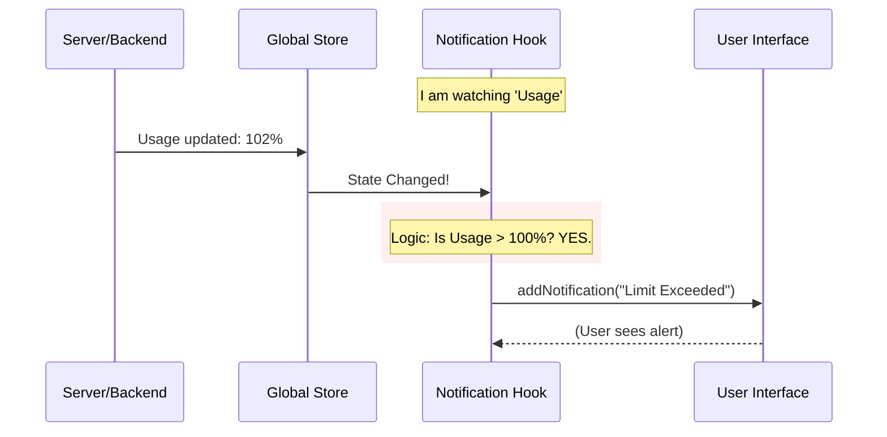

# Chapter 2: Usage Quotas & Modes

In the previous chapter, [One-Time Startup Alerts](01_one_time_startup_alerts.md), we acted like a hotel receptionist, handing out notes only when the guest first arrived.

But what happens **during** the stay?

### The "Data Plan" Analogy

Imagine you are watching videos on your phone using mobile data. You have a 5GB limit.
1.  **Approaching Limit:** When you hit 4.5GB, you want a gentle warning.
2.  **Limit Reached:** When you hit 5GB, you need an immediate alert saying data is paused.
3.  **Cooldown:** If the network is too busy, your phone might say, "High traffic, switching to 3G for 5 minutes."

This is exactly what **Usage Quotas & Modes** notifications do. They don't just run once; they **monitor** the system continuously while the app is running.

### The Problem

Our application uses powerful AI models. These have constraints:
1.  **Cost:** Using too much data (overage).
2.  **Rate Limits:** Sending too many messages too quickly.
3.  **Mode Availability:** Features like "Fast Mode" might be temporarily disabled by the server if it gets overloaded.

We need a system that watches these numbers in real-time and taps the user on the shoulder immediately when statuses change.

### The Solution: The "Watcher" Effect

Unlike Chapter 1, where we just ran a function, here we use React's `useEffect` hook to **listen** for changes in state.

We will look at two core examples: **Rate Limits** and **Fast Mode Cooldowns**.

#### Example 1: Rate Limit Warnings

Let's look at `useRateLimitWarningNotification`. Its job is to watch the `claudeAiLimits` object. If the user exceeds their quota, we must warn them.

**The Logic:**
1.  Get the current limits.
2.  Check if we are in "Overage" (using more than allowed).
3.  If yes—and we haven't warned them yet—show a notification.

```typescript
// useRateLimitWarningNotification.tsx (Simplified)

export function useRateLimitWarningNotification() {
  const { addNotification } = useNotifications();
  const limits = useClaudeAiLimits(); // <--- The data source we watch
  
  // We use a state to ensure we only show the error once per session
  const [hasNotified, setHasNotified] = useState(false);

  useEffect(() => {
    // 1. Are we over the limit?
    if (limits.isUsingOverage && !hasNotified) {
      
      // 2. Show the alert
      addNotification({
        key: "limit-reached",
        text: "You have exceeded your usage limit.",
        priority: "immediate"
      });

      // 3. Mark as shown so we don't spam the user
      setHasNotified(true);
    }
  }, [limits.isUsingOverage, hasNotified]); // <--- Re-run when limits change
}
```

*   **Input:** The `limits` object updates automatically from the server.
*   **Output:** An immediate notification on screen when `isUsingOverage` flips to `true`.

#### Example 2: Fast Mode Cooldowns

"Fast Mode" is a special feature that speeds up responses. However, it can "overheat" (hit a rate limit). When this happens, the app puts the user on a "Cooldown."

This is slightly different because it involves a **timer**.

```typescript
// useFastModeNotification.tsx (Simplified)

export function useFastModeNotification() {
  const { addNotification } = useNotifications();
  const isFastMode = useAppState(s => s.fastMode);

  useEffect(() => {
    // If Fast Mode isn't on, we don't care.
    if (!isFastMode) return;

    // Listen for the "Triggered" event (The Start)
    const stopListening = onCooldownTriggered((resetAt, reason) => {
      
      addNotification({
        key: 'fast-mode-cooldown',
        text: `Fast mode limit reached. Resets in 5 minutes.`,
        color: "warning",
        priority: "immediate"
      });

    });

    // Cleanup: Stop listening if the component unmounts
    return () => stopListening();
  }, [isFastMode]);
}
```

Here, we aren't just watching a variable; we are subscribing to an event called `onCooldownTriggered`. This allows the backend logic to tell the UI, "Hey! Start the timer!"

### Under the Hood: The Monitoring Loop

How does the app know when to switch from "All Good" to "Warning"?



1.  **API updates the Store:** The backend sends new data (e.g., "User used 500 tokens").
2.  **Store updates the Hook:** Because our hook uses `useAppState` or `useClaudeAiLimits`, React automatically re-runs the hook when data changes.
3.  **Hook checks logic:** The `useEffect` inside the hook compares the new numbers against the rules.
4.  **Notification fires:** If a rule is broken, the alert appears.

### Handling "Remote Mode"

Just like in [Chapter 1](01_one_time_startup_alerts.md), we must respect **Remote Mode**.

If the application is running on a headless server (without a screen), sending a notification to the UI is useless and might cause errors.

You will notice this guard clause in almost every hook in this module:

```typescript
if (getIsRemoteMode()) {
  return;
}
```

This simple line ensures our "Usage Quotas" logic shuts down quietly when there is no human to read the meter.

### Complex Scenario: Auto Mode Unavailable

Sometimes, a notification depends on a combination of **User Intent** and **System Permission**.

Imagine a user enables "Auto Mode" (autonomous coding), but their corporate settings (Organization Allowlist) disable it.

We use `useAutoModeUnavailableNotification` to detect this conflict.

```typescript
// useAutoModeUnavailableNotification.ts

useEffect(() => {
  // 1. Did the user WANT Auto Mode? (mode === 'auto')
  // 2. Is Auto Mode AVAILABLE? (!isAutoModeAvailable)
  const isBlocked = (mode === 'auto') && (!isAutoModeAvailable);

  if (isBlocked && !shownRef.current) {
    
    addNotification({
      key: 'auto-mode-unavailable',
      text: "Auto Mode is disabled by your organization.",
      color: 'warning'
    });
    
    shownRef.current = true; // Don't show again
  }
}, [mode, isAutoModeAvailable]);
```

This proactively explains to the user *why* a feature isn't working, rather than just letting the button fail silently.

### Summary

In this chapter, we learned:
1.  **Continuous Monitoring:** Unlike startup alerts, usage quotas need continuous watching using `useEffect`.
2.  **State vs. Events:** We can watch state changes (like billing limits) or subscribe to events (like cooldown timers).
3.  **Guarding:** We use `useState` or `useRef` to prevent spamming the user with the same error 100 times a second.

We are now effectively handling startup messages and runtime usage limits. But what if the user's initial setup—their environment variables and API keys—is broken from the start?

We need to validate the configuration before we even worry about usage limits.

[Next Chapter: Configuration Validation](03_configuration_validation.md)

---

Generated by [Code IQ](https://github.com/adityasoni99/Code-IQ)