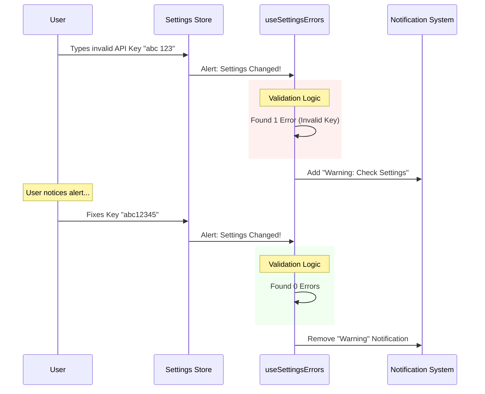

# Chapter 3: Configuration Validation

In the previous chapter, [Usage Quotas & Modes](02_usage_quotas___modes.md), we built a system to watch the "speedometer" of our app—monitoring data usage and rate limits while the engine was running.

But what if the engine is broken before we even start driving?

### The "Check Engine Light" Analogy

Imagine getting into your car. You haven't driven a single mile yet, so you haven't hit any speed limits or used any gas. However, the dashboard lights up red. Why?
*   The door is open.
*   The oil level is wrong.
*   The key battery is low.

**Configuration Validation** is the "Check Engine Light" of our application. It doesn't care how much you use the app; it cares about **how the app is set up**. It looks for:
1.  **Invalid API Keys:** Keys that are malformed or contain spaces.
2.  **Deprecated Models:** Settings that point to AI models that no longer exist or are outdated.
3.  **Missing Fields:** Required settings that were left blank.

### The Problem

Configuration "rot" is common. A user might set up the app perfectly, but months later, an API provider deprecates a model. Suddenly, the app stops working, and the user doesn't know why.

We need a system that:
1.  **Validates continuously:** Checks settings whenever they change.
2.  **Persists the error:** The warning shouldn't disappear until the user fixes it (unlike a toast message that vanishes after 3 seconds).
3.  **Clears automatically:** As soon as the user fixes the typo, the warning must vanish instantly.

### The Solution: The "Linter" Hooks

We treat configuration settings like code that needs to be "linted" (checked for errors). We have two main hooks for this: `useSettingsErrors` for general issues and `useDeprecationWarningNotification` for specific model issues.

#### Example 1: General Settings Validation

The `useSettingsErrors` hook is our comprehensive health checker. It relies on a helper function `getSettingsWithAllErrors()` which does the heavy lifting (checking regexes, empty strings, etc.).

**How to use it:**

You generally don't need to pass anything to it. It hooks directly into the global settings store.

```typescript
// MainApp.tsx

// 1. Mount the hook at the top level of your app
import { useSettingsErrors } from './useSettingsErrors';

export function MainApp() {
  // This hook will automatically push/remove notifications
  // based on the health of the settings.
  useSettingsErrors(); 
  
  return <Layout />;
}
```

*   **Input:** None (it reads from the global store).
*   **Output:** It returns the array of errors (if you need to display them elsewhere), but primarily it **side-effects** into the Notification system.

#### Example 2: Model Deprecation

Sometimes a setting isn't "wrong," but it's "old." The `useDeprecationWarningNotification` hook watches the currently selected AI model.

```typescript
// ChatInterface.tsx

export function ChatInterface({ currentModel }) {
  // Pass the ID of the model being used
  useDeprecationWarningNotification(currentModel);

  return <ChatWindow />;
}
```

If `currentModel` is something like `gpt-3.5-legacy`, the hook triggers a high-priority warning suggesting an upgrade.

### Under the Hood: The "Fix-It" Loop

The most important feature of Configuration Validation is that it is **reactive**. It doesn't just complain; it watches for the fix.



### Deep Dive: Implementation Details

Let's look at `useSettingsErrors.tsx`. This hook is unique because it pushes a notification **AND** removes it.

**1. Listening for Changes**

We use a custom hook `useSettingsChange` which acts like an event listener. It fires whenever the user types in the settings menu.

```typescript
// useSettingsErrors.tsx

// 1. Define the handler for when settings change
const handleSettingsChange = useCallback(() => {
  // Get the latest list of validation errors
  const { errors } = getSettingsWithAllErrors();
  setErrors(errors);
}, []);

// 2. Subscribe to changes
useSettingsChange(handleSettingsChange);
```

**2. The persistent Notification Logic**

This is the clever part. In a standard `useEffect`, we check the error count.

```typescript
// useSettingsErrors.tsx

useEffect(() => {
  if (getIsRemoteMode()) return; // Always check for remote mode!

  if (errors.length > 0) {
    // A. BAD STATE: Show the warning
    addNotification({
      key: 'settings-errors', // Fixed key allows us to update/remove it later
      text: `Found ${errors.length} settings issues`,
      color: "warning",
      timeoutMs: 60000 // Stay visible for a long time
    });
  } else {
    // B. GOOD STATE: Clean up!
    removeNotification('settings-errors');
  }
}, [errors]);
```

By using a specific `key` (`'settings-errors'`), we ensure we don't stack up 10 different warnings. We either show *the* warning, or we remove *the* warning.

### Preventing "Nagging" (Deprecation Warnings)

For deprecation warnings, we face a different challenge. We don't want to flash a warning every single time the component renders. We use `useRef` to remember what we last warned about.

```typescript
// useDeprecationWarningNotification.tsx

export function useDeprecationWarningNotification(model) {
  const lastWarningRef = useRef(null); // Memory of last warning

  useEffect(() => {
    const warning = getModelDeprecationWarning(model);

    // Only notify if the warning exists AND it is different from the last one
    if (warning && warning !== lastWarningRef.current) {
      lastWarningRef.current = warning; // Update memory
      
      addNotification({
        key: "model-deprecation-warning",
        text: warning,
        priority: "high"
      });
    }
  }, [model]);
}
```

This ensures that if the user dismisses the warning, we don't immediately show it again unless they switch to *another* deprecated model.

### Summary

In this chapter, we learned:
1.  **Configuration Validation** is like a "Check Engine Light"—it validates the static setup of the app.
2.  **Reactivity:** The notification system is tied directly to the settings store. If the user creates an error, it appears. If they fix it, it disappears immediately.
3.  **State Management:** We use `useSettingsChange` to listen for updates and `useRef` to prevent repetitive nagging about the same issue.

We have now covered startup alerts, usage monitoring, and configuration health. But what about the external tools our AI interacts with? Are they installed? Are they working?

[Next Chapter: Tool Integration Status](04_tool_integration_status.md)

---

Generated by [Code IQ](https://github.com/adityasoni99/Code-IQ)