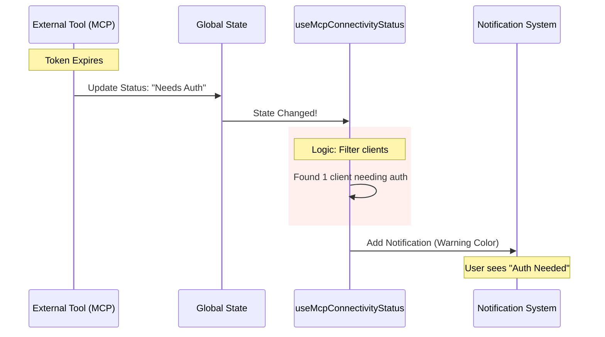

# Chapter 4: Tool Integration Status

In the previous chapter, [Configuration Validation](03_configuration_validation.md), we learned how to build a "Check Engine Light" to warn users about bad settings before they even start.

Now, imagine you are flying a plane. Your pre-flight checks were good, but what if your radio disconnects *while* you are in the air? Or what if your radar stops spinning?

### The "Dashboard" Analogy

Your AI coding assistant is like a pilot. To do its job, it connects to several external instruments:
1.  **The Editor (IDE):** The cockpit (VS Code, JetBrains).
2.  **Language Servers (LSP):** The radar (provides autocomplete and error checking).
3.  **MCP Servers:** The landing gear (external tools like database connectors).

**Tool Integration Status** hooks act as the live dashboard. They monitor the "heartbeat" of these connections and flash a warning light the moment a peripheral tool disconnects, crashes, or demands a password.

### The Problem

External tools are unstable.
*   A language server might crash if it runs out of memory.
*   An IDE plugin might lose connection if the computer sleeps.
*   An external tool might suddenly require an OAuth login token.

If these fail silently, the AI starts hallucinating because it can no longer "see" the code or "touch" the database. We need a system to alert the user immediately.

### The Solution: The Status Hooks

We have three specialized hooks, each designed to monitor a specific type of peripheral connection.

#### 1. Monitoring External Tools (MCP)

The Model Context Protocol (MCP) allows the AI to use tools. We use `useMcpConnectivityStatus` to watch the list of connected clients.

**The Logic:**
We don't just check if they are "connected." We categorize issues into:
1.  **Failed:** The tool crashed.
2.  **Needs Auth:** The tool works but needs a login.

```typescript
// useMcpConnectivityStatus.tsx (Simplified)

export function useMcpConnectivityStatus({ mcpClients }) {
  const { addNotification } = useNotifications();

  useEffect(() => {
    // 1. Filter the list to find broken tools
    const failed = mcpClients.filter(c => c.type === 'failed');
    const needsAuth = mcpClients.filter(c => c.type === 'needs-auth');

    // 2. Alert if any failures exist
    if (failed.length > 0) {
      addNotification({
        key: 'mcp-failed',
        text: `${failed.length} MCP servers failed`,
        color: 'error'
      });
    }
    
    // 3. Alert if auth is needed
    if (needsAuth.length > 0) {
      addNotification({
        key: 'mcp-needs-auth',
        text: 'MCP servers need authentication',
        color: 'warning'
      });
    }
  }, [mcpClients]);
}
```

*   **Input:** A list of `mcpClients` (live connection objects).
*   **Output:** An error notification if any client in the list is unhealthy.

#### 2. Monitoring the IDE Connection

The `useIDEStatusIndicator` hook ensures the AI is actually talking to the text editor.

This hook is tricky because of **Context**.
*   If the user is running inside a Terminal, there is no IDE to connect to. We shouldn't show an error!
*   If the user is in VS Code, and the connection drops, we *must* show an error.

```typescript
// useIDEStatusIndicator.tsx (Simplified)

export function useIDEStatusIndicator({ ideStatus, ideName }) {
  const { addNotification, removeNotification } = useNotifications();

  useEffect(() => {
    // 1. If we are just a CLI terminal, do nothing.
    if (isSupportedTerminal()) return;

    // 2. If disconnected, SHOW the error
    if (ideStatus === "disconnected") {
      addNotification({
        key: "ide-disconnected",
        text: `${ideName} disconnected`,
        color: "error"
      });
    } else {
      // 3. If connected, REMOVE the error
      removeNotification("ide-disconnected");
    }
  }, [ideStatus]);
}
```

#### 3. Monitoring Language Servers (LSP)

Language Servers (LSP) are heavy processes (like the Python or Java analyzer). They are prone to crashing.

Unlike the other hooks which are **Reactive** (waiting for an update), `useLspInitializationNotification` often uses **Polling**. It asks, "Are you okay?" every 5 seconds.

```typescript
// useLspInitializationNotification.tsx

// Poll every 5000ms
useInterval(() => {
  const manager = getLspServerManager();
  
  // Loop through all servers (TypeScript, Python, etc.)
  for (const server of manager.getAllServers()) {
    
    // If one is in error state, notify
    if (server.state === "error") {
      addNotification({
        key: `lsp-error-${server.name}`,
        text: `LSP for ${server.name} failed`,
        priority: "medium"
      });
    }
  }
}, 5000);
```

### Under the Hood: The Dashboard Flow

How does the system ensure the user isn't overwhelmed? Let's look at the flow when a tool requires Authentication.



### Deep Dive: Handling "JetBrains" Specifics

Integration status can be platform-specific. For example, JetBrains IDEs interact differently than VS Code.

In `useIDEStatusIndicator.tsx`, we see logic dedicated to handling specific IDE quirks.

```typescript
// useIDEStatusIndicator.tsx

// Check if the connected IDE is JetBrains
const isJetBrains = isJetBrainsIde(ideInstallationStatus?.ideType);

useEffect(() => {
  // If it's JetBrains and NOT connected...
  if (isJetBrains && !isConnected) {
    addNotification({
      key: "ide-status-jetbrains-disconnected",
      text: "IDE plugin not connected. Run /status for info",
      priority: "medium"
    });
  }
}, [isJetBrains, isConnected]);
```

This ensures the error message is specific ("Plugin not connected") rather than a generic "Error," helping the user debug faster.

### The "Hint" System

Sometimes, the status isn't an error, but a helpful tip.

If the user is running the app but hasn't connected their IDE yet, we might want to gently suggest, "Hey, run /ide to connect." However, we don't want to nag them forever.

```typescript
// useIDEStatusIndicator.tsx

// Stop showing hint after 5 times
if (globalConfig.ideHintShownCount >= 5) {
  return;
}

// Show the hint
addNotification({
  key: "ide-status-hint",
  text: "/ide for VS Code",
  priority: "low" // Low priority = less intrusive
});
```

This creates a tiered system:
1.  **Errors (Red):** Something is broken (Disconnected).
2.  **Warnings (Yellow):** Action required (Auth needed).
3.  **Hints (Grey):** Helpful suggestions (Connect IDE).

### Summary

In this chapter, we learned:
1.  **Dashboarding:** How to monitor multiple external tools (LSP, IDE, MCP) simultaneously.
2.  **Polling vs. Reactive:** We use `useInterval` for heavy processes (LSP) and `useEffect` for state updates (MCP/IDE).
3.  **Context Awareness:** We hide IDE errors if the user is running in a CLI terminal.
4.  **Tiered Alerts:** We distinguish between critical failures and helpful hints.

We have now ensured the engine works (Startup), the fuel is monitored (Quotas), the settings are valid (Config), and the instruments are connected (Tools).

Finally, we need to track the AI's actual thought process. Is it thinking? Is it writing code? Is it waiting for you?

[Next Chapter: Dynamic Lifecycle Tracking](05_dynamic_lifecycle_tracking.md)

---

Generated by [Code IQ](https://github.com/adityasoni99/Code-IQ)