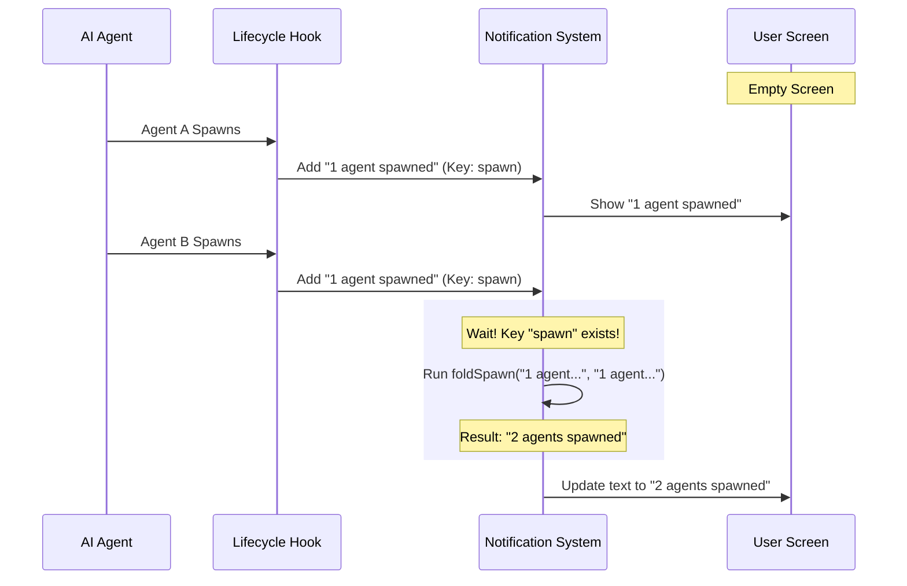

# Chapter 5: Dynamic Lifecycle Tracking

Welcome to the final chapter of our notification system tutorial!

In the previous chapter, [Tool Integration Status](04_tool_integration_status.md), we built a "dashboard" to monitor the steady connection of external tools like IDEs and language servers.

Now, we move to the busiest part of the application: **Dynamic Events**.

### The "Group Chat" Analogy

Imagine you are in a group chat. If one person joins, you get a notification: *"Alice joined the group."*

But what happens if **20 people** join at the exact same second?
*   **Bad User Experience:** Your phone buzzes 20 times. The screen fills with 20 separate banners. You get annoyed.
*   **Good User Experience:** Your phone buzzes once. The message says: *"Alice and 19 others joined the group."*

This is **Dynamic Lifecycle Tracking**. It handles components that are born (spawn), live for a while, and die (shutdown) rapidly. We need to tell the user what's happening without spamming them.

### The Problem

In our AI application, the main "dynamic" components are **Teammate Agents**. When you ask a complex coding question, the AI might spawn 5 sub-agents to read different files simultaneously.

If we used a standard notification for each one:
1.  *Agent A spawned*
2.  *Agent B spawned*
3.  *Agent C spawned*
...

The user loses track of the actual conversation because their screen is full of logs.

### The Solution: "Folding" Notifications

We solve this using a technique called **Folding**.

Instead of stacking notifications on top of each other, we update the existing notification to increase a counter.

#### Step 1: Defining the "Fold" Logic

To make a notification "foldable," we attach a special function to it. This function defines how to merge a new event into an old one.

```typescript
// useTeammateShutdownNotification.ts

// The logic: Take the old count and add 1
function foldSpawn(oldNotif, newNotif) {
  const currentCount = parseCount(oldNotif.text); // e.g., reads "1"
  return makeSpawnNotif(currentCount + 1);        // returns "2 agents spawned"
}
```

*   **Input:** The existing notification on screen and the new one trying to appear.
*   **Output:** A *single* new notification object with updated text.

#### Step 2: Creating the Notification

When we create the notification object, we pass this `fold` function inside it.

```typescript
// useTeammateShutdownNotification.ts

function makeSpawnNotif(count) {
  return {
    key: 'teammate-spawn', // Same key = same notification slot
    text: `${count} agents spawned`,
    priority: 'low',
    fold: foldSpawn, // <--- The magic instruction
  };
}
```

By using the same `key` (`'teammate-spawn'`), the notification system knows these messages belong together. The `fold` property tells it *how* to combine them.

### Real-World Example: Tracking Agents

Let's look at `useTeammateLifecycleNotification`. This hook watches the list of active tasks to see if agents are starting or stopping.

We use `useRef` to keep a list of agents we have already greeted, so we don't say hello to the same agent twice.

```typescript
// useTeammateShutdownNotification.ts (Simplified)

export function useTeammateLifecycleNotification() {
  const tasks = useAppState(s => s.tasks); // Live list of agents
  const seenRunning = useRef(new Set());   // Memory of who we saw

  useEffect(() => {
    for (const [id, task] of Object.entries(tasks)) {
      
      // If it's running and we haven't seen it yet...
      if (task.status === 'running' && !seenRunning.current.has(id)) {
        seenRunning.current.add(id); // Remember it
        
        // Trigger the notification (System handles the folding!)
        addNotification(makeSpawnNotif(1));
      }
    }
  }, [tasks]);
}
```

### Under the Hood: The Folding Flow

How does the notification system decide whether to add a new line or update the old one?



### Handling Batch Events (Plugin Updates)

Sometimes, the system doesn't fire events one by one. It might give us a list all at once. For example, when plugins auto-update.

In `usePluginAutoupdateNotification.tsx`, we receive an array of updated plugins. We don't need "folding" here because we already have the full list. We just need to format the summary nicely.

```typescript
// usePluginAutoupdateNotification.tsx (Simplified)

// 1. Listen for the event
onPluginsAutoUpdated((updatedPlugins) => {
  
  // 2. Format the text based on the count
  const count = updatedPlugins.length;
  const names = updatedPlugins.join(", ");
  
  // 3. Show one summary notification
  addNotification({
    key: "plugin-autoupdate",
    jsx: <Text>Plugins updated: {names}</Text>,
    priority: "low"
  });
});
```

This is the simpler version of lifecycle tracking: **Batching**. If you can catch the events in a group, batch them *before* sending them to the notification system.

### Tracking Failures (Installation Status)

Finally, we track the lifecycle of **Plugin Installations**. This is a mix of [Chapter 4](04_tool_integration_status.md) (Status) and Lifecycle.

We want to know: "Did everything install correctly?"

In `usePluginInstallationStatus.tsx`, we calculate the total number of failures and show a single summary warning.

```typescript
// usePluginInstallationStatus.tsx

const { totalFailed } = useMemo(() => {
  // Sum up failed marketplaces + failed plugins
  return { totalFailed: failedMarketplaces.length + failedPlugins.length };
}, [status]);

useEffect(() => {
  if (totalFailed > 0) {
    addNotification({
      key: "plugin-install-failed",
      // Use "plural" helper to handle grammar: "1 plugin" vs "2 plugins"
      text: `${totalFailed} ${plural(totalFailed, "plugin")} failed to install`,
      color: "error"
    });
  }
}, [totalFailed]);
```

### Summary

In this final chapter, we learned how to handle high-frequency, dynamic events.

1.  **The Challenge:** Rapid-fire events cause notification spam.
2.  **The Solution (Folding):** We use a `fold` function to combine new events with existing notifications (e.g., changing "1 agent" to "2 agents").
3.  **The Alternative (Batching):** If possible, we wait for a list of updates (like plugins) and show a single summary.

### Course Conclusion

Congratulations! You have built a robust notification system for the **notifs** project.

Let's review your journey:
1.  **[One-Time Startup Alerts](01_one_time_startup_alerts.md):** You learned to greet the user exactly once.
2.  **[Usage Quotas & Modes](02_usage_quotas___modes.md):** You learned to monitor fuel and speed limits in real-time.
3.  **[Configuration Validation](03_configuration_validation.md):** You learned to check the engine health and persist warnings.
4.  **[Tool Integration Status](04_tool_integration_status.md):** You learned to build a dashboard for external instruments.
5.  **Dynamic Lifecycle Tracking:** You learned to summarize chaotic activity into clean updates.

You now possess the tools to communicate with your users effectively—keeping them informed, respecting their focus, and ensuring they never miss a critical update. Happy coding!

---

Generated by [Code IQ](https://github.com/adityasoni99/Code-IQ)