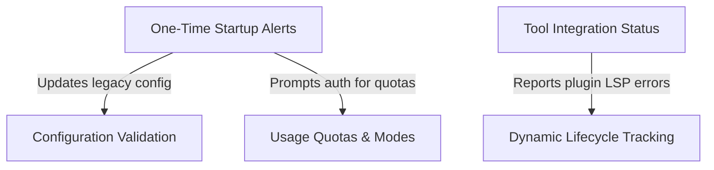

# Tutorial: notifs

The `notifs` project implements a comprehensive **notification management system** for the Claude Code application using React hooks. It monitors various system states including **one-time startup events**, **external tool integration** (LSP, IDE, MCP), **usage quotas** (rate limits, fast mode), and **configuration health**. By centralizing these checks, the system ensures users receive timely, prioritized alerts about connection failures, deprecated settings, or usage limits without notification fatigue.

## Chapters

1. [One-Time Startup Alerts](01_one_time_startup_alerts.md)
2. [Usage Quotas & Modes](02_usage_quotas___modes.md)
3. [Configuration Validation](03_configuration_validation.md)
4. [Tool Integration Status](04_tool_integration_status.md)
5. [Dynamic Lifecycle Tracking](05_dynamic_lifecycle_tracking.md)

---

Generated by [Code IQ](https://github.com/adityasoni99/Code-IQ)