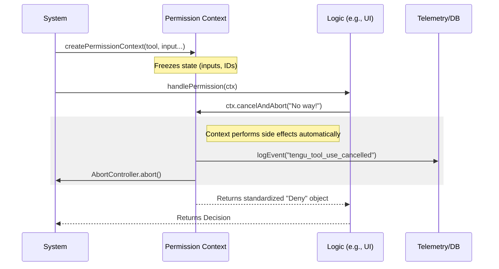

# Chapter 1: Permission Context (The "Smart Case File")

Welcome to the **Tool Permission** project! In this first chapter, we are going to look at the bedrock of our permission system: the **Permission Context**.

## The Problem: "The Cluttered Desk"

Imagine you are a judge. A lawyer runs in and shouts, "I need to search a house!"
You immediately have questions:
1.  *Which house?* (Input data)
2.  *Which case number is this for?* (Message ID)
3.  *If I say yes, where do I sign?* (Resolution logic)
4.  *Where do I file the paperwork afterwards?* (Logging/Persistence)

In code, this usually leads to functions with massive argument lists:

```typescript
// ❌ The "Cluttered Desk" approach
async function askPermission(
  toolName, input, messageId,
  saveToDatabaseFunc, logAnalyticsFunc,
  abortController, userSettings
) { ... }
```

Passing these loose variables around is messy and prone to error. If you forget the `logAnalyticsFunc`, the "paperwork" gets lost.

## The Solution: The "Smart Case File"

The **Permission Context** (`ctx`) is a wrapper object that bundles everything together.

Think of it like a **Smart Case File** handed to the judge.
1.  **The Evidence:** It opens up to show the tool name and inputs.
2.  **The Stamp:** It contains the "Approved" and "Denied" stamps right inside the folder.
3.  **The Clerk:** When you stamp a paper, the folder *automatically* files the decision to the database and sends analytics.

It decouples **what** needs to happen (logging, saving, aborting) from **how** the user interface works.

## Key Concepts

The Context object has three main jobs. Let's look at them one by one.

### 1. Holding State (The Evidence)
The context holds the "read-only" facts about the request. Once created, these don't change.

```typescript
// Inside the Context object
const ctx = {
  tool: toolObject,           // Who is asking?
  input: { path: "./src" },   // What do they want?
  messageId: "msg_123",       // Which message triggered this?
  toolUseID: "toolu_01",      // Unique ID for this specific action
  // ...
}
```

### 2. Decision Helpers (The Stamps)
Instead of manually constructing a complex result object, the context provides helper methods to build standard answers.

**Example: Denying a request**
If the user clicks "Cancel," you don't just return `false`. You use the context to abort the tool properly.

```typescript
// ✅ The "Smart" approach
// Stops the tool execution signal and formats the rejection message
const decision = ctx.cancelAndAbort("User clicked cancel");
```

### 3. Side Effects (The Filing Clerk)
This is the most powerful part. When a decision is made, we often need to:
1.  Log the event to analytics.
2.  Save "Always Allow" preferences to a database.

The context handles this internally so your logic stays clean.

```typescript
// Handled automatically inside helper methods:
ctx.logDecision({ decision: 'accept', source: { type: 'user' } });
```

---

## How to Use It

Let's see how a simple permission handler uses the Context to make a decision.

**Use Case:** We want to allow a tool immediately if the user has previously said "Always Allow" for this specific input.

```typescript
async function handleRequest(ctx: PermissionContext) {
  // 1. Check if the "Smart File" says we have a saved permission
  // (We'll cover how this logic works in Chapter 2)
  
  // 2. If approved, use the Context to build the "Allow" result
  const decision = ctx.buildAllow(ctx.input);
  
  // 3. Return the decision
  return decision;
}
```

If the user *denies* the request with feedback:

```typescript
// The user typed: "Don't delete that file!"
const decision = ctx.buildDeny(
  "User rejected the request", 
  { type: 'user_reject', hasFeedback: true }
);
```

By using `ctx.buildAllow` and `ctx.buildDeny`, we ensure the return format is always correct.

---

## Under the Hood

How does this object work internally? Let's look at the flow when a `PermissionContext` is created and used.

### The Lifecycle



### Implementation Details

The `createPermissionContext` function acts as a factory. It takes the raw variables and returns the frozen "Smart Case File" object.

#### 1. Setup
The factory captures the raw data so it doesn't need to be passed again.

```typescript
// File: PermissionContext.ts
function createPermissionContext(
  tool, input, toolUseContext, assistantMessage, toolUseID
) {
  const messageId = assistantMessage.message.id
  
  // The object we will return
  const ctx = {
    tool,
    input,
    messageId,
    // ... methods below
  }
```

#### 2. The Abort Logic
This method is crucial. It doesn't just return "No"; it actively pulls the emergency brake on the tool execution (`abortController`).

```typescript
    // Inside ctx object definition
    cancelAndAbort(feedback?: string, isAbort?: boolean) {
      // 1. Send the signal to kill the process
      toolUseContext.abortController.abort()

      // 2. Return the decision object for the UI/LLM
      return { 
        behavior: 'ask', // Ask usually allows the model to retry/apologize
        message: feedback || "Interrupted by user"
      }
    },
```

#### 3. Logging Decisions
We keep telemetry centralized. The context knows *exactly* how to format the data for our analytics system. This relates to [Centralized Telemetry (The "Black Box")](05_centralized_telemetry__the__black_box__.md).

```typescript
    // Inside ctx object definition
    logDecision(args, opts) {
      logPermissionDecision(
        { tool, input, messageId, toolUseID }, // Context data
        args,                                  // Decision result
        opts?.permissionPromptStartTimeMs      // Timing
      )
    },
```

#### 4. Freezing
Finally, we freeze the object to ensure no one accidentally modifies the evidence during the trial.

```typescript
  // Return the immutable object
  return Object.freeze(ctx)
}
```

---

## Conclusion

The **Permission Context** is your best friend in this codebase. It removes the clutter of passing variables and ensures that every permission decision—whether allowed, denied, or aborted—is handled consistently with proper logging and cleanup.

In the next chapter, we will see *who* gets to hold this case file. Different "judges" (Main Agent, Coordinator, Swarm Worker) handle permissions differently.

[Next Chapter: Role-Based Handling Strategies](02_role_based_handling_strategies.md)

---

Generated by [Code IQ](https://github.com/adityasoni99/Code-IQ)