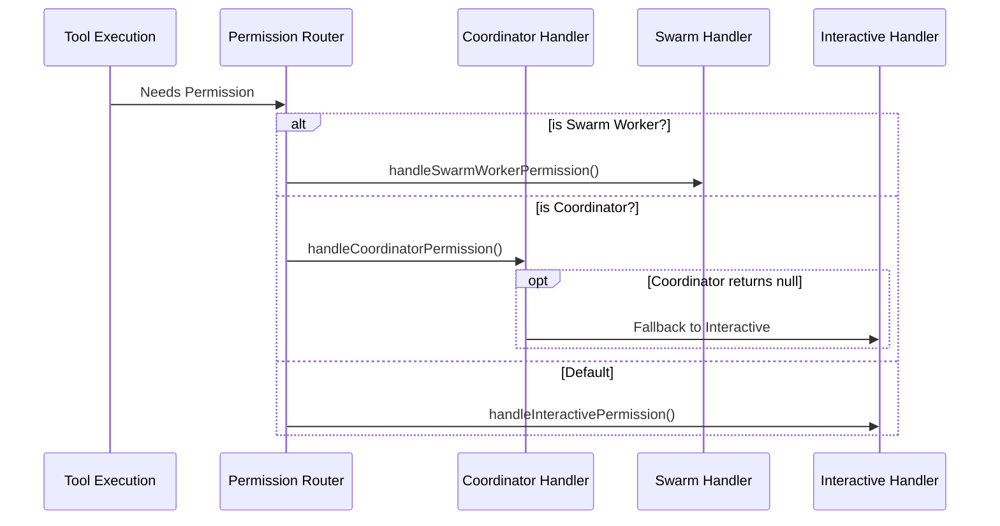

# Chapter 2: Role-Based Handling Strategies

In the previous chapter, [Permission Context (The "Smart Case File")](01_permission_context__the__smart_case_file__.md), we learned how we bundle all the data about a request into a single `ctx` object.

Now that we have the "Case File," the next logical question is: **Who gets to look at it?**

## The Problem: "Different Rules for Different Roles"

Imagine a high-security office building. Not everyone enters the same way:
1.  **The CEO (User):** Walks straight to the gate. If the face scanner recognizes them, they enter instantly. If not, they type a code.
2.  **The Middle Manager (Coordinator):** Must check the rulebook first. If the rulebook says "No," they stop. If the rulebook is unclear, only *then* do they bug the CEO.
3.  **The Intern (Swarm Worker):** Cannot authorize anything. They must email their boss (the "Leader" agent) and wait for a reply.

If we treated everyone like the CEO, the Intern would be accidentally authorizing nuclear launches. If we treated everyone like the Intern, the CEO would be stuck waiting for emails.

We need **Role-Based Handling Strategies**.

## The Three Strategies

Our codebase separates these logics into three distinct handlers.

### 1. The Coordinator Strategy (The "Rule Follower")
*Used by: Coordination Agents*

This is the most cautious strategy. It tries to resolve the permission automatically first (using hooks or classifiers). It only bothers the human user if the automation has no answer.

**Logic Flow:**
1.  Check Permission Hooks (Config files).
2.  Check Classifiers (AI checks).
3.  If both fail to decide -> Fall back to asking the User.

```typescript
// handlers/coordinatorHandler.ts
async function handleCoordinatorPermission(params) {
  // 1. Try permission hooks first (fast, local)
  const hookResult = await params.ctx.runHooks(/*...*/)
  
  // If hooks have an answer (Allow/Deny), return it immediately
  if (hookResult) return hookResult

  // 2. Try classifier (slow, AI inference)
  const classifierResult = await params.ctx.tryClassifier(/*...*/)
  
  if (classifierResult) return classifierResult
  
  // 3. No automatic answer? Return null to trigger the User Dialog
  return null 
}
```
*We run checks **sequentially** (one after another). We want to avoid bothering the user at all costs.*

---

### 2. The Swarm Worker Strategy (The "Remote Intern")
*Used by: Sub-agents (Swarm Workers)*

A "Worker" agent is usually running in the background or on a different thread. It doesn't have a screen to show a dialog box to the human. Instead, it asks its "Leader" agent.

**Logic Flow:**
1.  Check Classifiers (Auto-approve if obvious).
2.  If not obvious, send a message to the "Leader" agent.
3.  **Wait** (Pause execution) until the Leader replies.

```typescript
// handlers/swarmWorkerHandler.ts
async function handleSwarmWorkerPermission(params) {
  // 1. Try automated checks first
  const autoResult = await params.ctx.tryClassifier(/*...*/)
  if (autoResult) return autoResult

  // 2. Create a "Mailbox" request to the Leader Agent
  const request = createPermissionRequest({
    toolName: params.ctx.tool.name,
    // ... details
  })

  // 3. Send and Wait (This returns a Promise that resolves later)
  return await sendPermissionRequestViaMailbox(request)
}
```
*This handles the complexity of asynchronous communication. The worker effectively goes to sleep until the boss replies.*

---

### 3. The Interactive Strategy (The "Fast Lane")
*Used by: The Main Agent (You)*

This is the default for the main user interface. It is unique because it values **speed**.

Instead of checking rules *before* showing the dialog (like the Coordinator), it does both **at the same time**. It races the user against the automation.

**Logic Flow:**
1.  Show the "Allow/Deny" dialog to the user immediately.
2.  Run the automated checks in the background simultaneously.
3.  **First one to finish wins.**

This "Race" is complex, so we dedicate the entire next chapter to it: [Interactive Race Handling (The "Trading Floor")](03_interactive_race_handling__the__trading_floor__.md).

```typescript
// handlers/interactiveHandler.ts
function handleInteractivePermission(params, resolve) {
  const { ctx } = params

  // 1. Put the request on the screen (Queue)
  ctx.pushToQueue({
    onAllow: () => resolve(ctx.buildAllow()), // User clicked "Allow"
    onReject: () => resolve(ctx.cancelAndAbort()) // User clicked "Reject"
  })

  // 2. Run background checks (The "Race")
  // We will explore this deep logic in Chapter 3!
}
```

---

## Under the Hood: The Router

How does the system know which strategy to use? It acts as a router. When a tool tries to run, the system looks at the current `PermissionContext` to see who is asking.

### The Routing Logic



### Implementation Details

Let's look closely at how the **Swarm Worker** handles the "Wait" state. This is a great example of using Javascript Promises to bridge the gap between two agents.

The Swarm Handler wraps the mailbox process in a Promise.

```typescript
// handlers/swarmWorkerHandler.ts

// We return a Promise that will resolve LATER
const decision = await new Promise((resolve) => {
  
  // A. Set up the "Phone Line" (Callback)
  registerPermissionCallback({
    requestId: request.id,
    
    // When the leader finally replies...
    onAllow: async (input) => {
      // Unpause and say Yes
      resolve(await ctx.handleUserAllow(input)) 
    },
    
    onReject: () => {
       // Unpause and say No
      resolve(ctx.cancelAndAbort())
    }
  })

  // B. Send the letter
  sendPermissionRequestViaMailbox(request)
})
```

1.  **Register Callback:** We tell the system, "When you get a reply for ID #123, run this function."
2.  **Send Request:** We actually send the message.
3.  **Await:** The function halts here. It only continues when `resolve()` is called inside the callback.

## Conclusion

We have moved from a cluttered desk to a "Smart Case File" (Chapter 1), and now we have assigned specific "Security Guards" (Chapter 2) to handle that file depending on who is asking:

1.  **Coordinator:** Checks rules sequentially.
2.  **Swarm Worker:** Asks a remote leader.
3.  **Interactive:** Races the user against the machine.

The **Interactive Strategy** is the most exciting and complex part of our system. How do you handle a user clicking "Deny" at the exact same millisecond an AI classifier says "Allow"?

Find out in the next chapter.

[Next Chapter: Interactive Race Handling (The "Trading Floor")](03_interactive_race_handling__the__trading_floor__.md)

---

Generated by [Code IQ](https://github.com/adityasoni99/Code-IQ)