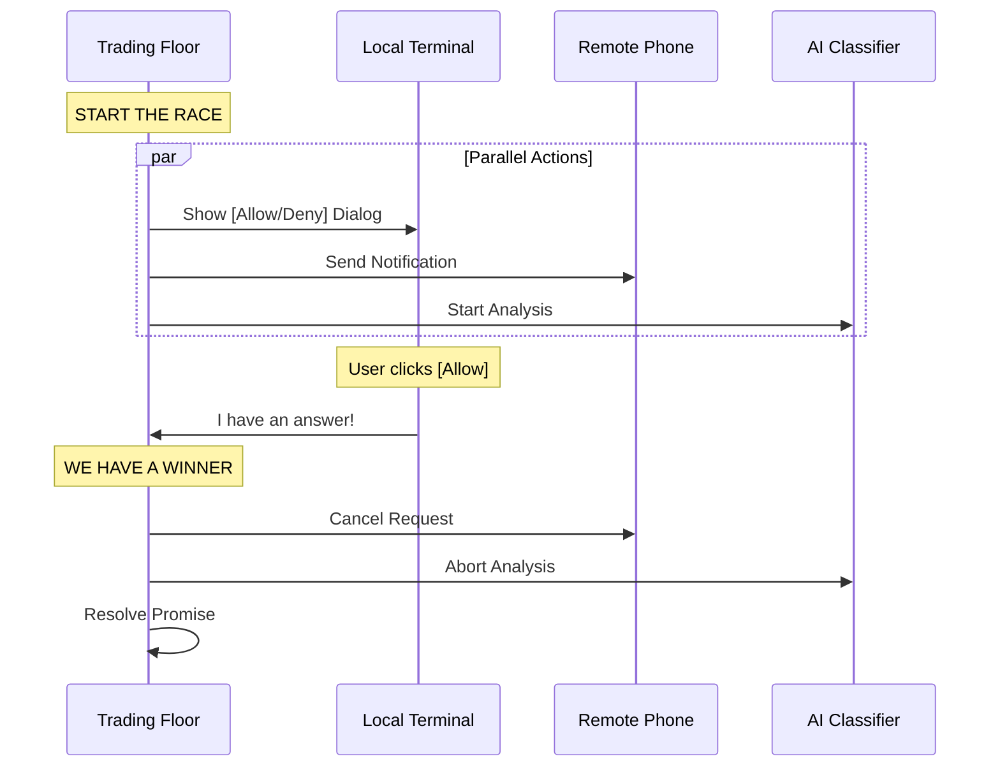

# Chapter 3: Interactive Race Handling (The "Trading Floor")

In the previous chapter, [Role-Based Handling Strategies](02_role_based_handling_strategies.md), we introduced the "Interactive Strategy" used by the main agent. We described it as a "Fast Lane" where the user races against automation.

Now, we are going to open up the hood and see exactly how this race works.

## The Motivation: "Don't Make Me Wait"

Imagine you are a busy stock trader on a loud trading floor. You want to buy a stock. You shout your order to three people:
1.  **The Clerk** standing next to you (The Local UI).
2.  **The Phone Broker** in another city (The Web Bridge/Mobile App).
3.  **The Algorithm** running on your computer (The Automated Classifier).

You don't care *who* executes the trade. You just want it done **now**. If the Algorithm approves the trade in 0.1 seconds, you want that to happen. If the Algorithm is slow but the Phone Broker says "Yes," you take that.

**The Rule:** The first valid confirmation wins. Everyone else gets cancelled.

Without this logic, the user would have to wait for the slow AI to finish thinking before they could click "Allow" themselves. That feels sluggish and broken.

## Key Concepts

To build this "Trading Floor," we need three specific mechanisms working together.

### 1. The Starting Pistol (Parallel Execution)
In standard code, we often `await` one thing, then the next.
```typescript
// ❌ Too Slow (Sequential)
await checkAI();   // Wait 2 seconds...
await askUser();   // Now show dialog...
```
In our Interactive Handler, we fire everything at once. The UI appears *while* the AI is thinking.

### 2. The Finish Line (The Resolver)
We need a single function that represents the "End." We pass this function to everyone.
```typescript
// ✅ The Race
askUser(resolve);       // Go!
checkAI(resolve);       // Go!
checkRemote(resolve);   // Go!
```

### 3. The Cleanup Crew (Cancellation)
If the User wins the race, the AI is still thinking in the background. We must immediately tell the AI: "Stop working, we already have an answer." Otherwise, we waste battery and API credits.

---

## The Implementation: Step-by-Step

This logic lives in `handlers/interactiveHandler.ts`. It is a complex function, but we can break it down into simple listeners.

### The Visual Flow

Here is what happens when a tool asks for permission in Interactive Mode.



### The Code: Building the Race

Let's look at the code. We don't use `Promise.race` directly because we need more control (like updating the UI). Instead, we use a callback pattern.

#### 1. Setup the Guard
First, we create a guard to ensure we only accept one answer. (We will explore this deeply in [Atomic Resolution (The "Game Show Buzzer")](04_atomic_resolution__the__game_show_buzzer__.md)).

```typescript
function handleInteractivePermission(params, resolve) {
  const { ctx } = params
  
  // This helper ensures 'resolve' is called only ONCE.
  // 'claim()' returns true only for the first person to call it.
  const { resolve: resolveOnce, claim } = createResolveOnce(resolve)
```

#### 2. Racer #1: The Local UI
We push the request to the terminal screen. Note the `onAllow` callback.

```typescript
  // Add the prompt to the user's screen queue
  ctx.pushToQueue({
    description: "Run command: rm -rf ./temp",
    
    // If the user presses ENTER locally:
    async onAllow(updatedInput) {
      if (!claim()) return // Check if we won the race
      
      // We won! Resolve the permission.
      resolveOnce(await ctx.handleUserAllow(updatedInput))
    },
    
    // ... handle onReject similarly
  })
```
*If the user acts first, `claim()` is true. We process the approval and finish.*

#### 3. Racer #2: The Remote Bridge
Simultaneously, we send the request to the Web Interface (like claude.ai) or a mobile app.

```typescript
  if (bridgeCallbacks) {
    // Send the notification to the phone/web
    bridgeCallbacks.sendRequest(requestId, ctx.tool.name, ...)

    // Listen for the reply
    bridgeCallbacks.onResponse(requestId, (response) => {
      if (!claim()) return // Did the local user beat us?
      
      // We won! Clean up the local UI so the dialog disappears
      ctx.removeFromQueue() 
      
      if (response.behavior === 'allow') {
        resolveOnce(ctx.buildAllow(response.updatedInput))
      }
    })
  }
```

#### 4. Racer #3: The AI Classifier
Finally, if enabled, we start the background AI check.

```typescript
  // Start the background check
  executeAsyncClassifierCheck(
    params.result.pendingClassifierCheck,
    // ... options
    {
      onAllow: (decisionReason) => {
        if (!claim()) return // Did the user click before AI finished?

        // AI won! Auto-approve.
        ctx.removeFromQueue() // Remove the dialog
        resolveOnce(ctx.buildAllow(ctx.input, { decisionReason }))
      }
    }
  )
```

### The "Cleanup"
You might have noticed `ctx.removeFromQueue()` in the examples above. This is crucial.

1.  **If User Wins:** The `onAllow` function runs. The UI is naturally updated. We explicitly call `bridgeCallbacks.cancelRequest(...)` (not shown in snippet above for brevity) to remove the notification from the user's phone.
2.  **If Remote Wins:** The phone sends an "Allow". We must call `ctx.removeFromQueue()` to remove the dialog from the local terminal immediately. It looks like magic: you tap your phone, and your computer screen clears instantly.

---

## Example Scenario

Let's walk through a concrete example.

**Scenario:** The agent wants to edit a file.
1.  **0ms:** `handleInteractivePermission` is called.
2.  **5ms:** The terminal shows: `[?] Allow Edit File? (Y/n)`.
3.  **10ms:** A notification pops up on your phone.
4.  **10ms:** An AI Safety Classifier starts reading the file content in the background.

**Outcome A (Local Win):**
*   **500ms:** You press 'Y' on the terminal.
*   **501ms:** The code checks `claim()`. It returns `true`.
*   **502ms:** The Permission is resolved as "Allowed".
*   **503ms:** The system sends a "Cancel" signal to the phone and the AI.

**Outcome B (AI Win):**
*   **0ms - 200ms:** You are reading the screen. You haven't pressed anything.
*   **250ms:** The AI finishes reading and decides the edit is safe.
*   **251ms:** The AI code checks `claim()`. It returns `true`.
*   **252ms:** `ctx.removeFromQueue()` is called. The dialog vanishes from your screen.
*   **253ms:** The tool executes automatically.

## Conclusion

The "Trading Floor" (Interactive Handler) is all about **responsiveness**. By running checks in parallel and accepting the first valid result, we create a system that feels snappy and intelligent. It doesn't force the user to wait for the machine, nor does it force the machine to wait for the user.

However, running parallel races introduces a dangerous bug potential: **Race Conditions**. What happens if the AI says "Allow" at the *exact* same millisecond the user clicks "Deny"?

To solve this, we need a special "Game Show Buzzer" logic. We touched on `claim()` briefly here, but in the next chapter, we will see how we ensure atomic safety.

[Next Chapter: Atomic Resolution (The "Game Show Buzzer")](04_atomic_resolution__the__game_show_buzzer__.md)

---

Generated by [Code IQ](https://github.com/adityasoni99/Code-IQ)