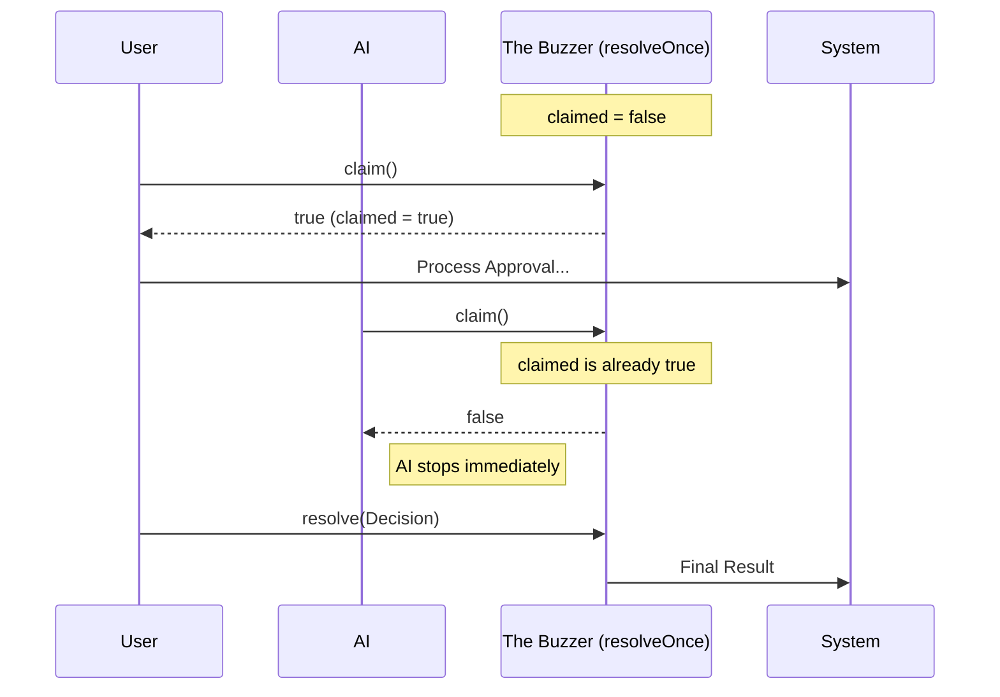

# Chapter 4: Atomic Resolution (The "Game Show Buzzer")

In the previous chapter, [Interactive Race Handling (The "Trading Floor")](03_interactive_race_handling__the__trading_floor__.md), we created a high-speed environment where the User, the AI, and the Remote Bridge all race to answer a permission request.

But a race creates a dangerous problem: **What if two runners cross the finish line at the exact same time?**

If the AI approves a tool use at the exact millisecond the user clicks "Cancel," we might accidentally run the tool *and* try to cancel it, causing errors or corrupt data. We need a way to guarantee that only the **first** answer counts.

## The Problem: "The Double Buzz"

Imagine a game show like *Jeopardy!*.
The host asks a question. Three contestants rush to hit their buzzers.
1.  **Contestant A** hits it at 100ms.
2.  **Contestant B** hits it at 101ms.
3.  **Contestant C** hits it at 102ms.

Without a control system, all three lights would turn on, and three people would start talking at once. Chaos!

In our code, this is a **Race Condition**.
1.  **AI** finishes analyzing: "Allow!"
2.  **User** clicks button: "Allow!"
3.  **System:** "Okay, I'll run the tool... and then I'll run the tool again." (Disaster)

## The Solution: The Atomic Guard

We use a utility called `createResolveOnce`. Think of this as the **Game Show Buzzer System**.

It has a strict rule: **The moment the first signal is received, the system locks.** All future signals are ignored, no matter how loudly they buzz.

## Key Concepts

There are two main parts to this mechanism.

### 1. The `resolveOnce` Wrapper
Normally, a Javascript Promise `resolve` function can be called multiple times (though only the first one effectively settles the promise state, the code *around* it might keep running). Our wrapper adds a "delivered" flag to ensure we stop processing immediately.

### 2. The `claim()` Method
This is the most important part. Before a handler (like the UI or AI) tries to resolve the permission, it must ask: **"Am I the first one?"**

*   If `claim()` returns `true`: You won! Proceed.
*   If `claim()` returns `false`: You lost. Stop everything and do nothing.

---

## How to Use It

Let's look at how we use this in our Interactive Handler (`handlers/interactiveHandler.ts`).

### Step 1: Create the Buzzer System
At the very start of the race, we create the guard.

```typescript
// handlers/interactiveHandler.ts
function handleInteractivePermission(params, resolve) {
  // Create the guard. It wraps the original 'resolve' function.
  const { resolve: resolveOnce, claim } = createResolveOnce(resolve);
  
  // Now the race begins...
}
```

### Step 2: Buzzing In (The "Check-and-Mark")
Here is the critical pattern. Whether it's the User clicking a button or the AI finishing a check, they **must** call `claim()` first.

**Example: The User Handler**

```typescript
async function onUserClickAllow(input) {
  // 🛑 STOP! Check the buzzer first.
  if (!claim()) {
    return; // Someone else beat us. Give up.
  }

  // ✅ We won! Now we can do the work.
  const decision = await ctx.handleUserAllow(input);
  
  // Tell the system we are done.
  resolveOnce(decision);
}
```

### Why is this necessary?
Notice the `await` in the code above? Asynchronous operations take time.
1.  User clicks "Allow".
2.  We call `claim()` -> True.
3.  We start `await handleUserAllow...` (This takes 50ms to save to the database).
4.  *During those 50ms*, the AI finishes and tries to `claim()`.
5.  Because we already claimed it in step 2, the AI gets `false` and stops immediately.

Without `claim()`, the AI would overwrite the User's decision while the database was still saving!

---

## Under the Hood

How does `createResolveOnce` work? It is a surprisingly simple but powerful closure (a function that remembers its variables).

### The Logic Flow



### Implementation Details

Let's look at `PermissionContext.ts`.

#### 1. The State
We hold a simple boolean variable called `claimed`.

```typescript
// PermissionContext.ts
function createResolveOnce<T>(resolve: (value: T) => void) {
  // The state is hidden inside this function
  let claimed = false;
  let delivered = false;
  
  return {
     // Methods go here...
  }
}
```

#### 2. The `claim` Method
This method performs an **atomic** action. It checks the value and changes it in the same synchronous step. No other code can run in between the `if` and the `true`.

```typescript
    // Inside returned object
    claim() {
      // If the light is already on, you lose.
      if (claimed) return false;
      
      // Turn the light on.
      claimed = true;
      
      // You win!
      return true;
    },
```

#### 3. The `resolve` Wrapper
Just for safety, we also wrap the final resolve function. Even if you somehow bypassed `claim()`, this ensures the promise is only settled once.

```typescript
    resolve(value: T) {
      if (delivered) return; // Ignore subsequent calls
      
      delivered = true;
      claimed = true; // Ensure claimed is set
      resolve(value);
    }
```

---

## Real-World Example: The "Clean Up"

One of the best features of this system is how it helps with cleanup.

In `handlers/interactiveHandler.ts`, we have a callback for when the Remote Bridge (e.g., a phone app) responds.

```typescript
// handlers/interactiveHandler.ts
bridgeCallbacks.onResponse(requestId, (response) => {
  // 1. Check the buzzer
  if (!claim()) return; 

  // 2. We won! Now we must clean up the losers.
  // Remove the dialog from the local terminal screen
  ctx.removeFromQueue(); 
  
  // 3. Resolve
  resolveOnce(ctx.buildAllow(response.input));
});
```

Because `claim()` guarantees we are the winner, we can safely delete the UI (`removeFromQueue`) without worrying that the user might be clicking it at that exact moment. The `claim` check protects us from UI glitches.

## Conclusion

The **Atomic Resolution** pattern is a small piece of code with a huge responsibility. By acting as the "Game Show Buzzer," it allows us to run multiple permission strategies in parallel (User, AI, Remote) without fear of collisions or double-execution.

It ensures that no matter how chaotic the race is, there is only ever one winner.

Now that we have made a decision safely, what happens to that data? We need to record what happened for security auditing and future improvements.

[Next Chapter: Centralized Telemetry (The "Black Box")](05_centralized_telemetry__the__black_box__.md)

---

Generated by [Code IQ](https://github.com/adityasoni99/Code-IQ)