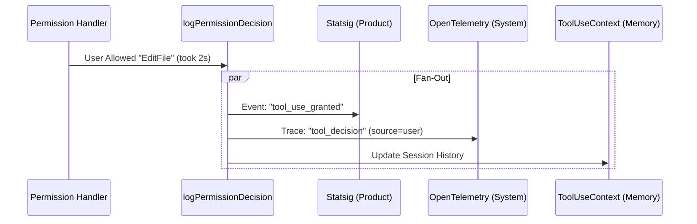

# Chapter 5: Centralized Telemetry (The "Black Box")

In the previous chapter, [Atomic Resolution (The "Game Show Buzzer")](04_atomic_resolution__the__game_show_buzzer__.md), we solved the problem of handling simultaneous responses by creating a strict "buzzer" system. We ensured that only one decision—whether from the user, the AI, or a remote bridge—actually counts.

But once that decision is made, where does it go?

If a user denies a tool, we need to know *why*. If an AI classifier auto-approves a dangerous command, we need a record of *exactly* what logic was used.

Welcome to the final piece of the puzzle: **Centralized Telemetry**.

## The Problem: "The Scattered Diary"

Imagine a pilot flying a plane.
*   Sometimes they pull the joystick manually.
*   Sometimes the autopilot takes over.
*   Sometimes the co-pilot flips a switch.

If the "flight logs" were written on random sticky notes, some in the cockpit, some in the cargo hold, and some shouted into the wind, accident investigation would be impossible.

In code, developers often do this:
```typescript
// ❌ The "Scattered Diary" approach
if (userSaidYes) {
  console.log("User agreed"); // Logging to console
  analytics.track("agreement"); // Logging to a service
  // ... forgot to log the timing!
}
```
This leads to inconsistent data. You might record *that* a tool ran, but forget to record *who* authorized it (The User? The Config? The AI?).

## The Solution: The "Black Box" Recorder

We solve this by creating a dedicated layer—a "Black Box"—that handles **Fan-Out**.

The rest of the application calls **one** function with the result. That function then splits the signal and sends it everywhere it needs to go:
1.  **Analytics:** For product usage stats.
2.  **OpenTelemetry (OTel):** For system tracing and performance monitoring.
3.  **Internal State:** To remember the decision for the session history.

## Key Concepts

### 1. The Choke Point
We force every single permission decision in the entire app to pass through `logPermissionDecision`. This is our "choke point." By controlling this gateway, we guarantee that no decision ever goes unrecorded.

### 2. Attribution (The "Source")
It is not enough to say "Allowed." We must know the **Source**.
*   `user`: The human clicked "Allow."
*   `config`: The `settings.json` file auto-approved it.
*   `classifier`: An AI model analyzed the risk and approved it.

### 3. The Fan-Out
This is the "mailing list" concept. You send one message to the logging function, and it automatically forwards copies to different destinations (Metrics, Logs, Traces).

---

## How to Use It

As a developer using the `PermissionContext`, you rarely need to call the logging function manually. The context methods we built in [Chapter 1](01_permission_context__the__smart_case_file__.md) handle it for you.

**Example: How the Context uses it internally**

```typescript
// Inside PermissionContext.ts
async function handleUserAllow(input) {
  // ... save changes ...

  // ✅ AUTOMATIC LOGGING
  // The context knows "who" (User) and "what" (Accept)
  this.logDecision({
    decision: 'accept',
    source: { type: 'user', permanent: false }
  });

  return this.buildAllow(input);
}
```

**Example: Analyzing the Output**
When the code above runs, the "Black Box" generates a structured event like this:

```json
{
  "event": "tengu_tool_use_granted_in_prompt_temporary",
  "metadata": {
    "toolName": "WriteFile",
    "waiting_for_user_permission_ms": 1500,
    "sandboxEnabled": true
  }
}
```
Notice how it automatically calculated how long the user waited (`1500ms`)? That logic is centralized, so we never forget to calculate it.

---

## Under the Hood

Let's look at the flow of data when a decision is made.

### The Fan-Out Diagram



### Implementation Details

This logic lives in `permissionLogging.ts`. It acts as a switchboard.

#### 1. The Entry Point
This function takes the raw context and the decision arguments. It is the only public door to the logging system.

```typescript
// permissionLogging.ts
function logPermissionDecision(
  ctx: PermissionLogContext,  // The "Case File"
  args: PermissionDecisionArgs, // The Decision (Accept/Reject)
  promptStartTimeMs?: number    // Timing data
) {
  const { tool, input, messageId } = ctx;
  const { decision, source } = args;

  // Calculate how long the user stared at the screen
  const waitMs = promptStartTimeMs 
    ? Date.now() - promptStartTimeMs 
    : undefined;
    
  // ... proceed to fan-out ...
}
```

#### 2. Destination A: Product Analytics
We use distinct event names so data analysts can easily filter "Funnels" (e.g., how many users reject requests vs. allow them).

```typescript
  // Inside logPermissionDecision...
  
  if (decision === 'accept') {
    // Helper function maps the source to a specific event string
    logApprovalEvent(tool, messageId, source, waitMs);
  } else {
    logRejectionEvent(tool, messageId, source, waitMs);
  }
```

#### 3. Destination B: OpenTelemetry (System Metrics)
For engineering observability, we want standard metrics. We also do something special for **Code Editing** tools: we try to guess the programming language to track "most edited languages."

```typescript
  // Inside logPermissionDecision...

  // 1. Log generic system event
  logOTelEvent('tool_decision', { decision, sourceString, toolName });

  // 2. Special handling for Code Editors
  if (isCodeEditingTool(tool.name)) {
    // Extract language (e.g., "typescript") from the input filename
    const attributes = await buildCodeEditToolAttributes(tool, input);
    
    // Increment a counter
    getCodeEditToolDecisionCounter().add(1, attributes);
  }
```

#### 4. Destination C: Session Memory
Finally, we store the decision on the `toolUseContext` object. This allows other parts of the code to look back and ask, "What happened with that tool use 5 minutes ago?"

```typescript
  // Inside logPermissionDecision...

  toolUseContext.toolDecisions.set(toolUseID, {
    source: sourceString,
    decision,
    timestamp: Date.now(),
  });
```

---

## Why This Matters

By centralizing telemetry, we gain **Observability**.

1.  **Safety:** If a tool is executing suspiciously, we can look at the logs and see *exactly* that it was "Allowed by Config" (maybe the user has a loose permission setting).
2.  **Performance:** We can measure `waiting_for_user_permission_ms`. If this number is high, we know our UI is confusing or users are hesitant.
3.  **Simplicity:** The developers writing the UI logic (Chapter 3) don't need to import analytics libraries. They just call `ctx.handleUserAllow()`.

## Conclusion

We have reached the end of the **Tool Permission** tutorial series.

Let's recap our journey:
1.  **[Permission Context](01_permission_context__the__smart_case_file__.md):** We bundled our data into a "Smart Case File."
2.  **[Handling Strategies](02_role_based_handling_strategies.md):** We assigned different "Security Guards" (Coordinator, Worker, User).
3.  **[The Race](03_interactive_race_handling__the__trading_floor__.md):** We let the User and AI race to answer first.
4.  **[Atomic Resolution](04_atomic_resolution__the__game_show_buzzer__.md):** We ensured only one winner could press the button.
5.  **Centralized Telemetry:** We recorded the result in a "Black Box" for safety and science.

You now understand the architecture of a high-performance, safe, and observable permission system. Happy coding!

---

Generated by [Code IQ](https://github.com/adityasoni99/Code-IQ)