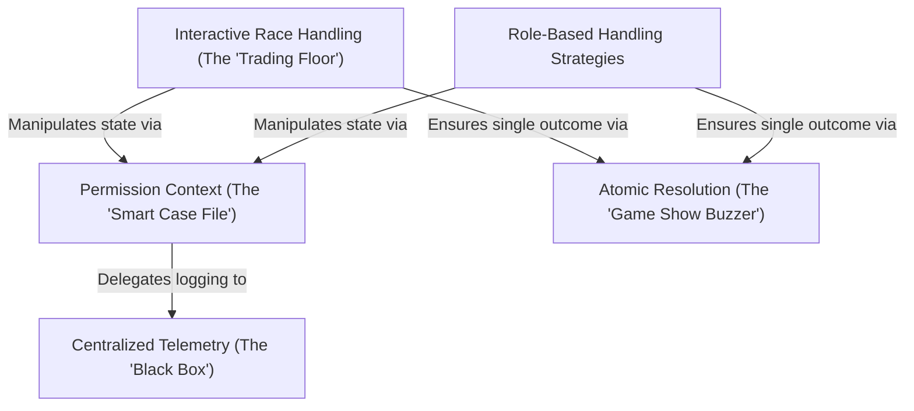

# Tutorial: toolPermission

This project manages **tool permissions** by encapsulating all request details into a smart "Case File" context. It employs different *strategies* to handle decisions—whether automatically by a coordinator, delegated to a swarm leader, or via a complex **interactive race** where local user clicks, remote signals, and automation compete to provide the first valid answer. To ensure safety amidst this concurrency, it uses an **atomic buzzer** mechanism to guarantee decisions happen exactly once, while a **centralized telemetry** system records the outcome for analytics.

## Chapters

1. [Permission Context (The "Smart Case File")](01_permission_context__the__smart_case_file__.md)
2. [Role-Based Handling Strategies](02_role_based_handling_strategies.md)
3. [Interactive Race Handling (The "Trading Floor")](03_interactive_race_handling__the__trading_floor__.md)
4. [Atomic Resolution (The "Game Show Buzzer")](04_atomic_resolution__the__game_show_buzzer__.md)
5. [Centralized Telemetry (The "Black Box")](05_centralized_telemetry__the__black_box__.md)

---

Generated by [Code IQ](https://github.com/adityasoni99/Code-IQ)