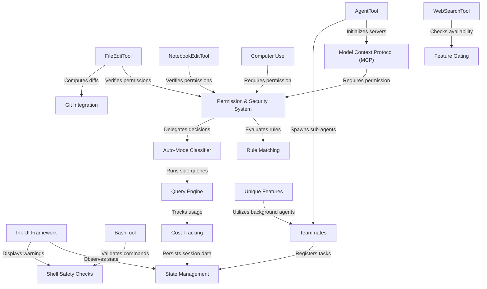

# Tutorial: claudeCode

`claudeCode` is an advanced AI CLI tool designed to act as an **autonomous software engineer**. It features a robust **Query Engine** that orchestrates conversation loops, manages state, and executes a diverse suite of tools including file editing, terminal commands, and **Computer Use**. The system emphasizes safety and control through a granular **Permission & Security System** (enhanced by an **Auto-Mode Classifier**), detailed **Cost Tracking**, and deep **Git Integration** for context-aware coding assistance.

## Chapters

1. [State Management](01_state_management.md)
2. [Ink UI Framework](02_ink_ui_framework.md)
3. [Query Engine](03_query_engine.md)
4. [FileEditTool](04_fileedittool.md)
5. [Git Integration](05_git_integration.md)
6. [BashTool](06_bashtool.md)
7. [Shell Safety Checks](07_shell_safety_checks.md)
8. [Permission & Security System](08_permission___security_system.md)
9. [Rule Matching](09_rule_matching.md)
10. [Auto-Mode Classifier](10_auto_mode_classifier.md)
11. [NotebookEditTool](11_notebookedittool.md)
12. [WebSearchTool](12_websearchtool.md)
13. [Feature Gating](13_feature_gating.md)
14. [Model Context Protocol (MCP)](14_model_context_protocol__mcp_.md)
15. [AgentTool](15_agenttool.md)
16. [Teammates](16_teammates.md)
17. [Unique Features](17_unique_features.md)
18. [Computer Use](18_computer_use.md)
19. [Cost Tracking](19_cost_tracking.md)

---

Generated by [Code IQ](https://github.com/adityasoni99/Code-IQ)