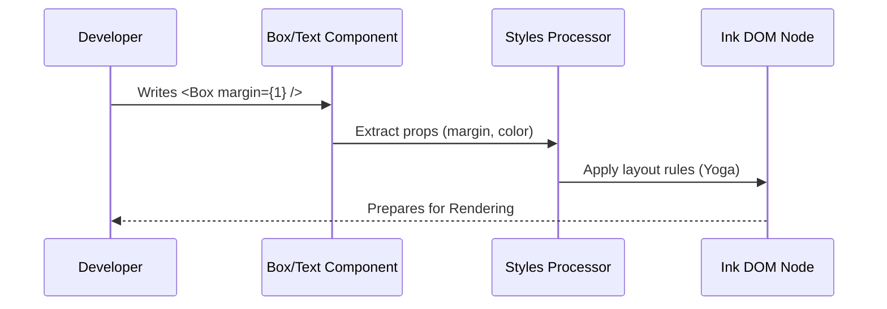

# Chapter 1: Core Component Primitives

Welcome to the world of Ink! If you have ever tried to style text in a terminal using raw codes like `\x1b[31m`, you know it can be a headache.

Ink allows you to build Command Line Interfaces (CLIs) using **React**. Just like building a website, you compose your UI using components.

In this chapter, we will explore the two building blocks of every Ink application:
1.  **`<Text>`**: Used for rendering strings and applying styles (colors, bold, etc.).
2.  **`<Box>`**: Used for layout (margins, padding, borders, and positioning).

## The Goal: A "Server Status" Card

To understand these components, let's build a simple UI element: a box that tells the user the server is running successfully.

It should look something like this in your terminal:
```text
┌──────────────────────────────┐
│  ✔ Server running on port 80 │
└──────────────────────────────┘
```

## 1. The `<Text>` Component

In standard HTML, you wrap text in `<span>` or `<p>` tags to style it. In Ink, you use the `<Text>` component.

The `<Text>` component is responsible for **styling characters**. It handles colors, background colors, and modifiers like **bold** or *italic*.

### Basic Usage

Here is how you make text green and bold:

```tsx
import { Text } from 'ink';

const Status = () => (
  <Text color="green" bold>
    ✔ Server running on port 80
  </Text>
);
```

**What happens here?**
Ink takes the string `✔ Server running on port 80`, applies the ANSI color code for green, applies the code for bold, and prints it to the terminal.

### Text Wrapping

Terminals have a fixed width. If your text is too long, `<Text>` helps you control how it breaks.

```tsx
<Text wrap="truncate-end">
  This is a very long path that might not fit...
</Text>
```

This prevents your CLI from looking broken when a window is resized.

---

## 2. The `<Box>` Component

Now that we have styled text, we need to position it. In HTML, you use `<div>`. In Ink, you use `<Box>`.

The `<Box>` component is the container. It uses **Flexbox** (just like CSS) to arrange its children. It handles:
*   **Layout:** Rows vs Columns.
*   **Spacing:** Margins and Padding.
*   **Decoration:** Borders.

### Adding a Border and Padding

Let's put our text inside a Box to create the card effect.

```tsx
import { Box, Text } from 'ink';

const Card = () => (
  <Box borderStyle="single" paddingX={1}>
    <Text color="green">✔ Server running</Text>
  </Box>
);
```

**Explanation:**
1.  `borderStyle="single"` draws the lines around the content.
2.  `paddingX={1}` adds 1 space of gap on the left and right inside the border.

### Layout with Flexbox

By default, a `<Box>` arranges children in a **Row** (left to right). You can change this to a **Column** (top to bottom).

```tsx
<Box flexDirection="column" borderStyle="round">
  <Text color="green">Status: Online</Text>
  <Text color="blue">Port: 8080</Text>
</Box>
```

This stacks the two lines of text vertically inside a rounded box.

---

## 3. Solving the Use Case

Let's combine everything to build our final "Server Status" component.

```tsx
import React from 'react';
import { Box, Text } from 'ink';

const ServerStatus = () => (
  <Box borderStyle="single" borderColor="green">
    <Box paddingX={2}>
      <Text color="green" bold>✔ Success:</Text>
    </Box>
    <Text>Server running on localhost:3000</Text>
  </Box>
);
```

**Visualizing the Output:**
This creates a green-bordered box. Inside, on the left, "✔ Success:" appears in bold green (with some padding). Immediately following it is the white text description.

---

## Under the Hood: How it Works

You might be wondering: *How does a React component turn into a terminal layout?*

Ink uses a fascinating translation layer. It doesn't use the browser's DOM. Instead, it creates a custom "Ink DOM" and passes style instructions to a layout engine.

### The Flow



1.  **Component Mounts:** React calls your `<Box>` function.
2.  **Prop Extraction:** The component separates standard props (like `children`) from style props (like `margin`, `color`).
3.  **Style Processing:** A helper file (`styles.ts`) translates these props into commands for the layout engine.
4.  **DOM Node Creation:** An internal node (covered in [Ink DOM & Layout Engine](02_ink_dom___layout_engine.md)) is updated with these settings.

### Deep Dive: `styles.ts`

The file `styles.ts` is the dictionary that translates Ink props into layout commands.

When you write `<Box margin={1} />`, Ink calls a function like this internally:

```typescript
// Inside styles.ts (Simplified)
const applyMarginStyles = (node: LayoutNode, style: Styles): void => {
  // If "margin" prop exists...
  if ('margin' in style) {
    // Tell the underlying layout engine to set margin on all sides
    node.setMargin(LayoutEdge.All, style.margin ?? 0)
  }
}
```

This directly manipulates the **Yoga** layout node (the engine Ink uses for Flexbox math).

### Deep Dive: `Text.tsx`

The `<Text>` component is essentially a filter. It creates an internal `<ink-text>` element and attaches style metadata.

```typescript
// Inside components/Text.tsx (Simplified)
export default function Text({ color, bold, children }: Props) {
  // 1. Group style props together
  const textStyles = {
    color,
    bold
  };

  // 2. Render an internal primitive with these styles
  return (
    <ink-text textStyles={textStyles}>
      {children}
    </ink-text>
  );
}
```

Unlike HTML, `<ink-text>` is not a real DOM tag. It is a signal to the Ink Reconciler (which we will discuss in [React Reconciler](03_react_reconciler.md)).

### Deep Dive: `Box.tsx`

The `<Box>` component is the heavy lifter. It gathers layout styles and passes them down.

```typescript
// Inside components/Box.tsx (Simplified)
function Box({ children, style, flexDirection = 'row' }) {
  // 1. Merge default styles with user styles
  const finalStyle = {
    flexDirection,
    ...style
  };

  // 2. Render the internal primitive
  return (
    <ink-box style={finalStyle}>
      {children}
    </ink-box>
  );
}
```

Notice `<ink-box>`. This internal element holds the configuration that eventually determines exactly which cell (row/column) in the terminal a character will appear in.

## Summary

In this chapter, you learned:
*   **`<Text>`** is for styling strings (color, bold).
*   **`<Box>`** is for layout (flexbox, borders, spacing).
*   These components are abstractions. They take your props and translate them into instructions for a layout engine via `styles.ts`.

But how does Ink actually *know* where to put the cursor based on these boxes?

[Next Chapter: Ink DOM & Layout Engine](02_ink_dom___layout_engine.md)

---

Generated by [Code IQ](https://github.com/adityasoni99/Code-IQ)