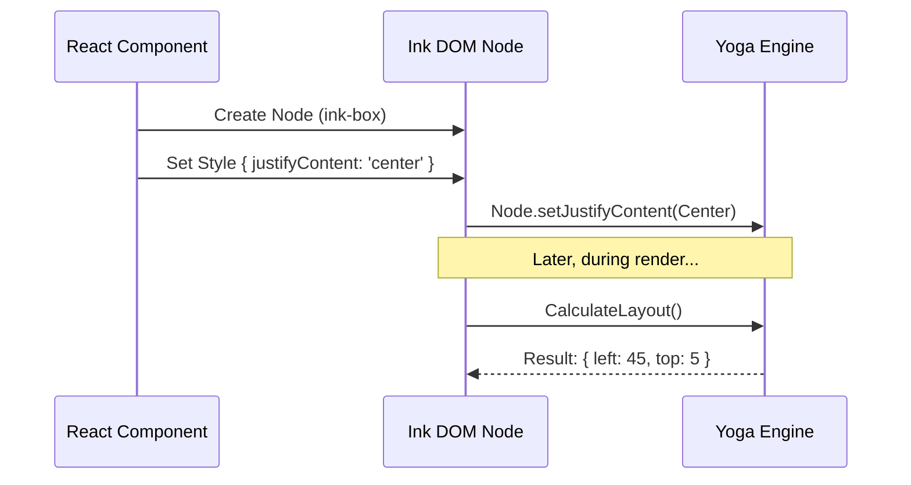

# Chapter 2: Ink DOM & Layout Engine

In the previous chapter, [Core Component Primitives](01_core_component_primitives.md), we learned how to compose UI using `<Box>` and `<Text>`.

But here is the mystery: **The terminal is just a grid of characters.** It doesn't know what a "Flexbox" is. It doesn't know what a "component" is. It doesn't even know what a "parent" or "child" is.

So, how does Ink know that `justifyContent="center"` means "calculate the width of the window, subtract the width of the content, divide by two, and place the cursor there"?

The answer is the **Ink DOM** and the **Yoga Layout Engine**.

---

## The Motivation: An Invisible Skeleton

Imagine you are building a house. Before you paint the walls (render pixels), you need a blueprint and a wooden frame (DOM) to hold everything together.

Browsers have the HTML DOM (`<div>`, `<span>`).
Ink creates its own **DOM (Document Object Model)** solely in memory.

### The Goal: A Centered Modal

Let's look at this simple layout:

```tsx
<Box height={10} alignItems="center" justifyContent="center">
  <Text>I am centered!</Text>
</Box>
```

To make this work, Ink needs to perform three invisible steps:
1.  **Construct a Tree:** Remember that `<Text>` is inside `<Box>`.
2.  **Calculate Math:** Figure out the exact X and Y coordinates for the text based on the Box's size.
3.  **Store Data:** Hold the style information (colors, bold) until we are ready to print.

---

## Concept 1: The Ink DOM Node

In a browser, you have `HTMLElement`. In Ink, we have `DOMElement`.

An `InkNode` (or `DOMElement`) is a plain JavaScript object that represents one piece of your UI. It acts as a container for:
1.  **Children:** Which nodes are inside this one?
2.  **Styles:** What colors or margins does this node have?
3.  **The Yoga Node:** A reference to the math engine (more on this below).

### What a Node looks like

If you could inspect Ink's memory while running the example above, a simplified `ink-box` node would look like this:

```javascript
// A simplified view of an Ink Node
const boxNode = {
  nodeName: 'ink-box',
  parentNode: rootNode,
  childNodes: [textNode], // The "I am centered" node
  style: { alignItems: 'center' },
  // The layout engine instance
  yogaNode: <YogaNode Instance>
};
```

---

## Concept 2: Yoga Layout Engine

Terminals don't come with CSS layout engines. Browsers do. To bridge this gap, Ink uses **Yoga**.

Yoga is a layout engine written in C++ (and compiled to JavaScript) that implements **Flexbox**. It does the heavy math.

Think of Yoga as a calculator:
1.  You tell it: "I have a parent 100px wide, and a child 10px wide. I want the child centered."
2.  You say: "Calculate!"
3.  Yoga replies: "The child should start at X coordinate 45."

---

## How It Works: The Flow

When your React code runs, it talks to the Ink DOM, which talks to Yoga.



1.  **Creation:** React asks Ink to create a node.
2.  **Configuration:** Ink passes styles to the Yoga node.
3.  **Calculation:** Ink triggers a layout calculation.
4.  **Result:** The Yoga node now knows exactly where it sits in the terminal grid.

---

## Implementation Details

Let's look under the hood at how Ink implements this "Invisible Skeleton."

### 1. Creating a Node (`dom.ts`)

When Ink initializes a component, it creates a `DOMElement`. Notice how it initializes the `yogaNode` immediately.

```typescript
// dom.ts (Simplified)
import { createLayoutNode } from './layout/engine.js';

export const createNode = (nodeName) => {
  return {
    nodeName,
    childNodes: [],
    style: {},
    // Every visual element gets a Yoga node for math
    yogaNode: createLayoutNode(), 
    dirty: false
  };
};
```

**Explanation:**
*   `nodeName`: Keeps track of what this is (`ink-box`, `ink-text`).
*   `yogaNode`: This is the bridge to the C++ engine.

### 2. Translating Styles to Math (`styles.ts`)

When you write `<Box margin={1}>`, Ink has to translate that React prop into a Yoga instruction.

```typescript
// styles.ts (Simplified)
const applyMarginStyles = (node, style) => {
  // If the user set a margin prop...
  if ('margin' in style) {
    // ...tell Yoga to apply it to All sides.
    // LayoutEdge.All maps to Yoga.EDGE_ALL
    node.setMargin(LayoutEdge.All, style.margin ?? 0);
  }
};
```

**Explanation:**
*   This function runs whenever styles change.
*   It takes the user-friendly Ink style (`margin`) and calls the strict Yoga setter (`setMargin`).

### 3. The Yoga Adapter (`layout/yoga.ts`)

Ink wraps the raw Yoga library to make it safer and easier to use with TypeScript.

```typescript
// layout/yoga.ts (Simplified)
export class YogaLayoutNode {
  constructor(yogaNode) {
    this.yoga = yogaNode;
  }

  calculateLayout(width, height) {
    // Trigger the heavy C++ calculation
    this.yoga.calculateLayout(width, height, Direction.LTR);
  }

  getComputedLeft() {
    // Retrieve the calculated X position
    return this.yoga.getComputedLeft();
  }
}
```

**Explanation:**
*   `calculateLayout`: The trigger button. It cascades down the tree, calculating positions for the node and all its children.
*   `getComputedLeft`: After calculation, this tells us where to draw the element.

---

## Putting It Together: The "Server Status" Example

Recalling our example from Chapter 1:
```tsx
<Box borderStyle="single">
  <Text>Status: OK</Text>
</Box>
```

Here is the lifecycle in the Ink DOM:

1.  **Construction:**
    *   Ink creates a parent `ink-box` (The Box).
    *   Ink creates a child `ink-text` (The Text).
    *   It appends the child to the parent in the DOM *and* in the Yoga tree.

2.  **Styling:**
    *   The Box has `borderStyle="single"`.
    *   `styles.ts` sees this and tells Yoga: `node.setBorder(Edge.All, 1)`. Use 1 unit of space for the border.

3.  **Measurement:**
    *   The Text node contains "Status: OK" (10 characters).
    *   Yoga asks: "How big is this child?"
    *   Ink measures the string and tells Yoga: "It is 10 units wide."

4.  **Layout Calculation:**
    *   Yoga calculates:
        *   Text Width: 10
        *   Border Width: 1 (left) + 1 (right) = 2
        *   **Total Box Width:** 12

Now the "Skeleton" is complete. Every node knows its X, Y, Width, and Height.

## Summary

In this chapter, we learned:
*   **Ink DOM:** An in-memory tree of objects (`ink-box`, `ink-text`) representing your UI.
*   **Yoga Engine:** The math wizard that calculates Flexbox layouts for the terminal.
*   **The Bridge:** `styles.ts` translates your props into Yoga commands.

We have a structure. We have positions. But how does React manage updates to this structure when data changes?

[Next Chapter: React Reconciler](03_react_reconciler.md)

---

Generated by [Code IQ](https://github.com/adityasoni99/Code-IQ)