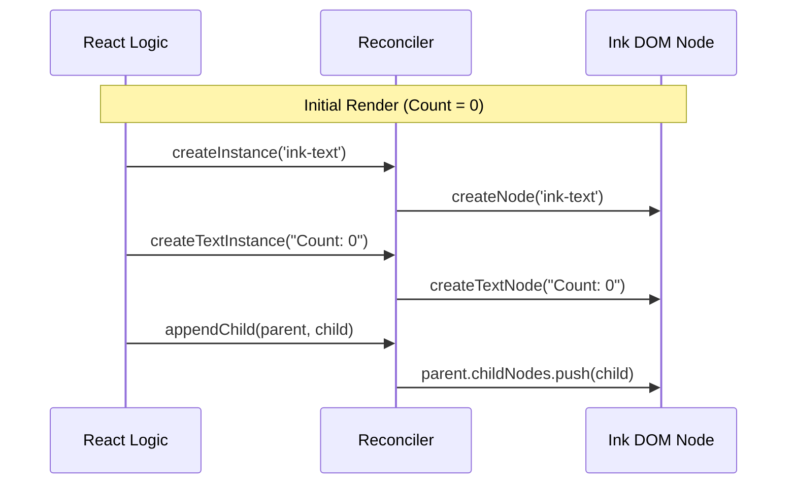

# Chapter 3: React Reconciler

In the previous chapter, [Ink DOM & Layout Engine](02_ink_dom___layout_engine.md), we discovered that Ink builds an invisible tree of nodes (the Ink DOM) and uses the Yoga engine to calculate layout.

But there is a missing link.

When you write React code, you are dealing with **State** (`useState`) and **Virtual Components**. You aren't manually creating `ink-box` nodes or calculating math.

**Who connects your React state to the Ink DOM?**
That is the job of the **React Reconciler**.

---

## The Motivation: The Foreman

Imagine React as an **Architect**.
*   React draws blueprints (Virtual DOM).
*   React decides when the design changes (State updates).
*   React doesn't know how to build anything physically.

Ink's DOM is the **Construction Site**.
*   It has the raw materials (Nodes).
*   It follows physics (Layout Engine).

The **Reconciler** is the **Foreman**.
The Architect (React) hands a blueprint to the Foreman (Reconciler). The Foreman looks at the construction site and shouts orders: "Build a wall here!", "Paint that text green!", "Tear down that box!"

### The Use Case: A Simple Counter

To understand this, let's look at the "Hello World" of interactivity: a Counter.

```tsx
const Counter = () => {
  const [count, setCount] = React.useState(0);

  // Updates count every second
  useInterval(() => {
    setCount(c => c + 1);
  }, 1000);

  return <Text color="green">Count: {count}</Text>;
};
```

**The Challenge:**
1.  React changes `count` from `0` to `1`.
2.  React creates a new "Virtual" tree: `<Text>Count: 1</Text>`.
3.  The Reconciler must figure out how to update the real Ink DOM to match this new reality without rebuilding the whole world.

---

## Concept: The Host Config

React is designed to be universal. It can run on the web (ReactDOM), on phones (ReactNative), and thanks to Ink, in terminals.

To make React work in a new environment, you provide a **Host Config**. This is a dictionary of methods that tells React how to translate its commands into specific actions for that environment.

Ink implements `react-reconciler` by providing methods like:
*   `createInstance`: "Make a new Box."
*   `appendChild`: "Put this Text inside that Box."
*   `commitUpdate`: "Change the color property."

---

## The Workflow

Let's trace what happens when our Counter component starts up.



1.  **React:** "I need a Text element."
2.  **Reconciler:** Calls Ink's `createNode`.
3.  **React:** "I need the string 'Count: 0'."
4.  **Reconciler:** Calls Ink's `createTextNode`.
5.  **React:** "Put the string inside the element."
6.  **Reconciler:** Links the two nodes in the Ink DOM.

---

## Under the Hood: `reconciler.ts`

Let's look at the actual code Ink uses to implement this "Foreman." This file is the bridge between the two worlds.

### 1. Creating Elements (`createInstance`)

When React encounters a `<Box>` or `<Text>`, it calls this method.

```typescript
// reconciler.ts (Simplified)
createInstance(type, props, root, hostContext) {
  // 1. Delegate to the DOM layer to make the object
  const node = createNode(type);

  // 2. Apply initial props (styles, attributes)
  for (const [key, value] of Object.entries(props)) {
    applyProp(node, key, value);
  }

  return node;
}
```

**Explanation:**
*   It creates the plain JavaScript object we discussed in the previous chapter.
*   It immediately applies styles (like `color="green"`) so the node is born ready.

### 2. Handling Structure (`appendChild`)

React builds trees. It needs to connect parents to children.

```typescript
// reconciler.ts (Simplified)
appendChild(parentNode, childNode) {
  // Delegate to DOM layer
  appendChildNode(parentNode, childNode);
}
```

**Explanation:**
This wrapper calls `appendChildNode` in `dom.ts`, which pushes the child into the parent's array *and* connects the underlying Yoga layout nodes together.

### 3. Handling Updates (`commitUpdate`)

This is where the magic of the **Counter** example happens. When `count` changes, React calls this.

```typescript
// reconciler.ts (Simplified)
commitUpdate(node, type, oldProps, newProps) {
  // 1. Figure out what actually changed
  const propsDiff = diff(oldProps, newProps);

  // 2. Apply only the changes
  if (propsDiff) {
    // If style changed, update it
    if (propsDiff.style) {
      setStyle(node, propsDiff.style);
    }
    // If other attributes changed, update them
    setAttribute(node, key, value);
  }
}
```

**Explanation:**
*   **Efficiency:** Ink doesn't delete the node and recreate it.
*   **Precision:** It calculates the difference (`diff`). If only the color changed, it only updates the color property.
*   **Trigger:** Calling `setStyle` marks the node as "dirty," which tells the Layout Engine it needs to re-calculate positions soon.

### 4. Updating Text (`commitTextUpdate`)

For our counter, the text string itself is changing.

```typescript
// reconciler.ts (Simplified)
commitTextUpdate(node, oldText, newText) {
  // Update the raw string value
  setTextNodeValue(node, newText);
}
```

**Explanation:**
Simple and direct. It updates the `.nodeValue` property on the Ink text node.

---

## Bringing it back to the Use Case

Let's re-run the **Counter** update with our new knowledge.

1.  **State Change:** `count` becomes `1`.
2.  **React Render:** React compares the Virtual DOM and sees the text changed from "Count: 0" to "Count: 1".
3.  **Reconciler Call:** React calls `commitTextUpdate(textNode, "Count: 0", "Count: 1")`.
4.  **DOM Update:** The `textNode` in memory now holds the string "Count: 1".
5.  **Dirty Flag:** The node is marked `dirty = true`.

Because the node is dirty, Ink knows the layout might have changed (maybe "10" is wider than "9"?). This triggers the next phase of the pipeline.

## Summary

In this chapter, you learned:
*   **React Reconciler** is the translator between React logic and Ink's internal DOM.
*   **Host Config** is the dictionary of translation methods (`createInstance`, `commitUpdate`).
*   **Updates are Granular:** The reconciler only touches the specific nodes and properties that changed, keeping performance high.

At this point, we have a DOM tree that updates automatically when React state changes. But a terminal application isn't just about output—it's about interaction.

How does Ink handle keystrokes like `Ctrl+C` or moving a selection with Arrow Keys?

[Next Chapter: Input Processing Pipeline](04_input_processing_pipeline.md)

---

Generated by [Code IQ](https://github.com/adityasoni99/Code-IQ)