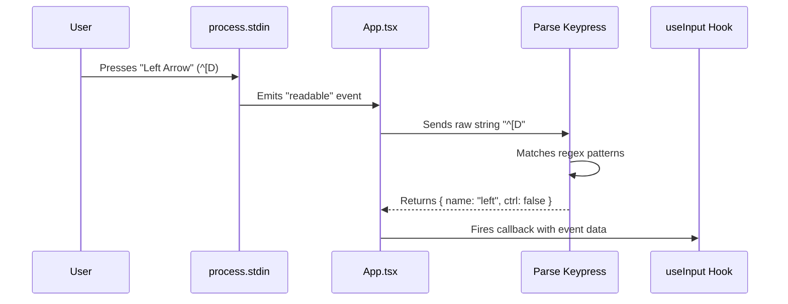

# Chapter 4: Input Processing Pipeline

In the previous chapter, [React Reconciler](03_react_reconciler.md), we learned how Ink updates the DOM when state changes. We can now *output* text to the terminal.

But a CLI tool isn't a movie; it's a conversation. You need to listen to the user.

Whether it's navigating a menu with arrow keys, typing a search query, or clicking with a mouse, Ink needs a way to understand what the user is doing. This is handled by the **Input Processing Pipeline**.

---

## The Motivation: Speaking the Language

Terminals are old technology. When you press a key on your keyboard, the terminal doesn't send a nice JavaScript object like `{ key: "ArrowUp" }`.

Instead, it sends a **Stream of Bytes**.

1.  If you type `a`, it sends the byte `97`.
2.  If you press `Up Arrow`, it sends a sequence of three bytes: `27`, `91`, `65`. In text, that looks like `^[A` (Escape, Bracket, A).

**The Challenge:**
Ink needs to sit between the raw terminal stream and your React component, acting as a translator. It must convert cryptic byte sequences into friendly events.

### The Goal: A Moveable Robot

Let's build a tiny interactive UI. We want to move an "R" (Robot) left and right using the arrow keys.

```text
[ ] [ ] [R] [ ] [ ]
```

---

## 1. Concept: Raw Mode vs. Cooked Mode

By default, terminals operate in **Cooked Mode**. This is what happens when you type a command in bash:
1.  You type text. It appears on screen.
2.  You can use Backspace to fix mistakes.
3.  Nothing is sent to the program until you hit **Enter**.

Ink needs **Raw Mode**.
In Raw Mode:
1.  Keystrokes are not automatically printed.
2.  Input is sent to the program **immediately** (no waiting for Enter).

Ink handles this switch automatically when your app starts.

---

## 2. Using the Abstraction: `useInput`

Ink provides a React hook called `useInput`. This is your main interface for listening to the user.

It gives you two arguments:
1.  `input`: The string character (e.g., "a", "1").
2.  `key`: An object with metadata (e.g., `leftArrow: true`, `ctrl: true`).

### The Robot Implementation

Here is how we solve our "Moveable Robot" use case:

```tsx
import React, { useState } from 'react';
import { useInput, Text } from 'ink';

const Robot = () => {
  const [x, setX] = useState(0);

  useInput((input, key) => {
    if (input === 'q') process.exit(0); // Quit on 'q'

    if (key.leftArrow) {
      setX(prev => Math.max(0, prev - 1));
    }

    if (key.rightArrow) {
      setX(prev => prev + 1);
    }
  });

  return <Text>Position: {x}</Text>;
};
```

**What happens here?**
Every time you press a key, Ink runs your callback. It abstracts away the complex byte parsing so you can just check `key.leftArrow`.

---

## Under the Hood: The Pipeline

How does a byte stream turn into that callback execution? Let's trace the journey of a keystroke.

### The Flow



1.  **Detection:** Node.js detects activity on the Standard Input (`stdin`).
2.  **Reading:** The root `App` component wakes up and reads the chunk.
3.  **Parsing:** The chunk is fed into a tokenizer state machine.
4.  **Dispatch:** Ink broadcasts the result to all active `useInput` hooks.

---

## Deep Dive: `App.tsx` (The Listener)

The `App` component (which we learned about in [Chapter 3](03_react_reconciler.md) as the root of our tree) is responsible for monitoring the input stream.

It sets up a listener on `stdin` when the app mounts.

```typescript
// components/App.tsx (Simplified)
handleReadable = () => {
  let chunk;
  // Read all available data from stdin
  while ((chunk = this.props.stdin.read()) !== null) {
    // Send it to the processing function
    this.processInput(chunk);
  }
};
```

**Explanation:**
This loop grabs every byte currently in the buffer. If you paste a long string, this loop grabs it all at once.

---

## Deep Dive: `parse-keypress.ts` (The Brain)

This is where the magic happens. This file contains a massive dictionary of "Escape Sequences." It uses Regular Expressions (Regex) to identify what the bytes mean.

### Simple Character Parsing

If the input is just a letter, it's easy:

```typescript
// parse-keypress.ts (Simplified)
if (s.length === 1 && s >= 'a' && s <= 'z') {
  return {
    name: s,
    original: s
  };
}
```

### Escape Sequence Parsing

If the input starts with `\x1b` (Escape), things get tricky. The parser checks against known patterns.

```typescript
// parse-keypress.ts (Simplified)

// Regex for "Arrow Keys": ESC [ letter
const ARROW_KEY_RE = /^\x1b\[([A-D])$/;

function parseKeypress(s) {
  if (s.match(ARROW_KEY_RE)) {
    // Map '[A' to 'up', '[B' to 'down', etc.
    return { 
      name: 'up', 
      ctrl: false 
    };
  }
}
```

**Why is this hard?**
Because `Escape` is also a key! If you press the `Esc` key, the computer sends `27`. If you press `Arrow Up`, it sends `27` followed by `[A`. Ink has to wait a few milliseconds to see if more bytes are coming after the `27` to decide if it's the `Esc` key or the start of a special command.

---

## Deep Dive: Mouse Support & Complex Inputs

Ink's parser handles more than just keyboard keys. It also supports **Mouse Events** (clicks, scrolling) and **Paste Events**.

### Mouse Protocols (SGR)

Modern terminals support mouse tracking via "SGR Protocol". When you click, the terminal sends a sequence like:
`\x1b[<0;32;15M`

*   `0`: Left Mouse Button
*   `32`: Column 32
*   `15`: Row 15
*   `M`: Press (vs `m` for Release)

`parse-keypress.ts` decodes this:

```typescript
// parse-keypress.ts (Simplified)
const SGR_MOUSE_RE = /^\x1b\[<(\d+);(\d+);(\d+)([Mm])$/;

if (match = SGR_MOUSE_RE.exec(s)) {
  return {
    kind: 'mouse',
    col: parseInt(match[2]),
    row: parseInt(match[3])
  };
}
```

The `App` component then checks if this click happened on top of a component with an `onClick` handler.

---

## Deep Dive: `useInput.ts` (The Bridge)

Finally, how does the parsed event reach your component? Through the `useInput` hook.

This hook relies on an internal `EventEmitter`. When `App.tsx` processes a key, it emits an `'input'` event.

```typescript
// hooks/use-input.ts (Simplified)
const useInput = (handler) => {
  useEffect(() => {
    // Subscribe to the global input emitter
    internal_eventEmitter.on('input', handler);

    return () => {
      // Unsubscribe when component unmounts
      internal_eventEmitter.removeListener('input', handler);
    };
  }, [handler]);
};
```

**Optimization Note:**
Ink runs these updates inside `discreteUpdates`. This ensures that if you smash the keyboard, React batches the updates together so your CLI doesn't freeze trying to render every single keystroke individually.

---

## Summary

In this chapter, you learned:
*   **Raw Mode:** We must take control of `stdin` to hear individual keystrokes.
*   **Parsing:** Terminal inputs are byte streams. `parse-keypress.ts` decodes ANSI escape sequences into JavaScript objects.
*   **Consumption:** `useInput` connects your React components to this decoded stream.

Now we can **Build** a UI (Components), **Layout** it (Yoga), **Reconcile** updates (React), and **Interact** with it (Input).

The final piece of the puzzle is actually putting the pixels on the screen.

[Next Chapter: Frame Renderer](05_frame_renderer.md)

---

Generated by [Code IQ](https://github.com/adityasoni99/Code-IQ)