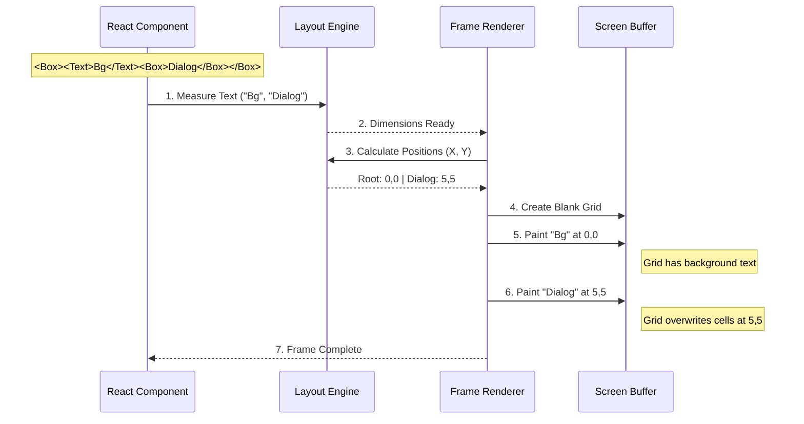

# Chapter 5: Frame Renderer

In the previous chapter, [Input Processing Pipeline](04_input_processing_pipeline.md), we gave our application ears—it can listen to user keystrokes. Before that, in [Ink DOM & Layout Engine](02_ink_dom___layout_engine.md), we gave it a skeleton using Yoga.

But right now, our application is just a ghost. We have a mathematical structure in memory (the Ink DOM) and input events flying around, but we haven't actually **drawn** anything to the terminal yet.

Enter the **Frame Renderer**.

## The Motivation: The Artist

Imagine you are an artist.
1.  **The Subject:** You have a tree of objects (the Ink DOM).
2.  **The Rules:** You have instructions on where they stand (Yoga coordinates).
3.  **The Canvas:** You have a sheet of graph paper (the Terminal).

The Terminal is a strict medium. It is a grid of cells. You cannot draw "half a pixel." You cannot draw a circle. You can only place a specific character (like `a`, `│`, or `█`) into a specific row and column.

 The **Frame Renderer** is responsible for taking the mathematical snapshot of your UI and "painting" it onto that grid.

---

## The Goal: A Pop-up Dialog

To understand rendering, let's look at a case where "painting" matters most: **Overlapping Content**.

We want to render a background, and then "paint" a dialog box on top of it.

```text
Background Text...
Background Text...
┌──────────────┐
│  I am on top │
└──────────────┘
Background Text...
```

To achieve this, the Renderer must respect the order of elements. It must draw the background first, and then draw the box *over* it, replacing the characters underneath.

---

## Concept 1: The Screen Buffer

Browsers paint pixels. Ink paints **Cells**.

A **Screen Buffer** is essentially a big 2D array representing your terminal window.
*   `buffer[0][0]` is the top-left corner.
*   Each cell contains:
    1.  **Char:** The character (e.g., "A").
    2.  **Style:** The color (e.g., Red, Bold).

When the Renderer runs, it doesn't print to the screen immediately. It writes to this invisible grid in memory first. This is called **Double Buffering**.

### Why Double Buffer?
If we printed characters one by one directly to the terminal, the user would see the UI flickering as it builds up. By building the frame in memory and showing it all at once, the UI looks solid and smooth.

---

## Concept 2: The Text Measurement

Before we can paint, we have a "chicken and egg" problem.

1.  To position a Box, Yoga needs to know how big the text inside it is.
2.  To know how big the text is, we need to measure the string.

This is the very first step of rendering.

### `measure-text.ts`

Ink includes a specialized function to measure strings. It isn't as simple as `string.length`.

```typescript
// measure-text.ts (Simplified)
function measureText(text: string, maxWidth: number) {
  // If text is empty, size is 0
  if (text.length === 0) return { width: 0, height: 0 };

  // Calculate width of the longest line
  // Calculate how many lines (height) it takes based on wrapping
  // ... implementation details ...

  return { width, height };
}
```

**What happens here?**
*   It handles **wrapping**: If a line is 20 chars long, but `maxWidth` is 10, the height becomes 2.
*   It handles **newlines**: `\n` increases height.

This function feeds the raw data into the Yoga engine so it can calculate `x` and `y` coordinates.

---

## Concept 3: The Painting Loop

Once Yoga has calculated where everything goes (x, y, width, height), the Renderer iterates through the Ink DOM.

It uses the **Painter's Algorithm**:
1.  Draw the root element (background).
2.  Draw the first child.
3.  Draw the second child (if it overlaps the first, it overwrites those cells).

### The Implementation: `renderer.ts`

The renderer creates a factory function. It takes the current DOM tree and produces a **Frame**.

```typescript
// renderer.ts (Simplified)
export default function createRenderer(node, stylePool) {
  // Reuse the output buffer for performance
  let output; 

  return (options) => {
    const { terminalWidth, terminalRows } = options;

    // 1. Calculate the final Layout (math)
    node.yogaNode.calculateLayout(terminalWidth, terminalRows);

    // 2. Create a blank screen buffer (canvas)
    const screen = createScreen(terminalWidth, height, ...);

    // 3. Paint the nodes onto the screen
    renderNodeToOutput(node, output, { screen });

    // 4. Return the finished picture
    return {
      screen: output.get(), // The filled grid
      cursor: { x: 0, y: 0 } // Where should the cursor be?
    };
  };
}
```

**Beginner Explanation:**
1.  **`calculateLayout`**: The layout engine (Yoga) runs the numbers.
2.  **`createScreen`**: We get a fresh piece of graph paper.
3.  **`renderNodeToOutput`**: This is the heavy lifter. It walks through every `<Box>` and `<Text>`, looks at their calculated X/Y coordinates, and fills in the cells on the graph paper.

---

## The Workflow: From Tree to Grid

Let's visualize the "Pop-up Dialog" example.



---

## Deep Dive: `render-to-screen.ts`

While `renderer.ts` handles the main application loop, Ink also has `render-to-screen.ts`. This is often used for one-off rendering tasks or testing.

It highlights an important detail: **Isolation**.

```typescript
// render-to-screen.ts (Simplified)
export function renderToScreen(element, width) {
  // 1. Create a temporary root node
  const root = createNode('ink-root');
  
  // 2. Run React Reconciler explicitly to build the tree
  reconciler.updateContainerSync(element, container, ...);

  // 3. Trigger Layout
  root.yogaNode.calculateLayout(width);

  // 4. Paint to a fresh screen
  const screen = createScreen(width, height, ...);
  renderNodeToOutput(root, output, { ... });

  return { screen, height };
}
```

**Why look at this?**
It proves that Ink is "headless." It doesn't *need* a real terminal to work. You can render a React component into a string variable in memory. This is exactly how Ink's testing library (`ink-testing-library`) works!

---

## Handling "Clipping"

What happens if you have a Box of width 5, but the text inside is "Hello World" (11 chars)?

The Renderer enforces **Clipping**.
When `renderNodeToOutput` runs, it knows the boundaries of the current Box.

1.  It tries to write "H" at index 0. (Success)
2.  ...
3.  It tries to write "o" at index 4. (Success)
4.  It tries to write " " (space) at index 5. **(Stop!)**

The Renderer checks: `if (currentX > boxRightEdge) return;`.
This ensures your UI doesn't spill out of its containers, keeping your "Pop-up Dialog" neat and tidy.

---

## Summary

In this chapter, we learned:
*   **Text Measurement:** We must measure string size (`measure-text.ts`) before we can calculate layout.
*   **The Screen Buffer:** We paint onto an in-memory grid of cells, not directly to the terminal.
*   **Painter's Algorithm:** We draw from back to front. Later elements (like our Dialog) overwrite earlier elements.
*   **The Result:** The Renderer produces a **Frame**—a complete snapshot of what the terminal should look like right now.

We have a snapshot. But we generated a *new* snapshot 100 milliseconds later. If we just clear the terminal and print the new snapshot, the screen will flash and flicker horribly.

How do we update the screen smoothly, changing *only* the pixels that are different?

[Next Chapter: Output Diffing (LogUpdate)](06_output_diffing__logupdate_.md)

---

Generated by [Code IQ](https://github.com/adityasoni99/Code-IQ)