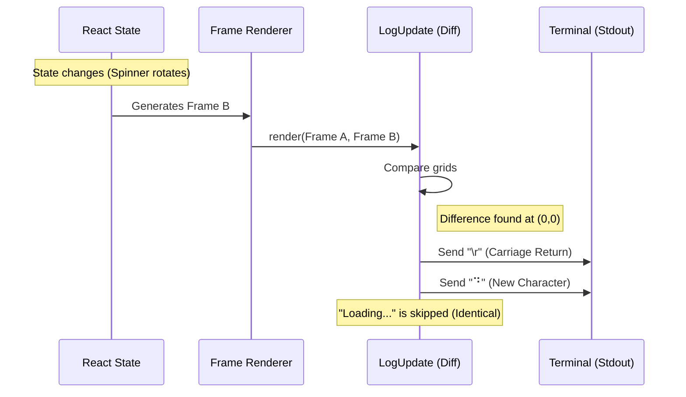

# Chapter 6: Output Diffing (LogUpdate)

In the previous chapter, [Frame Renderer](05_frame_renderer.md), we learned how Ink takes a tree of components and paints them onto an in-memory grid called a **Frame**.

We now have a snapshot of what we *want* the terminal to look like. But there is a problem.

If we simply clear the entire terminal screen and print the new frame every time a state changes (like a spinner rotating), the screen will flash white, text will jump, and the user experience will feel "glitchy." This is known as **Flickering**.

To fix this, Ink uses **Output Diffing** (implemented in `LogUpdate`).

---

## The Motivation: The Surgical Artist

Imagine you are painting a portrait.
*   **The Brute Force Way:** Every time you want to change the eye color, you throw away the canvas, buy a new one, and repaint the entire face from scratch. (This causes flickering).
*   **The Ink Way:** You look at the canvas, see that the nose and mouth are fine, and carefully paint *only* over the eyes.

**Output Diffing** is the process of comparing the **Previous Frame** with the **Next Frame** and generating the minimum list of commands needed to transform one into the other.

### The Use Case: A Spinner

Let's look at a simple loading spinner that rotates every 100ms.

**Frame A:**
```text
⠋ Loading...
```

**Frame B:**
```text
⠙ Loading...
```

Notice that the text " Loading..." didn't change. Only the first character changed from `⠋` to `⠙`.
Ink should figure this out and send a command to the terminal saying: "Go to column 0, row 0. Draw '⠙'. Done."

---

## Concept 1: The Diff

The core logic lives in `log-update.ts`. Its job is to generate a **Diff**.

A Diff is a list of instructions. It might look like this logically:
1.  Move Cursor to X: 5, Y: 2.
2.  Set Color to Green.
3.  Write "Success".
4.  Move Cursor to X: 0, Y: 3.

### Comparing Frames

Ink iterates through every cell of the new grid and compares it to the old grid.

```typescript
// Conceptual Logic
function calculateDiff(prevScreen, nextScreen) {
  const patches = [];

  // Loop through every row (y) and column (x)
  for (let y = 0; y < rows; y++) {
    for (let x = 0; x < columns; x++) {
      
      // If the cell is different...
      if (prevScreen[y][x] !== nextScreen[y][x]) {
        // ...add an instruction to fix it
        patches.push({ type: 'cursorMove', x, y });
        patches.push({ type: 'write', char: nextScreen[y][x] });
      }
    }
  }
  return patches;
}
```

**Explanation:**
This loop ensures we only touch the parts of the screen that actually changed. If 90% of your UI is static (like a border or a title), Ink never rewrites it after the first render.

---

## Concept 2: Cursor Management

Terminals are like typewriters. To write text in the middle of the screen, you have to move the carriage (cursor) there first.

Ink uses **ANSI Escape Codes** to move the cursor.
*   `\x1b[A`: Move Up
*   `\x1b[C`: Move Right

In `log-update.ts`, there is a helper to generate these moves efficiently.

```typescript
// log-update.ts (Simplified)
function moveCursorTo(screen, targetX, targetY) {
  const dx = targetX - screen.cursor.x;
  const dy = targetY - screen.cursor.y;

  // Generate a move instruction
  return { type: 'cursorMove', x: dx, y: dy };
}
```

**Why is this hard?**
Ink has to track where the cursor *currently* is. If we just wrote a character at (5, 5), the cursor is now at (6, 5). If the next change is at (6, 5), we don't need to move the cursor at all! This optimization saves bytes and makes rendering faster.

---

## The Flow: From Frame to Terminal

Let's trace how the "Spinner" updates.



1.  **Render:** The [Frame Renderer](05_frame_renderer.md) produces the new grid.
2.  **Compare:** `LogUpdate` sees that only index 0 changed.
3.  **Patch:** It generates a stream containing a rewind command (`\r`) and the new character.
4.  **Output:** Node.js writes this string to `process.stdout`.

---

## Under the Hood: `log-update.ts`

This file is the final output stage of Ink. Let's look at the real implementation of the diffing loop.

### 1. The Diff Loop (`diffEach`)

Ink uses a helper `diffEach` to iterate efficiently.

```typescript
// log-update.ts (Simplified logic inside render)
diffEach(prev.screen, next.screen, (x, y, removed, added) => {
  // 1. Move the cursor to the location of the change
  moveCursorTo(screen, x, y);

  // 2. If a new cell exists (Update/Create)
  if (added) {
    // Check if color changed and apply codes
    const styleStr = stylePool.transition(currentStyleId, added.styleId);
    
    // Write the actual character
    writeCellWithStyleStr(screen, added, styleStr);
  } 
  // 3. If a cell was removed (Shrink)
  else if (removed) {
    // Overwrite with a space
    writeCellWithStyleStr(screen, { char: ' ' }, '');
  }
});
```

**Explanation:**
*   `moveCursorTo`: Logic to get the typewriter head to the right spot.
*   `stylePool.transition`: Calculates if we need to switch from "Red" to "Blue". It returns ANSI codes like `\x1b[31m`.
*   `writeCell...`: Pushes the character into the output buffer.

### 2. Handling Resizes (`fullResetSequence`)

Sometimes, diffing is too dangerous. If the user resizes the terminal window, the text wraps differently, and our coordinate system (X, Y) becomes invalid.

In this case, Ink creates a "Keyframe" (to use video terminology). It clears the screen and redraws everything.

```typescript
// log-update.ts (Simplified)
if (next.viewport.width !== prev.viewport.width) {
  // If width changed, we can't trust the old coordinates.
  // Force a full re-render.
  return fullResetSequence_CAUSES_FLICKER(next, 'resize', stylePool);
}
```

**Note:** The function name `_CAUSES_FLICKER` is a deliberate warning to developers that this path is expensive and visually jarring, so it's used only when absolutely necessary.

### 3. Outputting the Buffer

Finally, all these small move/write instructions are collected into a `Diff` array. `LogUpdate` joins them into a single string.

```typescript
// log-update.ts (Simplified)
const output = patches.map(p => {
  if (p.type === 'cursorMove') return ansi.cursorMove(p.x, p.y);
  if (p.type === 'stdout') return p.content;
  return '';
}).join('');

process.stdout.write(output);
```

This single `write` call ensures the terminal updates in one "tick," making the animation smooth.

---

## Summary of the Whole Pipeline

Congratulations! You have navigated the entire architecture of Ink.

Let's recap the journey of a single keystroke:

1.  **Input:** User presses `A`. [Input Processing Pipeline](04_input_processing_pipeline.md) detects it.
2.  **React:** `useInput` fires, updating React state (`setText("A")`).
3.  **Reconciler:** React calls the [Reconciler](03_react_reconciler.md) to update the [Ink DOM](02_ink_dom___layout_engine.md).
4.  **Layout:** Yoga recalculates the positions of your `<Box>` elements.
5.  **Render:** The [Frame Renderer](05_frame_renderer.md) paints the DOM onto a grid in memory.
6.  **Diff:** **LogUpdate** compares the new grid to the old one.
7.  **Output:** Ink writes `\x1b[C A` to the terminal.

The user sees the letter `A` appear instantly, unaware of the massive amount of engineering that ensured it appeared in exactly the right box, with the right color, without flickering.

**This concludes the Ink Architecture Tutorial.**
You now possess the knowledge to build, debug, and contribute to complex terminal interfaces. Happy hacking!

---

Generated by [Code IQ](https://github.com/adityasoni99/Code-IQ)