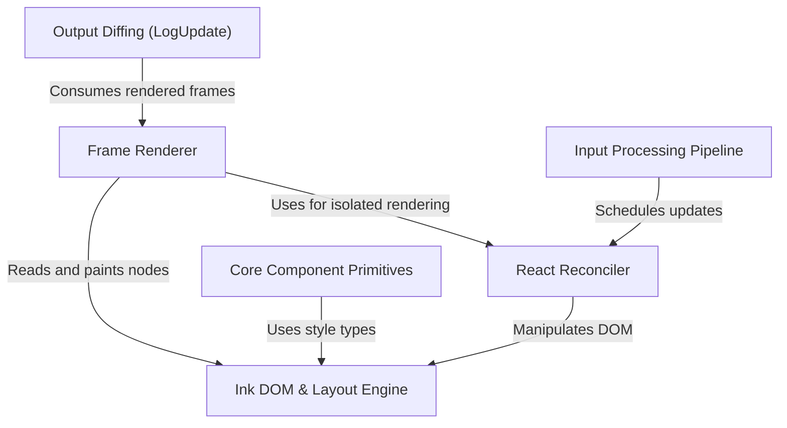

# Tutorial: ink

Ink is a library for building **interactive command-line interfaces** using **React**. It mirrors the browser environment by providing a custom **DOM** (powered by the Yoga layout engine), a **Reconciler** to translate React state into terminal operations, and a specialized **Renderer** that paints the UI to `stdout` using efficient **diffing** to ensure high performance and prevent flickering.

## Chapters

1. [Core Component Primitives](01_core_component_primitives.md)
2. [Ink DOM & Layout Engine](02_ink_dom___layout_engine.md)
3. [React Reconciler](03_react_reconciler.md)
4. [Input Processing Pipeline](04_input_processing_pipeline.md)
5. [Frame Renderer](05_frame_renderer.md)
6. [Output Diffing (LogUpdate)](06_output_diffing__logupdate_.md)

---

Generated by [Code IQ](https://github.com/adityasoni99/Code-IQ)