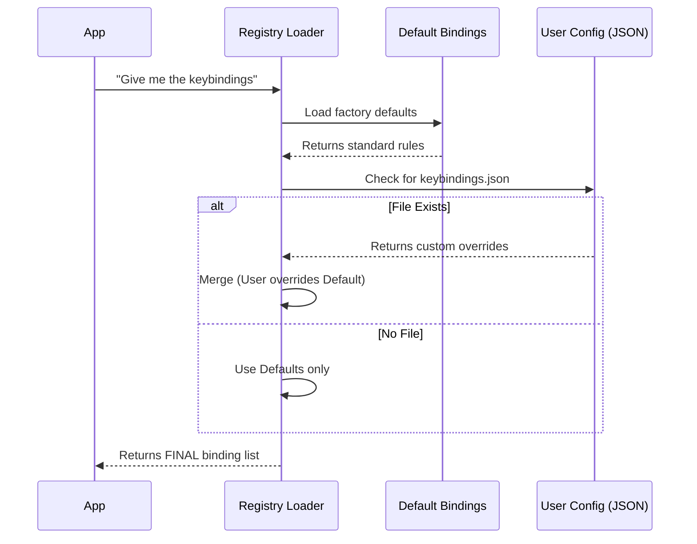

# Chapter 1: The Keybinding Registry

Welcome to the **Keybindings** project!

Imagine you are building a complex video game. You have hundreds of possible moves: jumping, shooting, opening a map, or checking your inventory.

You *could* hardcode these checks all over your code:
`if (event.key === 'Space') jump()`

But what happens when:
1.  You want "Space" to *select* items when the Inventory is open, not jump?
2.  A user wants to change "Jump" to the "W" key?

Hardcoding keys creates a mess. Instead, we use a central **Keybinding Registry**.

## What is the Registry?

The Keybinding Registry is the "database" or "rulebook" of our system. It separates **Intent** (what the user wants to do) from **Input** (which button they pressed).

It handles three main jobs:
1.  **Defining Valid Actions:** A list of every possible move (e.g., `chat:submit`).
2.  **Defining Contexts:** Where those moves are allowed (e.g., `Global` vs `Autocomplete`).
3.  **Merging Configurations:** Taking the factory defaults and overlaying user customizations.

### Core Concept: Actions and Contexts

Before we bind a key, we need to know *what* we are binding. We use unique ID strings for this.

**Actions** are namespaced strings that describe the behavior:
*   `chat:submit`: Send the message.
*   `history:previous`: Go back in command history.
*   `app:exit`: Close the application.

**Contexts** describe the "state" of the app:
*   `Global`: Works everywhere.
*   `Chat`: Works only when typing in the input box.
*   `Confirmation`: Works only when a Yes/No dialog is open.

Here is how we define these in `schema.ts`:

```typescript
// From schema.ts
// A list of places where keybindings can exist
export const KEYBINDING_CONTEXTS = [
  'Global',
  'Chat',
  'Autocomplete',
  'Settings',
  // ... many others
] as const
```

*Explanation:* This defines the "rooms" in our application. If you are in the `Settings` room, the rules might be different than in the `Chat` room.

## The Default Configuration

The application comes with a built-in rulebook called `DEFAULT_BINDINGS`. This is a TypeScript object that maps keys to actions.

Here is what the "Global" default bindings look like:

```typescript
// From defaultBindings.ts
export const DEFAULT_BINDINGS: KeybindingBlock[] = [
  {
    context: 'Global',
    bindings: {
      'ctrl+c': 'app:interrupt', // Stop the current task
      'ctrl+d': 'app:exit',      // Close the app
      'ctrl+l': 'app:redraw',    // Clear/redraw screen
      'ctrl+r': 'history:search' // Search past commands
    },
  },
  // ... other contexts
]
```

*Explanation:* This is the factory setting. If a user installs the app and never touches a configuration file, `ctrl+c` will always trigger the `app:interrupt` action because of this block.

## How Loading Works: The Merge Strategy

The most powerful feature of the Registry is **Prioritization**.

We don't just load the defaults. We also check if the user has created a `keybindings.json` file in their configuration folder. If they have, the Registry merges the two, giving the user's file priority.

### The Flow of Data

Here is how the Registry builds the final rulebook when the app starts:



### Implementation: Loading the Data

Let's look at how the code handles this logic in `loadUserBindings.ts`.

First, we load the defaults we saw earlier:

```typescript
// From loadUserBindings.ts
function getDefaultParsedBindings(): ParsedBinding[] {
  // Parse the TypeScript object into a standardized format
  return parseBindings(DEFAULT_BINDINGS)
}
```

Next, the loader tries to find the user's file. If it finds it, it parses it. Then comes the most important line: **The Merge**.

```typescript
// Inside loadKeybindings() function
const defaultBindings = getDefaultParsedBindings()
const userParsed = parseBindings(userBlocks) // Loaded from JSON

// User bindings come AFTER defaults, so they override them
const mergedBindings = [...defaultBindings, ...userParsed]

return { bindings: mergedBindings, warnings: [] }
```

*Explanation:* By using the spread syntax `[...defaultBindings, ...userParsed]`, we create a new list. If the user defines `ctrl+c` in their file, it appears *later* in this list. When the system looks for a match later, it will find the user's preference and use that instead of the default.

## Safety and Validation

The Registry is also the "Security Guard". Since users are writing JSON files manually, they might make mistakes (like typing "Cht" instead of "Chat").

We use a library called **Zod** to validate the data structure.

```typescript
// From schema.ts
export const KeybindingBlockSchema = lazySchema(() =>
  z.object({
    context: z.enum(KEYBINDING_CONTEXTS), // Must be one of our valid contexts
    bindings: z.record(
      z.string(), // The key pattern (e.g. "ctrl+k")
      z.union([z.enum(KEYBINDING_ACTIONS), z.null()]) // The action name
    ),
  })
)
```

*Explanation:* This schema ensures that:
1.  The `context` is a real place in the app (like "Chat").
2.  The `action` is a real thing the app can do (like "app:exit").
3.  If the user makes a typo, the Registry can generate a friendly error message instead of crashing the app.

## Conclusion

The Keybinding Registry is the foundation of our input system. It acts as the single source of truth that tells the application: *"If the user presses **X** while looking at **Y**, trigger action **Z**."*

By separating the **Definitions** (Defaults) from the **Overrides** (User JSON), we allow the application to be flexible and customizable without changing the source code.

In the next chapter, we will look at how to actually *use* these bindings inside our UI components using React.

[Next: React Integration Hooks](02_react_integration_hooks.md)

---

Generated by [Code IQ](https://github.com/adityasoni99/Code-IQ)