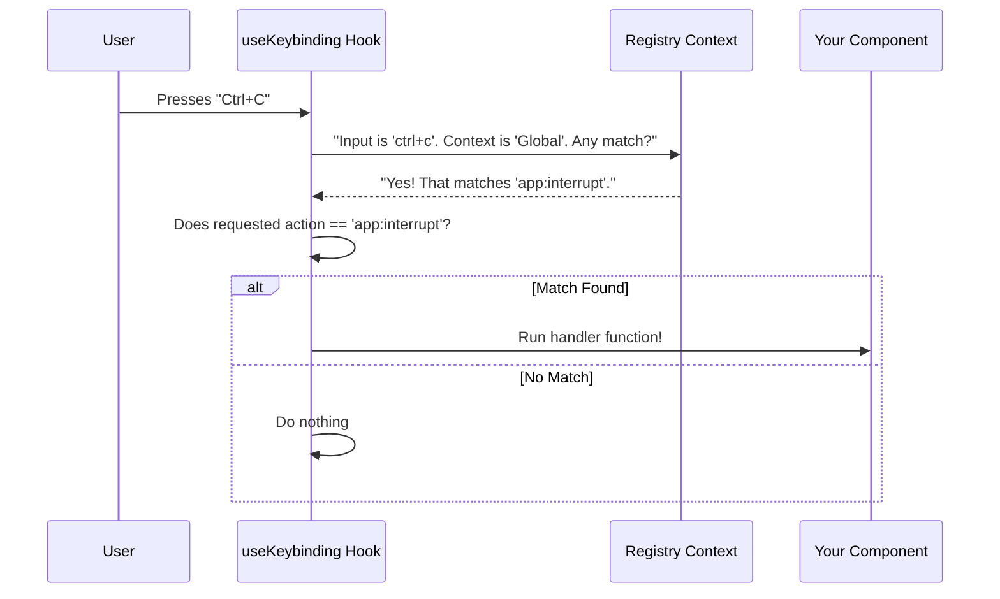

# Chapter 2: React Integration Hooks

In the previous chapter, [The Keybinding Registry](01_the_keybinding_registry.md), we built our "rulebook." We defined valid actions (like `app:save`) and loaded user configurations.

But a rulebook sitting on a shelf doesn't actually *do* anything. We need a way to connect those rules to our React components.

This chapter introduces the **React Integration Hooks**—the bridge between the static registry and your living, breathing UI.

## The Motivation: Decoupling Intent from Input

Imagine you are building a "Save" button.

**The Old Way (Hardcoded):**
You might write code that specifically listens for `Ctrl+S`.

```typescript
// ❌ Bad: Hardcoded physical key
useInput((input, key) => {
  if (key.ctrl && input === 's') {
    saveDocument();
  }
});
```

**The Problem:**
1.  What if the user wants to change "Save" to `F2`? Your component is broken.
2.  What if `Ctrl+S` is already used by another feature in a different context?

**The New Way (Intent-Based):**
We stop caring *which* key was pressed. We only care *what* action happened.

```typescript
// ✅ Good: Listening for the "Action"
useKeybinding('file:save', () => {
  saveDocument();
});
```

Now, the component doesn't know that `file:save` is bound to `Ctrl+S`. It just knows "When the user wants to save, run this function."

## Core Hook 1: `useKeybinding`

This is the workhorse of the system. It listens for a specific **Action** and triggers a **Handler**.

### Basic Usage

Let's say we want to toggle a "Help" modal when the user triggers `app:toggleHelp`.

```typescript
import { useKeybinding } from './hooks/useKeybinding';

function HelpModal() {
  const [isOpen, setIsOpen] = useState(false);

  // When 'app:toggleHelp' fires, toggle the state
  useKeybinding('app:toggleHelp', () => {
    setIsOpen(prev => !prev);
  });

  return isOpen ? <Text>Help Content...</Text> : null;
}
```

*Explanation:* This hook automatically connects to the Registry. It listens to every keystroke, asks the Registry "Does this match `app:toggleHelp`?", and if yes, runs your arrow function.

### Specifying Context

In [The Keybinding Registry](01_the_keybinding_registry.md), we learned about contexts (rooms) like `Global` or `Chat`. You can tell the hook which context this binding belongs to.

```typescript
useKeybinding('chat:submit', sendMessage, {
  context: 'Chat', // Only works if 'Chat' is active
});
```

*Explanation:* If the user presses `Enter` (usually bound to `chat:submit`), this handler will only fire if the application considers the `Chat` context to be active.

## Core Hook 2: `useKeybindings` (Plural)

Sometimes a component handles many actions. Instead of calling `useKeybinding` five times, you can use the plural version.

This is very useful for components like a List View, which might handle navigation, selection, and deletion all at once.

```typescript
useKeybindings({
  'list:up': () => moveCursor(-1),
  'list:down': () => moveCursor(1),
  'list:select': () => selectItem(),
  'list:delete': () => deleteItem(),
}, { context: 'ListView' });
```

*Explanation:* This keeps your code clean. It registers all these handlers efficiently in one go.

## Core Hook 3: `useShortcutDisplay`

If `Ctrl+S` saves the file, how does the user *know* that? We need to display the shortcut in the UI (e.g., on a button label).

Since users can remap keys, we cannot hardcode the text "Ctrl+S" in our UI. We must ask the Registry what the current binding is.

```typescript
function SaveButton() {
  // Ask: What keys trigger 'file:save'?
  // If nothing is bound, fall back to 'Ctrl+S' text.
  const shortcut = useShortcutDisplay('file:save', 'Global', 'Ctrl+S');

  // Renders: "Save (Ctrl+S)" or "Save (F2)" depending on config
  return <Text>Save ({shortcut})</Text>;
}
```

*Explanation:* This ensures your UI instructions never lie to the user. If they remap `file:save` to `F2` in their JSON config, this button will immediately update to say "Save (F2)".

## Under the Hood

How do these hooks actually work? They act as a **Middleman** between React's input system (Ink) and our Registry.

### The Flow of an Event

When you press a key, the `useKeybinding` hook doesn't just check `if (key === 'a')`. It performs a resolution lookup.



### Internal Implementation

Let's look at a simplified version of `useKeybinding.ts`.

It relies on `useInput` (from the Ink library) to catch raw keystrokes, and a Context Provider (which we will cover in the next chapter) to find matches.

```typescript
// Simplified usage logic from useKeybinding.ts
export function useKeybinding(action, handler, options) {
  const context = useOptionalKeybindingContext() // Access the Registry

  // Ink's hook to catch raw input
  useInput((input, key, event) => {

    // 1. Ask the Registry to resolve the input
    const result = context.resolve(input, key, [options.context])

    // 2. Check if the result matches the Action we are listening for
    if (result.type === 'match' && result.action === action) {
      
      // 3. Run the user's code
      handler()
      
      // 4. Stop others from hearing this key
      event.stopImmediatePropagation()
    }
  })
}
```

*Explanation:*
1.  **Dependency Injection:** It grabs the Registry via `useOptionalKeybindingContext`. This makes the hook testable and flexible.
2.  **Resolution:** It delegates the complex logic (checking user configs, defaults, chords) to the Registry's `resolve` function.
3.  **Safety:** It only runs the handler if the registry confirms a match.

## Summary

The **React Integration Hooks** allow us to write clean, intent-based UI components.

1.  **`useKeybinding`**: Listens for a specific action (e.g., `app:save`) instead of a physical key.
2.  **`useKeybindings`**: Groups multiple related actions together.
3.  **`useShortcutDisplay`**: dynamic text labels that update if the user changes their key config.

We briefly mentioned that the hook sends a list of contexts to the registry. But how does the system know which contexts are currently *active*? How do we handle overlapping contexts (like a Global shortcut vs. a Modal shortcut)?

We will answer that in the next chapter.

[Next: Context-Aware Resolution](03_context_aware_resolution.md)

---

Generated by [Code IQ](https://github.com/adityasoni99/Code-IQ)