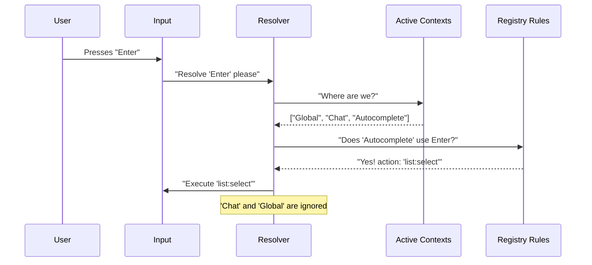

# Chapter 3: Context-Aware Resolution

In the previous chapter, [React Integration Hooks](02_react_integration_hooks.md), we learned how to make our components listen for actions like `app:save`.

However, we glazed over a massive problem.

Imagine your application has a **Global** shortcut: pressing `Enter` opens a "Quick Command" bar.
But your application also has a **Chat** window. When the user types a message and hits `Enter`, they expect to *send the message*, not open the Quick Command bar.

If both listeners are active, which one wins?

This is where **Context-Aware Resolution** comes in. It acts as the "Traffic Controller" of your input system.

## The Motivation: The "Enter" Dilemma

We cannot simply list every keybinding in one giant list. Key meanings change depending on where the user is looking.

Consider this hierarchy of needs for the `Enter` key:

1.  **Autocomplete Dropdown:** `Enter` selects the highlighted suggestion.
2.  **Chat Input:** `Enter` sends the message.
3.  **Global App:** `Enter` opens the command palette.

If the Autocomplete dropdown is open, it should "steal" the input. If it closes, the Chat input should get it. If the user clicks away from the chat, the Global app should get it.

## The Mental Model: Layers of Tracing Paper

Think of your application contexts as sheets of transparent tracing paper stacked on top of each other.

1.  **Bottom Layer (Global):** Has rules written on it (e.g., `Ctrl+C` = Quit).
2.  **Middle Layer (Chat):** Placed on top when the user enters chat. It has its own rules.
3.  **Top Layer (Dropdown):** Placed on top when a menu opens.

When a key is pressed, we look at the **Top Layer** first.
*   If that layer has a rule for the key, **it wins**. The layers below never see it.
*   If that layer is blank for that key, we look through to the **Middle Layer**.
*   If that layer is also blank, we look at the **Bottom Layer**.

## Registering Active Contexts

How does the system know which layers are currently on the stack?

We use a hook called `useRegisterKeybindingContext`. When a component mounts (appears on screen), it registers its name. When it unmounts, it removes it.

### Example: The Chat Component

```typescript
// Inside ChatComponent.tsx
import { useRegisterKeybindingContext } from './hooks';

function ChatComponent() {
  // 1. Tell the system: "The 'Chat' layer is now active!"
  useRegisterKeybindingContext('Chat');

  return <InputBox />;
}
```

*Explanation:* As long as `<ChatComponent />` is rendered, the system adds `'Chat'` to the list of active contexts. Any keybinding defined in the "Chat" section of our registry now takes priority over "Global".

### Example: The Autocomplete Component

```typescript
function Autocomplete() {
  // 1. This layer sits on top of Chat
  useRegisterKeybindingContext('Autocomplete');

  // 2. Define bindings specific to this dropdown
  useKeybindings({
    'list:select': selectItem, // Bound to 'Enter'
  }, { context: 'Autocomplete' });

  return <List />;
}
```

*Explanation:* If this component appears *inside* the Chat component, both contexts are active. But typically, the logic checks specific context matches before general ones.

## How Resolution Works: The Logic

When a key is pressed, the **Resolver** function takes over. It doesn't just look for a match; it looks for the *best* match based on what is active.

### The Flow of Decision Making



## Internal Implementation

Let's look under the hood at `resolver.ts`. The core function is `resolveKey`.

It filters the entire rulebook down to only the rules that apply to the current situation.

### Step 1: Filter by Active Contexts

First, we ignore any rules belonging to contexts that aren't currently active (like "Settings" or "Map").

```typescript
// From resolver.ts (Simplified)
const ctxSet = new Set(activeContexts); // e.g. {'Global', 'Chat'}

// Only keep bindings that belong to active rooms
const relevantBindings = allBindings.filter(b => 
  ctxSet.has(b.context)
);
```

### Step 2: Find the Match

Now we iterate through the relevant bindings. Because of how we load data (User Configs > Defaults), and how we structure context priority, the last matching binding usually wins.

```typescript
// From resolver.ts (Simplified)
function resolveKey(input, key, activeContexts, bindings) {
  let match = undefined;

  for (const binding of bindings) {
    // 1. Skip if this binding is for an inactive context
    if (!activeContexts.includes(binding.context)) continue;

    // 2. Check if the physical keys match (e.g. "Enter")
    if (matchesBinding(input, key, binding)) {
      match = binding; // Found a candidate!
    }
  }

  // Return the last found match (highest priority)
  return match ? { type: 'match', action: match.action } : { type: 'none' };
}
```

*Explanation:* This function is "stateless". It just takes the current inputs and the list of contexts and returns an answer. This makes it very easy to test.

## Shadowing and Unbinding

A powerful side effect of this system is **Shadowing**.

If you want to disable a Global shortcut while in a specific mode, you can simply bind that key to `null` (or a no-op action) in the higher-priority context.

**Scenario:** `Ctrl+F` searches globally. But in the "Game" context, we want `Ctrl+F` to do nothing so the user doesn't accidentally open a search bar while playing.

**Configuration:**
1.  **Global:** `Ctrl+F` -> `app:search`
2.  **Game:** `Ctrl+F` -> `null`

When the Resolver sees the "Game" context is active, it finds the `null` binding. It stops there and tells the system "This key is handled (by doing nothing)." It never reaches the Global `app:search`.

## Summary

**Context-Aware Resolution** transforms a messy list of `if/else` statements into a clean, layered system.

1.  **Contexts** are layers (Global, Chat, Modal).
2.  **Components** report when they are active using `useRegisterKeybindingContext`.
3.  **The Resolver** checks the top layer first. If it finds a match, it stops.

This ensures that your application always behaves predictably, even when the same key is used for different things in different places.

So far, we have only talked about pressing **one** key at a time. But what if we want to support sequences like `G` then `I` (Go to Inbox) or `Ctrl+K` then `Ctrl+S`?

That requires memory. That requires **Chord Sequence Management**.

[Next: Chord Sequence Management](04_chord_sequence_management.md)

---

Generated by [Code IQ](https://github.com/adityasoni99/Code-IQ)