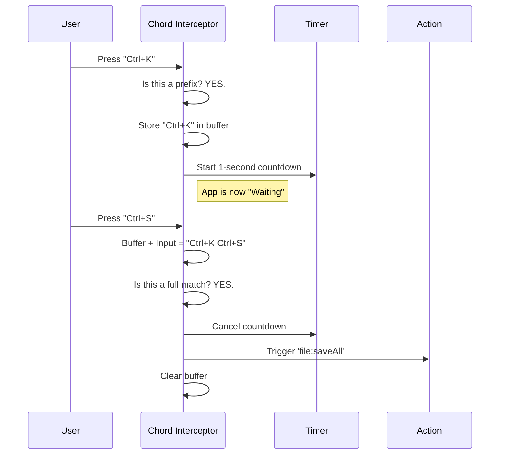

# Chapter 4: Chord Sequence Management

In the previous chapter, [Context-Aware Resolution](03_context_aware_resolution.md), we learned how to handle the same key doing different things in different "rooms" (contexts) of our app.

But what if we run out of keys? There are only so many keys on a keyboard, and `Ctrl`, `Alt`, and `Shift` can only take us so far.

Professional applications (like VS Code or Sublime Text) solve this with **Chords**. These are key sequences—like a "secret handshake"—where you press one combination, release it, and immediately press another.

This chapter explains how the **Keybindings** project manages these complex sequences.

## The Motivation: The "Waiting" Problem

Let's look at a classic example from text editors:
1.  **`Ctrl+K`**: Usually deletes the current line.
2.  **`Ctrl+K` then `Ctrl+S`**: Saves all files.

Here is the problem: When the user presses `Ctrl+K`, what should the application do?
*   Should it delete the line immediately?
*   Or should it wait to see if the user presses `Ctrl+S` next?

If it waits, how long should it wait? If the user falls asleep after pressing `Ctrl+K`, we don't want the app to be frozen forever.

This requires **State Management**. The application needs a temporary "Waiting Room" for incomplete key sequences.

## Defining Chords

In our system, defining a chord is incredibly simple. You just separate the keystrokes with a space in your definition string.

```typescript
// inside defaultBindings.ts
{
  // A two-step sequence
  'ctrl+k ctrl+s': 'file:saveAll',
  
  // A standard single key
  'ctrl+s': 'file:save'
}
```

*Explanation:* The Registry parses this string and realizes: "This isn't just one key; it's a list of keys that must happen in order."

## How It Works: The State Machine

To handle chords, we introduce a piece of state called `pendingChord`.

1.  **State: `null`** (Normal) -> User presses `Ctrl+K`.
2.  **System:** Checks bindings. "Wait! `Ctrl+K` is the start of `Ctrl+K Ctrl+S`!"
3.  **Action:** Enter **Chord Mode**. Set `pendingChord = ['ctrl+k']`. Start a timer.
4.  **State: `['ctrl+k']`** (Waiting) -> User presses `Ctrl+S`.
5.  **System:** Checks bindings. "`['ctrl+k', 'ctrl+s']` matches `file:saveAll`!"
6.  **Action:** Fire `file:saveAll`. Reset state to `null`.

### Visualizing the Flow

Here is what happens when a user successfully triggers a chord.



## The Interceptor Component

React hooks like `useInput` (from Ink) usually bubble events *up* or handle them in order of registration. To make chords work, we need to catch keys **before** anyone else sees them.

We use a component called `<ChordInterceptor />`. It sits at the very top of our application tree.

```tsx
// Inside KeybindingProviderSetup.tsx

function ChordInterceptor({ bindings, pendingChordRef, setPendingChord }) {
  // This hook runs BEFORE your specific component hooks
  useInput((input, key, event) => {
    
    // Check if the input is part of a chord
    const result = resolveKeyWithChordState(
      input, key, bindings, pendingChordRef.current
    );

    if (result.type === 'chord_started') {
      // 1. Enter waiting mode
      setPendingChord(result.pending);
      
      // 2. IMPORTANT: Don't let the Chat box see this letter!
      event.stopImmediatePropagation();
    }
  });
  
  return null; // This component renders nothing
}
```

*Explanation:*
1.  **`resolveKeyWithChordState`**: This is the brain. It checks if the current key combined with the history matches anything.
2.  **`event.stopImmediatePropagation()`**: This is the shield. If we are in the middle of a chord, we swallow the key event so it doesn't get typed into a text box or trigger other listeners.

## Handling Timeouts

What if the user presses `Ctrl+K` and then changes their mind? We can't leave the app in "Waiting Mode" forever, or the next key they press will be interpreted incorrectly.

We use a 1-second timer (1000ms).

```typescript
// Inside KeybindingProviderSetup.tsx

const setPendingChord = (pendingKeys) => {
  // 1. Clear any existing timer
  clearTimeout(timerRef.current);

  if (pendingKeys !== null) {
    // 2. Start a new timer
    timerRef.current = setTimeout(() => {
      // 3. Time's up! Reset everything.
      console.log('Chord timed out');
      setPendingChordState(null); 
    }, 1000); // 1 second
  }
  
  // Update state
  setPendingChordState(pendingKeys);
};
```

*Explanation:* Every time a key is added to the chord, we restart the timer. If 1 second passes with no input, we "give up" and reset the state to `null`.

## Resolving Conflicts (Shadowing)

A common question is: *What if I have `Ctrl+K` bound to "Delete Line" AND `Ctrl+K Ctrl+S` bound to "Save All"?*

The logic in `resolver.ts` prioritizes the **Longest Match**.

1.  User presses `Ctrl+K`.
2.  Registry sees a match for `Ctrl+K` (Delete).
3.  Registry *also* sees that `Ctrl+K` is a **prefix** for a longer chord (`Ctrl+K Ctrl+S`).
4.  **Decision:** The potential for a longer chord wins. The app enters "Waiting Mode" and the "Delete Line" action is skipped.

This means you cannot have an action fire immediately on `Ctrl+K` *and* have it be the start of a sequence. The sequence "shadows" the single key.

## Summary

**Chord Sequence Management** allows us to create complex, professional-grade shortcuts.

1.  **State:** We store incomplete sequences in `pendingChord`.
2.  **Interception:** We capture keys at the top level to prevent accidental input.
3.  **Timeouts:** We auto-cancel the sequence if the user hesitates too long.
4.  **Resolution:** We check if the current key is a prefix for a longer sequence.

Now that we understand how to handle complex sequences and contexts, we need to understand how the system actually knows that "Control" and "k" were pressed.

How do we turn raw terminal data into structured objects like `{ key: 'k', ctrl: true }`?

[Next: Input Parsing & Matching](05_input_parsing___matching.md)

---

Generated by [Code IQ](https://github.com/adityasoni99/Code-IQ)