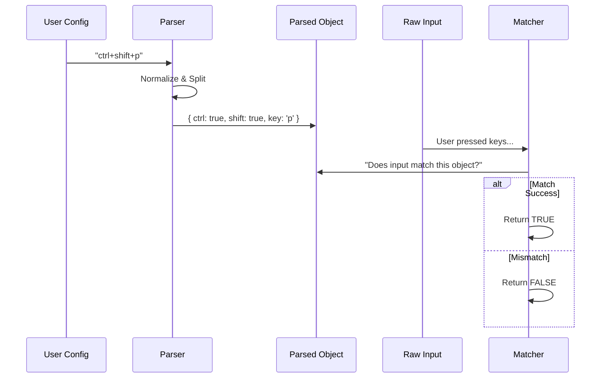

# Chapter 5: Input Parsing & Matching

In the previous chapter, [Chord Sequence Management](04_chord_sequence_management.md), we built a system that can "wait" for complex sequences like `Ctrl+K Ctrl+S`.

But we glossed over a fundamental question: **How does the computer know that "Ctrl+K" is the same thing as "control+k"?**

Terminals are messy. Windows, macOS, and Linux all send slightly different signals. Users write configurations in different styles (e.g., "Cmd+S" vs "Super+S").

This chapter introduces the **Parser** and the **Matcher**. They act as the "Universal Translator" for our system, converting messy inputs into a strict, standardized language.

## The Motivation: The "Language Barrier"

Imagine you are writing a `keybindings.json` file. You want to bind the "Escape" key.

*   User A writes: `"Esc": "app:close"`
*   User B writes: `"escape": "app:close"`
*   User C writes: `"ESC": "app:close"`

If we compare these strings directly against the raw signal from the terminal, the system will break. We need to normalize all these variations into a single, consistent object that our code can understand.

## Concept 1: The Parser (Standardizing Intent)

The **Parser** takes the string a user types (like `"ctrl+shift+k"`) and turns it into a `ParsedKeystroke` object.

This object is the "Truth." It doesn't care if you typed "control" or "ctrl"; the object will always look the same.

### How it looks

If a user configures: `"Cmd+Shift+P"`

The Parser converts it to:
```typescript
{
  key: 'p',
  ctrl: false,
  shift: true,  // 'Shift' was detected
  alt: false,
  super: true   // 'Cmd' becomes 'super' internally
}
```

### Handling Aliases

The parser handles synonyms automatically. This allows your app to support users coming from different operating systems without changing your code.

*   `"opt"` = `"alt"`
*   `"cmd"` = `"super"`
*   `"win"` = `"super"`
*   `"return"` = `"enter"`

### Using the Parser

Here is how we use the `parseKeystroke` function from our `parser.ts` file:

```typescript
import { parseKeystroke } from './parser';

const userString = "Ctrl+Alt+Delete";
const normalized = parseKeystroke(userString);

console.log(normalized);
// Output: { key: 'delete', ctrl: true, alt: true, ... }
```

## Concept 2: The Matcher (Comparing Reality)

Once we have a clean object representing the **Rule**, we need to compare it to the **Reality** (what the user actually pressed).

We use a library called **Ink**, which gives us a `Key` object every time a button is pressed. The **Matcher** compares the *Ink Key* against our *Parsed Object*.

### The Matching Logic

Matching isn't just `a === b`. We have to check every modifier explicitly.

If the Rule is `Ctrl+C`:
1.  Is the `Ctrl` button held down? **Yes.**
2.  Is the `Shift` button held down? **No.** (Ideally, it *shouldn't* be).
3.  Is the key pressed `c`? **Yes.**

If the user presses `Ctrl+Shift+C`, the match fails because `Shift` was pressed but wasn't asked for.

## Internal Implementation

Let's look at how the data flows from the configuration file to the final decision.



### Parsing Logic (parser.ts)

The parser splits the string by the `+` symbol and switches over the parts. Here is a simplified version of `parseKeystroke`:

```typescript
// From parser.ts
export function parseKeystroke(input: string) {
  const parts = input.split('+');
  const result = { ctrl: false, shift: false, key: '' /*...*/ };

  for (const part of parts) {
    const lower = part.toLowerCase();
    
    // Map aliases to internal boolean flags
    if (lower === 'ctrl' || lower === 'control') result.ctrl = true;
    else if (lower === 'shift') result.shift = true;
    else result.key = lower; // It's the letter (e.g., "a")
  }
  return result;
}
```

*Explanation:* This function loops through every part of the string "ctrl+shift+a". If it sees "ctrl", it flips the `ctrl` switch to `true`. Anything that isn't a modifier is assumed to be the main key (like "a").

### Matching Logic (match.ts)

The matcher takes the object we created above and checks it against the input.

```typescript
// From match.ts
function modifiersMatch(inkMods, target) {
  // 1. Check if Ctrl matches
  if (inkMods.ctrl !== target.ctrl) return false;

  // 2. Check if Shift matches
  if (inkMods.shift !== target.shift) return false;

  // 3. Check if Alt matches
  if (inkMods.alt !== target.alt) return false;

  return true; // Everything matches!
}
```

*Explanation:* This is a strict check. If the rule requires `Ctrl` to be **off** (`target.ctrl` is false), but the user is holding it **on**, the function returns `false`. This ensures `Ctrl+C` doesn't accidentally trigger `C` or `Shift+C`.

### The "Meta" vs "Alt" Quirk

Terminals have a confusing history. On modern Macs, the "Option" key is `Alt`. But in terminal speak, `Alt` is often called `Meta`.

To make life easier, our system treats them as the same thing in the logic, but allows specific display names for the UI.

```typescript
// From match.ts
// Ink (the library) sets key.meta when Alt is pressed.
// So we check if EITHER alt OR meta is required by the config.
const targetNeedsMeta = target.alt || target.meta;

if (inkMods.meta !== targetNeedsMeta) return false;
```

## Formatting for Display

We don't just read inputs; we also have to show them to the user (e.g., "Press Ctrl+S to save").

The parser includes a helper called `keystrokeToDisplayString`. It converts our internal objects back into human-readable strings, adapting to the user's OS.

```typescript
// Example usage in a React component
const binding = { ctrl: true, alt: true, key: 's' };

// On Mac: Renders "ctrl+opt+s"
// On Windows: Renders "ctrl+alt+s"
const label = keystrokeToDisplayString(binding, platform);
```

This ensures your application feels native on every platform.

## Summary

The **Parsing & Matching** layer is the invisible bridge between user configuration and application logic.

1.  **Parsing:** Converts messy strings (`"Cmd+S"`) into clean objects (`{ super: true, key: 's' }`).
2.  **Normalization:** Handles aliases so `"Esc"` and `"Escape"` mean the same thing.
3.  **Matching:** Strictly compares the configuration against the physical keys pressed.

We have now covered the Registry, React Hooks, Contexts, Chords, and Input Parsing. The system works!

But... what if the user makes a mistake in their `keybindings.json`? What if they try to bind a key to an action that doesn't exist? We need to protect the app from crashing.

[Next: Safety & Validation](06_safety___validation.md)

---

Generated by [Code IQ](https://github.com/adityasoni99/Code-IQ)