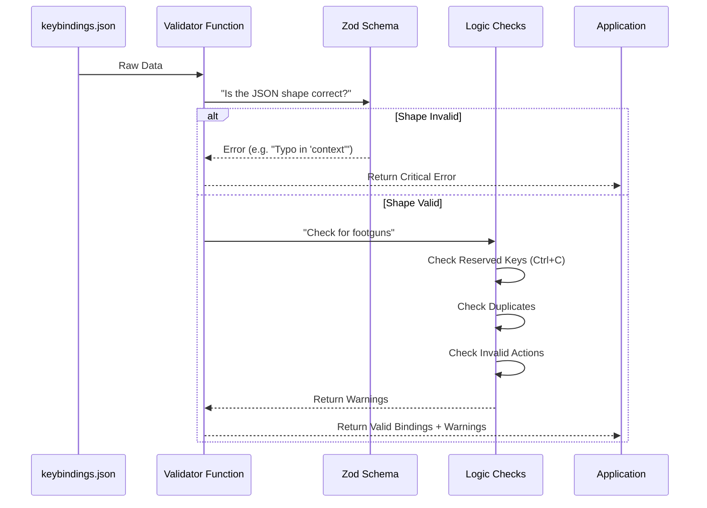

# Chapter 6: Safety & Validation

In the previous chapter, [Input Parsing & Matching](05_input_parsing___matching.md), we learned how to translate messy human input (like "Ctrl+S") into structured data the computer understands.

But just because we *can* understand what the user typed, doesn't mean we should *allow* it.

What if a user:
1.  Misspells a context: `"contex": "Global"`?
2.  Tries to override **Ctrl+C** (the only way to kill a frozen app)?
3.  Assigns two different actions to the exact same key?

If we don't catch these errors, the application could crash, become unusable, or simply confuse the user.

This chapter covers **Safety & Validation**: the guard rails that keep the system stable while still allowing customization.

## The Motivation: The "Footgun" Problem

In software development, a "footgun" is a feature that makes it easy for users to accidentally shoot themselves in the foot. Keybindings are a massive footgun.

Imagine a user writes this configuration:

```json
[
  {
    "context": "Global",
    "bindings": {
      "enter": "app:exit" 
    }
  }
]
```

If we load this without warning, the moment the user presses `Enter` to do anything, the app closes.

Our goal is to analyze the configuration *before* it becomes active and warn the user about potential disasters.

## Concept 1: Structural Validation (The Spellchecker)

The first line of defense is ensuring the JSON file is shaped correctly. Users often make typos.

We use a library called **Zod** to define a "Schema"—a strict blueprint of what a valid configuration looks like.

### Defining the Shape

Here is a simplified look at how we define valid data in `schema.ts`:

```typescript
// From schema.ts
export const KeybindingBlockSchema = z.object({
  // 1. Context must be one of the allowed strings (e.g. "Global")
  context: z.enum(KEYBINDING_CONTEXTS),
  
  // 2. Bindings must be a list of "key": "action"
  bindings: z.record(
    z.string(), 
    z.union([z.enum(KEYBINDING_ACTIONS), z.null()])
  ),
})
```

*Explanation:*
1.  **`z.enum`**: This checks that the `context` is a real room in our app (like 'Chat' or 'Global'). If the user types "Cht", Zod rejects it immediately.
2.  **`z.union`**: This checks that the action is valid OR `null` (which unbinds a key).

## Concept 2: Reserved Shortcuts (The Emergency Brake)

Some shortcuts are too dangerous to change. In terminal applications, `Ctrl+C` sends an "Interrupt Signal" to kill the process. If we let a user rebind `Ctrl+C` to "Copy", they might get stuck in an infinite loop with no way to exit.

We keep a list of **Reserved Shortcuts** in `reservedShortcuts.ts`.

```typescript
// From reservedShortcuts.ts
export const NON_REBINDABLE = [
  {
    key: 'ctrl+c',
    reason: 'Cannot be rebound - used for interrupt',
    severity: 'error',
  },
  {
    key: 'ctrl+d', // Often used for End of File (EOF)
    reason: 'Cannot be rebound - used for exit',
    severity: 'error',
  },
]
```

*Explanation:* This is our "Do Not Touch" list. If the system detects a user trying to rebind these, it will generate an error and refuse to apply that specific binding.

## Concept 3: Semantic Validation (The Logic Check)

Sometimes the JSON structure is correct, but the *logic* is wrong.

For example:
*   **Duplicate Keys:** Binding `Ctrl+A` to "Select All" AND "Delete All" in the same context.
*   **Invalid Actions:** Binding a key to `command:make-coffee` when that command doesn't exist.

We need a custom validator function to catch these nuances.

### Catching Duplicates

JSON parsers usually overwrite duplicates silently. The last one wins. We want to warn the user so they know why their first binding isn't working.

```typescript
// From validate.ts (Simplified)
function checkDuplicates(blocks) {
  const warnings = []
  
  for (const block of blocks) {
    const seenKeys = new Set()
    
    for (const key of Object.keys(block.bindings)) {
      if (seenKeys.has(key)) {
        warnings.push(`Duplicate binding found: ${key}`)
      }
      seenKeys.add(key)
    }
  }
  return warnings
}
```

## Internal Implementation: The Validator Pipeline

When the application starts, or when the user edits their `keybindings.json`, we run the configuration through a pipeline.



### The Code: `validateBindings`

This function in `validate.ts` acts as the coordinator. It runs all the checks we discussed above.

```typescript
// From validate.ts
export function validateBindings(userBlocks, parsedBindings) {
  const warnings = []

  // 1. Check strict structure errors
  warnings.push(...validateUserConfig(userBlocks))

  // 2. Check for logic duplicates
  if (Array.isArray(userBlocks)) {
    warnings.push(...checkDuplicates(userBlocks))
    
    // 3. Check for dangerous overrides (Ctrl+C)
    const userBindings = getUserBindingsForValidation(userBlocks)
    warnings.push(...checkReservedShortcuts(userBindings))
  }

  return warnings
}
```

*Explanation:*
1.  It aggregates errors from multiple sources.
2.  It uses the "Spread Operator" (`...`) to combine lists of warnings into one master list.
3.  It returns an array of `KeybindingWarning` objects.

### Displaying Warnings

We don't just log these to the console where users might miss them. We format them into friendly messages.

```typescript
// From validate.ts
export function formatWarning(warning) {
  const icon = warning.severity === 'error' ? '✗' : '⚠'
  
  return `${icon} Keybinding ${warning.severity}: ${warning.message}`
}
```

If a user tries to bind `Ctrl+C`, they will see:
`✗ Keybinding error: "ctrl+c" may not work: Cannot be rebound - used for interrupt`

## Conclusion

This concludes our tutorial series on the **Keybindings** project!

We have built a complete, professional-grade input system:

1.  **Registry:** The central rulebook ([Chapter 1](01_the_keybinding_registry.md)).
2.  **Hooks:** The bridge to React components ([Chapter 2](02_react_integration_hooks.md)).
3.  **Contexts:** Handling layers like Global vs. Chat ([Chapter 3](03_context_aware_resolution.md)).
4.  **Chords:** Handling sequences like `Ctrl+K Ctrl+S` ([Chapter 4](04_chord_sequence_management.md)).
5.  **Parsing:** Understanding raw inputs ([Chapter 5](05_input_parsing___matching.md)).
6.  **Safety:** Protecting the user from configuration errors.

By decoupling **Intent** (what happens) from **Input** (which key), and adding layers of safety and context awareness, we've created a system that is both powerful for power users and safe for beginners.

---

Generated by [Code IQ](https://github.com/adityasoni99/Code-IQ)