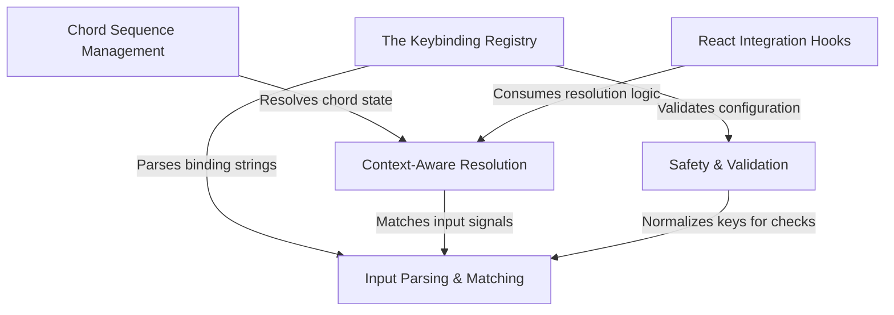

# Tutorial: keybindings

This project implements a robust **keyboard shortcut system** for a terminal-based React application, designed to decouple *key combinations* from the *actions* they trigger. It handles the entire lifecycle of keybindings: loading **default and user-defined configurations**, validating them against safety rules, normalizing raw terminal inputs, and managing complex **multi-step chord sequences** (like `Ctrl+K` followed by `Ctrl+S`).

## Chapters

1. [The Keybinding Registry](01_the_keybinding_registry.md)
2. [React Integration Hooks](02_react_integration_hooks.md)
3. [Context-Aware Resolution](03_context_aware_resolution.md)
4. [Chord Sequence Management](04_chord_sequence_management.md)
5. [Input Parsing & Matching](05_input_parsing___matching.md)
6. [Safety & Validation](06_safety___validation.md)

---

Generated by [Code IQ](https://github.com/adityasoni99/Code-IQ)