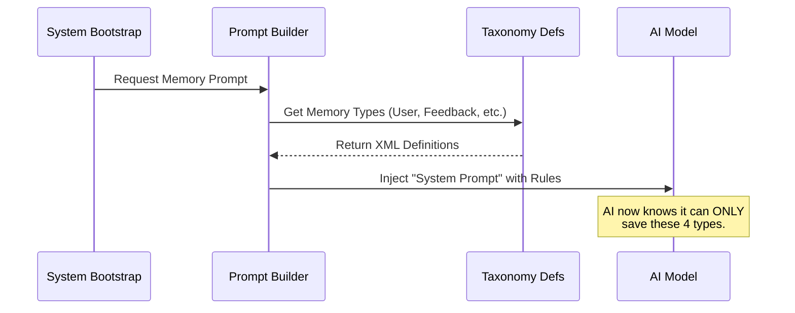

# Chapter 1: Structured Memory Taxonomy

Welcome to the **memdir** project! If you are new here, you might be wondering: "How do we stop an AI from remembering useless junk?"

When an AI works on a project for days or weeks, it generates a lot of information. Without rules, it might try to "remember" code snippets (which change constantly), git commit hashes (which become outdated), or temporary variable names. This creates "noise" that confuses the AI later.

To solve this, **memdir** introduces the **Structured Memory Taxonomy**.

## The Problem: The Sticky Note Chaos
Imagine a developer's desk covered in thousands of sticky notes. Some say "Don't use jQuery," but others say "i = 0" or "fix typo in line 43." Finding the important rule about jQuery is impossible amidst the noise.

## The Solution: The Four Specific Drawers
Instead of a messy desk, **memdir** forces the AI to use a virtual filing cabinet with exactly four labeled drawers. If a thought doesn't fit into one of these drawers, it **cannot be saved**.

This is called the **Structured Memory Taxonomy**.

### 1. The `User` Drawer
*   **What goes here:** Information about *you*.
*   **Example:** "The user is a Senior Go Engineer," or "The user prefers concise answers."
*   **Why:** So the AI adapts its personality and difficulty level to you.

### 2. The `Feedback` Drawer
*   **What goes here:** Corrections and affirmations.
*   **Example:** "Do not use `npm`, always use `bun`," or "Stop summarizing diffs."
*   **Why:** So the AI doesn't make the same mistake twice.

### 3. The `Project` Drawer
*   **What goes here:** High-level context *not* found in the code.
*   **Example:** "The deadline is Friday," or "This feature is for the marketing launch."
*   **Why:** Code tells you *how* something works, but not *why* or *by when*.

### 4. The `Reference` Drawer
*   **What goes here:** Pointers to the outside world.
*   **Example:** "Tickets are tracked in Linear project ID-123," or "Designs are in Figma."
*   **Why:** To link the code to external tools.

## The "No-Go" Zone: Derivable Information
The most important rule of this taxonomy is what **NOT** to save.

**Rule:** If you can find the information by running `ls`, `git log`, or reading a file, **do not save it**.

*   **Bad Memory:** "The function `login()` is in `auth.ts`." (Bad because the AI can just look at the file system).
*   **Good Memory:** "The `login()` function was written this way because Legal required it." (Good because the *reason* isn't in the code).

## How It Works: The Frontmatter
When the AI decides to save a memory, it must write a Markdown file with a specific header (called **frontmatter**) that declares the type.

Here is an example of what a valid memory file looks like:

```markdown
---
name: prefer_bun_over_npm
description: User prefers bun for package management
type: feedback
---

User explicitly stated to use `bun install` instead of `npm`.
Why: It is faster and consistent with the team workflow.
```

Notice the `type: feedback` line? If that was `type: random_thought`, the system would reject it.

## Internal Implementation: Under the Hood

How does the AI know about these rules? We don't just hope it guesses. We inject strict XML definitions into its "brain" (the System Prompt) before it starts working.

### Conceptual Flow
Here is what happens when the system starts:



### The Code
The taxonomy is defined in `src/memoryTypes.ts`. It is a simple array of allowed strings.

```typescript
// src/memoryTypes.ts

export const MEMORY_TYPES = [
  'user',
  'feedback',
  'project',
  'reference',
] as const

export type MemoryType = (typeof MEMORY_TYPES)[number]
```

This Typescript array is the "Source of Truth." If we wanted to add a `tasks` drawer, we would add it here.

### Teaching the AI (Prompt Generation)
To make the AI understand these types, we convert them into text instructions. The system uses XML-like tags to define the "scope" and "description" for each type.

Here is a simplified look at how the `feedback` type is described to the AI:

```typescript
// src/memoryTypes.ts (Simplified)

export const TYPES_SECTION_INDIVIDUAL = [
  '<type>',
  '    <name>feedback</name>',
  '    <description>Guidance the user has given you...</description>',
  '    <when_to_save>Any time the user corrects your approach...</when_to_save>',
  '    <examples>User: "stop doing X" -> Save feedback</examples>',
  '</type>',
  // ... other types
]
```

This text is injected into the prompt. By providing `<examples>`, we show the AI exactly how to categorize thoughts.

### Enforcing the Rules
We also explicitly tell the AI what to ignore. This is defined in the `WHAT_NOT_TO_SAVE_SECTION` constant.

```typescript
// src/memoryTypes.ts

export const WHAT_NOT_TO_SAVE_SECTION = [
  '## What NOT to save in memory',
  '',
  '- Code patterns, architecture, file paths...',
  '- Git history, recent changes...',
  '- Ephemeral task details...',
]
```

This block serves as a "filter" to prevent the AI from clogging up the filing cabinet with useless data.

## Summary

In this chapter, we learned:
1.  **The Problem:** Unstructured memory leads to noise.
2.  **The Taxonomy:** We limit memory to **User**, **Feedback**, **Project**, and **Reference**.
3.  **The Golden Rule:** Never save what you can derive from the current state (like code or git history).
4.  **The Mechanism:** We use TypeScript arrays to generate XML prompts that teach the AI these rules.

Now that we have a structure for *what* to save, we need to decide *who* gets to see it. Is a memory private to you, or shared with your whole team?

[Next Chapter: Scoped Persistence (Private vs. Team)](02_scoped_persistence__private_vs__team_.md)

---

Generated by [Code IQ](https://github.com/adityasoni99/Code-IQ)