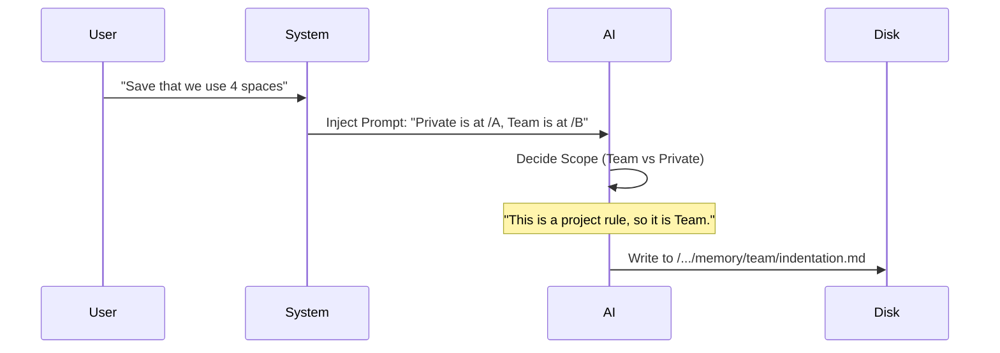

# Chapter 2: Scoped Persistence (Private vs. Team)

In the previous chapter, [Structured Memory Taxonomy](01_structured_memory_taxonomy.md), we learned **what** the AI is allowed to remember (User, Feedback, Project, Reference).

Now we face a social problem. Imagine you are an expert developer who hates long explanations, but your teammate is a junior developer who needs them. If the AI learns "The user likes concise answers" from you, should it apply that rule to your teammate? **No.**

However, if you tell the AI "We always use Tabs, never Spaces," should that apply to your teammate? **Yes.**

This brings us to **Scoped Persistence**.

## The Motivation: Notebooks vs. Whiteboards

To solve the conflict between personal preferences and project facts, **memdir** splits memory into two physical locations. Think of them like this:

### 1. Private Memory (The Personal Notebook)
*   **Analogy:** A diary kept in your desk drawer.
*   **Who sees it:** Only **you**.
*   **Content:** "I prefer concise code," "Don't explain React hooks to me."
*   **Location:** Stored locally on your machine, specific to your user profile.

### 2. Team Memory (The Shared Whiteboard)
*   **Analogy:** A whiteboard in the conference room.
*   **Who sees it:** Everyone working on the project.
*   **Content:** "We use the `fmt` library for logging," "The deployment script is `deploy.sh`."
*   **Location:** Stored in a folder that gets synced (usually via Git) so everyone has the same files.

## Use Case: The "Tabs vs. Spaces" Dilemma

Let's see how the AI handles two different pieces of information during a conversation.

1.  **User says:** "I hate it when you explain basic syntax."
    *   **Scope:** **Private**.
    *   **Result:** The AI writes a file to your local folder. Your teammates still get explanations.

2.  **User says:** "For this project, always use 4 spaces for indentation."
    *   **Scope:** **Team**.
    *   **Result:** The AI writes a file to the shared `team/` folder. When your teammate opens the project, the AI reads this file and enforces the 4-space rule for them too.

## Internal Implementation: How It Works

How does the AI know where to put things? We don't rely on magic. We give the AI a "map" of where the folders are and strict rules on which drawer to open.

### The Flow

When the system boots up, it constructs a prompt that defines these two scopes.



### 1. Determining the Paths
First, the code needs to figure out where these directories live on the hard drive. We distinguish between the `Auto` (Private) path and the `Team` path.

The Team path is actually just a sub-folder of the main memory directory.

```typescript
// src/teamMemPaths.ts

export function getTeamMemPath(): string {
  // It's just a 'team' folder inside the main memory directory
  return (join(getAutoMemPath(), 'team') + sep).normalize('NFC')
}
```

*   `getAutoMemPath()`: Finds your local "Personal Notebook" folder.
*   `join(..., 'team')`: Creates the "Shared Whiteboard" room inside it.

### 2. Teaching the AI (The Prompt)
The most important part is telling the AI *how* to use these folders. We do this in `teamMemPrompts.ts`. We build a specific set of instructions that explicitly defines the difference.

```typescript
// src/teamMemPrompts.ts (Simplified)

export function buildCombinedMemoryPrompt(): string {
  const autoDir = getAutoMemPath()
  const teamDir = getTeamMemPath()

  return `
    You have a persistent memory system with two directories:
    1. Private: ${autoDir} (Only for the current user)
    2. Team: ${teamDir} (Shared with all users)
    
    If the user gives personal preferences -> Save to Private.
    If the user gives project guidelines -> Save to Team.
  `
}
```

By injecting the actual file paths (`${teamDir}`) into the prompt, the AI knows exactly where to write the files on the disk.

### 3. Security: Preventing "Jailbreaks"
Since we are allowing the AI (and potentially shared team configuration) to write files to your disk, we must ensure it doesn't write outside the allowed box.

Imagine a malicious team memory that tries to write to `../../../../etc/passwd`. We prevent this with strict path validation.

```typescript
// src/teamMemPaths.ts (Simplified)

export function validateTeamMemWritePath(filePath: string) {
  const teamDir = getTeamMemPath()
  
  // 1. Check if the path starts with the allowed directory
  if (!filePath.startsWith(teamDir)) {
    throw new Error("Security Alert: Path escapes team directory!")
  }

  // 2. (Not shown) We also check for symlinks that point outside!
  return filePath
}
```

This ensures that "Team Memory" stays strictly inside the `memory/team` folder and cannot touch your system files or your private memory.

## Code Example: How the AI Sees It

When the system runs, the AI receives a prompt that combines the Taxonomy (Chapter 1) with the Scopes (Chapter 2). It looks roughly like this:

**Input (System Prompt):**
> "You have a **Private** directory at `/Users/me/mem/` and a **Team** directory at `/Users/me/mem/team/`.
> 
> **Taxonomy Rules:**
> - `User` type -> usually Private.
> - `Project` type -> usually Team.
> - `Feedback` type -> depends (Is it 'I hate this' or 'This logic is wrong'?)"

**Output (AI Action):**
The AI decides on the action based on the content.

```markdown
---
name: strict_linting_rules
type: feedback
scope: team 
---
User stated that the linter must run before every commit.
```

The system then routes this file creation to the path: `/Users/me/mem/team/strict_linting_rules.md`.

## Summary

In this chapter, we learned:
1.  **The Conflict:** Personal preferences vs. Team rules.
2.  **The Solution:** Two distinct directories (`Private` and `Team`).
3.  **The Implementation:** We inject the specific file paths into the AI's prompt and ask it to categorize memories accordingly.
4.  **The Safety:** We validate paths to ensure team memories don't overwrite system files.

We now have structured files (Chapter 1) stored in the right places (Chapter 2). But as the project grows, we might have **hundreds** of these files. Asking the AI to read 500 files every time you say "Hello" is too slow and expensive.

How do we solve the scaling problem?

[Next Chapter: Two-Tier Storage Architecture (Index vs. Detail)](03_two_tier_storage_architecture__index_vs__detail_.md)

---

Generated by [Code IQ](https://github.com/adityasoni99/Code-IQ)