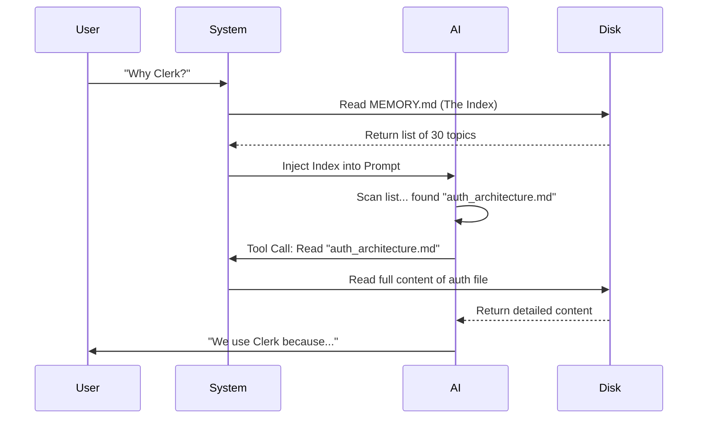

# Chapter 3: Two-Tier Storage Architecture (Index vs. Detail)

In the previous chapter, [Scoped Persistence (Private vs. Team)](02_scoped_persistence__private_vs__team_.md), we solved the problem of *who* sees a memory by splitting files into Private and Team folders.

Now we face a **scale** problem. Imagine your team has created 500 memory files. If the AI reads all 500 files every time you say "Hello," two bad things happen:
1.  **Cost:** It costs money (tokens) to process that text.
2.  **Confusion:** The AI gets overwhelmed by irrelevant details ("User likes blue buttons") when you are asking about database schema.

To solve this, **memdir** uses a **Two-Tier Storage Architecture**.

## The Motivation: The Library Card Catalog

Think of the AI's "Context Window" (what it can keep in its head at one time) like a **backpack**. It has limited space.

If you own 500 books (memories), you cannot fit them all in the backpack. Instead, you put a single sheet of paper in the backpack: a **List of Books**.

*   **Tier 1 (The List):** A lightweight index that fits easily in the backpack.
*   **Tier 2 (The Books):** The heavy, detailed content stored on the shelf (disk), retrieved only when needed.

## The Solution: `MEMORY.md` and Topic Files

We organize memory into these two specific layers:

### 1. The Index (`MEMORY.md`)
This is the "cheat sheet" loaded into every single conversation. It **must** be small. It does not contain details; it only contains pointers.

**Example Content of `MEMORY.md`:**
```markdown
- [User Prefs](user_preferences.md) — User prefers TypeScript, hates jQuery.
- [Project Goals](project_goals.md) — Launch by Friday, MVP only.
- [Auth System](auth_architecture.md) — We use OAuth2 with Clerk.
```

### 2. The Detail (`*.md`)
These are the actual memory files we discussed in Chapter 1. They contain the full context, reasoning, and examples.

**Example Content of `auth_architecture.md`:**
```markdown
---
type: project
---
We use Clerk for authentication.
Why: It handles 2FA and session management out of the box.
Configuration: keys are in .env.local...
```

## Use Case: Finding the Answer

Let's look at how the AI uses this system to answer a question without carrying all the weight.

**Scenario:** You ask, *"Why are we using Clerk?"*

1.  **System:** Loads **only** `MEMORY.md` into the AI's context.
2.  **AI:** Reads the list. It ignores `user_preferences.md` (irrelevant). It spots `[Auth System](auth_architecture.md)`.
3.  **AI:** Says, "Ah, I see a file about Auth. I will read that specific file."
4.  **System:** Loads the heavy `auth_architecture.md`.
5.  **AI:** Answers your question using the details.

## Internal Implementation: Under the Hood

How do we build this? We need to ensure the Index (`MEMORY.md`) never becomes too heavy itself. If the user writes a novel in the index, it defeats the purpose.

### Conceptual Flow



### The Code: Enforcing the Limit

In `src/memdir.ts`, we define strict limits for the Index file. We want it to stay under ~200 lines.

```typescript
// src/memdir.ts

export const ENTRYPOINT_NAME = 'MEMORY.md'

// We cap the index at 200 lines to save context space
export const MAX_ENTRYPOINT_LINES = 200

// We also cap it by bytes (~25KB) to prevent ultra-long lines
export const MAX_ENTRYPOINT_BYTES = 25_000
```

### Truncating the Index

If the index grows too large (e.g., 500 memories), we simply cut off the bottom. This forces the AI (and the user) to keep the index clean.

Here is the logic that chops the file:

```typescript
// src/memdir.ts (Simplified)

export function truncateEntrypointContent(raw: string) {
  const lines = raw.trim().split('\n')
  
  // Check if we exceeded the line limit
  if (lines.length > MAX_ENTRYPOINT_LINES) {
    // Keep only the top 200 lines
    return {
      content: lines.slice(0, MAX_ENTRYPOINT_LINES).join('\n') + 
               '\n> WARNING: Index truncated. Keep it concise!',
      wasTruncated: true
    }
  }
  
  return { content: raw, wasTruncated: false }
}
```

*Explanation:* 
1. We split the file into lines.
2. If it's longer than 200 lines, we keep the top 200.
3. We append a **WARNING** so the AI knows it doesn't have the full map.

### Teaching the AI (The Prompt)

Finally, we have to tell the AI how to behave. We don't just hope it updates the index; we order it to.

In `buildMemoryLines`, we give specific instructions:

```typescript
// src/memdir.ts (Simplified Prompt Construction)

const instructions = [
  // Step 1: Write the detail file
  'Step 1 — write the memory to its own file (e.g., `user_role.md`).',
  
  // Step 2: Update the index
  `Step 2 — add a pointer to that file in \`${ENTRYPOINT_NAME}\`.`,
  
  // The Constraint
  `\`${ENTRYPOINT_NAME}\` is an index. Each entry should be one line.`,
  'Never write memory content directly into the index.'
]
```

This prompt ensures that whenever the AI learns something new, it creates a **Detail File** first, and then adds a **One-Line Link** to the **Index File**.

## Summary

In this chapter, we learned:
1.  **The Problem:** Loading every memory file crashes the context window.
2.  **The Solution:** A Two-Tier system.
3.  **Tier 1:** `MEMORY.md` is a lightweight card catalog (Index).
4.  **Tier 2:** `*.md` files are the actual books (Detail).
5.  **The Mechanism:** The system auto-truncates the index if it gets too big, forcing efficiency.

Now we have a system that stores data efficiently. But what happens if the user asks a question that *isn't* in the index? Or what if the index is truncated and the AI can't see the file it needs?

We need a smarter way to search.

[Next Chapter: Contextual Recall Mechanism](04_contextual_recall_mechanism.md)

---

Generated by [Code IQ](https://github.com/adityasoni99/Code-IQ)