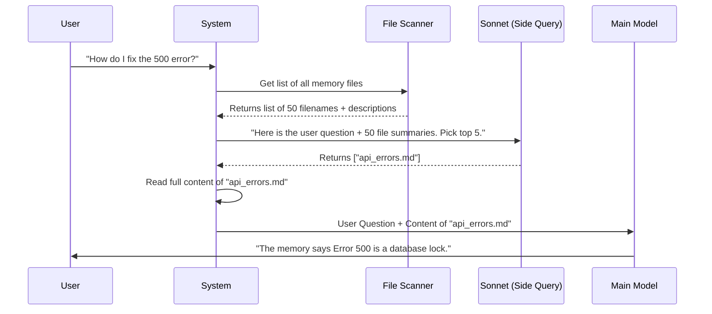

# Chapter 4: Contextual Recall Mechanism

In the previous chapter, [Two-Tier Storage Architecture (Index vs. Detail)](03_two_tier_storage_architecture__index_vs__detail_.md), we learned how to keep the AI's "backpack" light by using a simple index file (`MEMORY.md`).

However, as your project grows, that index might get truncated, or it might not be specific enough. If you have 100 files about "Authentication," a simple index isn't enough to find the *exact* file about "OAuth Token Expiration on Tuesdays."

We need a search engine. But instead of building a complex database, **memdir** uses a **Contextual Recall Mechanism**.

## The Motivation: The Librarian vs. The Keyword Search

Imagine you walk into a massive library and yell, "Help with login!"

1.  **Keyword Search (Ctrl+F):** Looks for the word "login." It misses books titled "Authentication" or "Sign-in Protocols" because the word "login" isn't in the title.
2.  **Vector Database (The Hard Way):** Requires complex math, heavy infrastructure, and syncing data to a cloud vector store. Overkill for a local project.
3.  **The Reference Librarian (Our Way):** You talk to a smart librarian. You describe your problem. The librarian scans the *titles* and *summaries* of the books and says, "Ah, you need this specific manual on OAuth."

**memdir** acts as that librarian. It uses a small, fast AI model to pick the right files *before* the main conversation starts.

## Use Case: Finding the Right Fix

**Scenario:** You have 3 memory files:
1.  `style_guide.md`: "We use blue buttons."
2.  `database_schema.md`: "Users table has a UUID."
3.  `api_errors.md`: "Error 500 usually means the database is locked."

**User Query:** "Why is the server returning a 500 code?"

**The Process:**
1.  The system scans the *descriptions* of all 3 files.
2.  It asks a fast AI: "Which of these files helps answer 'Why is the server returning a 500 code?'"
3.  The AI picks only **#3 (`api_errors.md`)**.
4.  The system loads *only* file #3 into the main conversation.

## Internal Implementation: Under the Hood

This mechanism relies on a "Side Query." This is a quick, invisible API call to an LLM (specifically Claude 3.5 Sonnet) that happens in the background.

### The Flow



### Step 1: Scanning the Manifest
First, we need to know what files exist. We don't read the whole files (that's too slow). We just read the **Frontmatter** (the header) to get the description.

We do this in `src/memoryScan.ts`.

```typescript
// src/memoryScan.ts (Simplified)

// We verify the file type and read just the top lines
export async function scanMemoryFiles(dir: string) {
  const entries = await readdir(dir) // Get all files
  
  // Read the headers (frontmatter) of every .md file
  const headers = await Promise.all(entries.map(file => readHeader(file)))
  
  return headers // Returns [{ filename: '...', description: '...' }, ...]
}
```

*Explanation:* This function runs `ls` on your memory folder and reads the first 30 lines of each file to extract the `description`.

### Step 2: Creating the Menu (The Manifest)
To ask the AI which files it wants, we format the list into a simple text block. Think of this as a restaurant menu.

```typescript
// src/memoryScan.ts

export function formatMemoryManifest(memories: MemoryHeader[]): string {
  return memories
    .map(m => `- ${m.filename}: ${m.description}`)
    .join('\n')
}
```

**Output Example:**
```text
- style_guide.md: Guidelines for CSS and buttons.
- database_schema.md: SQL structure for Users.
- api_errors.md: Common HTTP error codes and fixes.
```

### Step 3: The Side Query
Now comes the magic. We send this "Menu" and the "User Query" to the AI.

This logic lives in `src/findRelevantMemories.ts`.

```typescript
// src/findRelevantMemories.ts (Simplified)

// The prompt tells the AI to act as a filter
const SYSTEM_PROMPT = `
Return a list of filenames that will be useful for the user's query.
Be selective. If nothing is useful, return an empty list.
`

export async function findRelevantMemories(query, memoryDir) {
  const memories = await scanMemoryFiles(memoryDir)
  const manifest = formatMemoryManifest(memories)

  // The "Side Query" - asking the AI to pick files
  const result = await sideQuery({
    system: SYSTEM_PROMPT,
    messages: [`Query: ${query}\n\nAvailable memories:\n${manifest}`]
  })
  
  return result // Returns ['api_errors.md']
}
```

*Explanation:* 
1.  We build the prompt.
2.  We call `sideQuery` (a lightweight wrapper around the LLM API).
3.  The LLM replies with a JSON list of filenames.
4.  We trust the LLM's judgment because it understands context (it knows "500 code" relates to "HTTP errors").

### Step 4: Filtering Noise (Safety Check)
Sometimes, the AI might hallucinate a file that doesn't exist, or try to pick a file you are already looking at.

The code filters the results to ensure they match real files.

```typescript
// src/findRelevantMemories.ts

// We create a Set of valid filenames for O(1) lookup
const validFilenames = new Set(memories.map(m => m.filename))

// We only return files that actually exist in our folder
return parsed.selected_memories.filter(f => validFilenames.has(f))
```

This prevents the system from crashing if the AI says, "Read `imaginary_file.md`."

## Why Not Use Embeddings?
You might have heard of "Vector Embeddings" (RAG). That is the industry standard for searching millions of documents.

**memdir** avoids this because:
1.  **Complexity:** Vectors require a database (Pinecone, Weaviate) or a local Python server.
2.  **Staleness:** If you edit a file, you have to re-calculate the vectors.
3.  **Scale:** Most coding projects have < 500 memory files. A fast LLM (Sonnet) can read a list of 500 titles in milliseconds. It is "smart enough" without the engineering overhead.

## Summary

In this chapter, we learned:
1.  **The Problem:** Finding the right memory file without reading all of them.
2.  **The Solution:** A **Contextual Recall Mechanism** acting like a reference librarian.
3.  **The Method:**
    *   **Scan:** Get headers of all files.
    *   **Format:** Create a text "Menu" of options.
    *   **Side Query:** Ask a fast LLM to pick the relevant ones.
4.  **The Benefit:** We find files based on *meaning*, not just keywords, without heavy database infrastructure.

Now the AI can find the right memories. But what happens if those memories are **old**? What if the file says "Use React 16" but the project is now on "React 18"?

We need a way to verify if a memory is still true.

[Next Chapter: Temporal Freshness & Verification](05_temporal_freshness___verification.md)

---

Generated by [Code IQ](https://github.com/adityasoni99/Code-IQ)