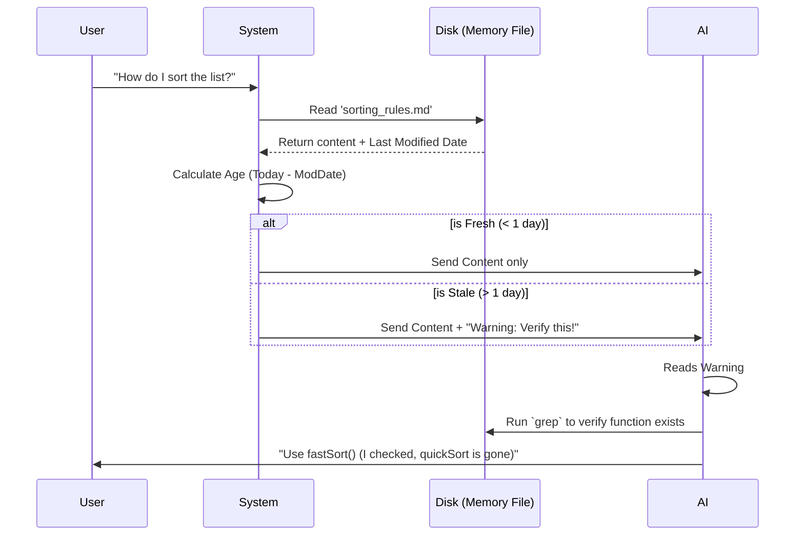

# Chapter 5: Temporal Freshness & Verification

In the previous chapter, [Contextual Recall Mechanism](04_contextual_recall_mechanism.md), we built a "smart librarian" that finds the right memory file for a user's question.

But there is a danger lurking in that library. What if the book the librarian hands you is from 1998?

Code changes fast. Memories do not update automatically. If a memory says, "The login function is in `auth.js`," but you renamed that file to `auth.ts` yesterday, the memory is now a lie. This is called **Memory Drift**.

In this chapter, we will learn how **memdir** solves this by treating memories like perishable goods (like milk) rather than permanent facts (like diamonds).

## The Motivation: The "Ghost Function" Problem

Imagine this scenario:
1.  **Two weeks ago:** You wrote a memory: "Always use `util.quickSort()` for sorting."
2.  **Yesterday:** You refactored the code and renamed it to `util.fastSort()`. You forgot to update the memory file.
3.  **Today:** You ask the AI to write a sorting function.

**Without Verification:**
The AI reads the memory. It confidently writes code using `util.quickSort()`. Your code crashes because that function no longer exists.

**With Verification:**
The AI reads the memory but sees a "Warning Label" because the memory is 14 days old. Instead of blindly trusting it, the AI thinks: *"This memory is old. I should check if `util.quickSort` still exists."* It runs a `grep` command, fails to find it, finds `fastSort` instead, and writes the correct code.

## Key Concept: The Expiration Date

To handle this, we don't delete old memories (they might still contain valid reasoning). Instead, we tag them based on their age.

We categorize memories into two states:
1.  **Fresh (0-1 days old):** Likely accurate. We trust it.
2.  **Stale (>1 day old):** Potentially dangerous. We treat it as a "historical observation," not a current fact.

## Use Case: Injecting the Warning

Let's see how the system alters what the AI reads based on the file's modification date.

**Input (File System):**
*   File: `memory/team/api_endpoints.md`
*   Last Modified: 20 days ago

**System Processing:**
The system calculates the age. Since 20 days > 1 day, it injects a warning.

**Output (What the AI sees):**
```xml
<system-reminder>
  This memory is 20 days old. Memories are point-in-time observations.
  Claims about code behavior or file:line citations may be outdated.
  Verify against current code before asserting as fact.
</system-reminder>
User: Where is the API endpoint?
```

Because of that `<system-reminder>`, the AI lowers its confidence in the specific file paths mentioned in the memory and looks at the real code first.

## Internal Implementation: Under the Hood

How does this happen automatically? It happens right before the memory content is sent to the AI.

### Conceptual Flow



### 1. Calculating the Age
We need a simple utility to convert a timestamp (milliseconds) into "Days Ago."

In `src/memoryAge.ts`:

```typescript
// src/memoryAge.ts

export function memoryAgeDays(mtimeMs: number): number {
  const oneDay = 86_400_000 // milliseconds
  // Math.max ensures we don't get negative numbers due to clock skew
  return Math.max(0, Math.floor((Date.now() - mtimeMs) / oneDay))
}
```

*Explanation:* We take the current time, subtract the file's modification time, and divide by the number of milliseconds in a day.

### 2. Generating the Warning Text
If the file is old, we generate the text that warns the AI.

```typescript
// src/memoryAge.ts

export function memoryFreshnessText(mtimeMs: number): string {
  const days = memoryAgeDays(mtimeMs)
  
  // If it was modified today or yesterday, it's fresh. No warning.
  if (days <= 1) return ''

  // Otherwise, warn the AI.
  return (
    `This memory is ${days} days old. ` +
    `Memories are point-in-time observations... ` +
    `Verify against current code before asserting as fact.`
  )
}
```

*Explanation:* This function returns an empty string for fresh files (reducing noise) but a strong warning for anything older than 48 hours.

### 3. Teaching the AI to Verify
The warning label is useless if the AI doesn't know *how* to verify things. We explicitly teach it this behavior in the System Prompt.

In `src/memoryTypes.ts`, we add a section called `TRUSTING_RECALL_SECTION`.

```typescript
// src/memoryTypes.ts (Simplified)

export const TRUSTING_RECALL_SECTION = [
  '## Before recommending from memory',
  '',
  'A memory that names a specific function or file is a claim that it existed *when the memory was written*.',
  '',
  '- If the memory names a file path: check the file exists.',
  '- If the memory names a function: grep for it.',
  '',
  '"The memory says X exists" is not the same as "X exists now."',
]
```

This is the most critical part. We act proactively. We tell the AI that **Memory ≠ Reality**. We force it to treat memory as a "lead" or a "hint" that must be confirmed by looking at the actual hard drive.

## Putting It All Together

When the system combines these pieces, it ensures the AI never hallucinates based on old data.

1.  **Retrieve:** The system grabs the file.
2.  **Check:** The system checks `mtime`.
3.  **Warn:** The system appends the warning text if needed.
4.  **Prompt:** The system prompt instructs the AI to verify claims.
5.  **Action:** The AI uses tools (like `grep` or `ls`) to confirm the memory is still valid before answering you.

## Summary

In this chapter, we learned:
1.  **The Problem:** Memories drift away from reality as code changes.
2.  **The Solution:** Calculate the age of every memory file.
3.  **The Mechanism:** Inject a `<system-reminder>` warning for any file older than 1 day.
4.  **The Instruction:** Explicitly tell the AI to verify specific claims (filenames, functions) against the current codebase.

We have now covered how to structure memories, where to store them, how to find them, and how to verify them.

But there is one final piece of the puzzle. If the AI is reading and writing files on your computer, how do we make sure it doesn't accidentally read your passwords or delete your operating system?

[Next Chapter: Path Security and Sandboxing](06_path_security_and_sandboxing.md)

---

Generated by [Code IQ](https://github.com/adityasoni99/Code-IQ)