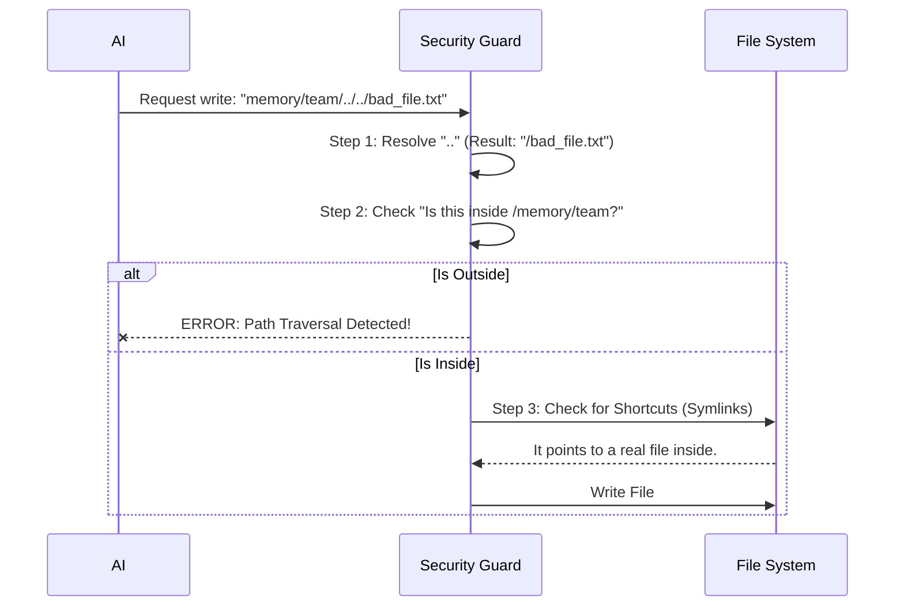

# Chapter 6: Path Security and Sandboxing

In the previous chapter, [Temporal Freshness & Verification](05_temporal_freshness___verification.md), we learned how to trust the **content** of a memory by checking if it is too old.

Now we must trust the **intent**.

The AI has the ability to write files to your computer. It *needs* this ability to save memories. But what if the AI gets confused (or tricked) and tries to write a memory to a sensitive location, like your operating system's configuration folder or your SSH keys?

This brings us to the final piece of the `memdir` puzzle: **Path Security and Sandboxing**.

## The Motivation: The "Guest Room" Analogy

Imagine you invite a guest to stay at your house. You tell them: *"You can put your things in the Guest Room."*

1.  **The Good Guest:** Puts their suitcase in the Guest Room.
2.  **The Climbing Guest:** Climbs out the Guest Room window and breaks into your Bedroom.
3.  **The Tunneling Guest:** Drills a hole in the floor to access the basement.

In computer terms, the "Guest Room" is the `memory/` folder. We need a security guard that ensures the AI never leaves that folder, no matter what path it tries to write to.

## The Threat: Escaping the Sandbox

There are two main ways a program (or AI) tries to escape its allowed folder.

### 1. Path Traversal (Climbing Out)
In file systems, `..` means "go up one level."

If the AI tries to save a file named:
`memory/team/../../../../etc/passwd`

The computer interprets this as:
1.  Start in `memory/team`
2.  Go up (`memory/`)
3.  Go up (Project Root)
4.  Go up (User Home)
5.  Go up (Root of drive)
6.  Go down to `etc/passwd`

If we just blindly write to the path the AI gives us, we overwrite a system file.

### 2. Symlink Attacks (Tunneling Out)
A **Symbolic Link** (symlink) is a shortcut. You can have a file inside `memory/` that actually points to a file *outside* `memory/`.

If `memory/team/shortcut.md` points to `~/.ssh/id_rsa`, writing to the shortcut actually overwrites your private key.

## Internal Implementation: The Security Guard

**memdir** implements a strict "Sandbox" mechanism. Before any file is written, it goes through a validation checkpoint.

### Conceptual Flow

Here is what happens every time the AI tries to write a memory:



### Step 1: Blocking Path Traversal
We use Node.js's `resolve` function. This function processes all the `..` segments *before* we check the path.

Here is a simplified version of the logic found in `src/teamMemPaths.ts`:

```typescript
// Simplified logic from src/teamMemPaths.ts
import { resolve } from 'path'

function validatePath(inputPath: string, allowedFolder: string) {
  // 1. Resolve removes all ".." segments
  const absolutePath = resolve(inputPath)

  // 2. Check if the result starts with the allowed folder
  if (!absolutePath.startsWith(allowedFolder)) {
    throw new Error("Security Alert: You cannot escape the sandbox!")
  }
  
  return absolutePath
}
```

**Example:**
*   **Allowed:** `/Users/me/project/memory`
*   **Input:** `memory/../../etc/passwd`
*   **Resolved:** `/etc/passwd`
*   **Check:** Does `/etc/passwd` start with `/Users/me/project/memory`? **NO.** -> **Error.**

### Step 2: Blocking Symlinks (The Real Path)
Even if the path *looks* like it is inside the folder, it might be a trick. We must ask the file system where the file *really* lives.

We use `realpath` to trace the path to its physical destination on the disk.

```typescript
// Simplified logic from src/teamMemPaths.ts
import { realpath } from 'fs/promises'

async function checkSymlinks(safePath: string, allowedFolder: string) {
  // 1. Ask the disk: "Where does this actually point?"
  const physicalPath = await realpath(safePath)

  // 2. Check if the PHYSICAL location is safe
  if (!physicalPath.startsWith(allowedFolder)) {
    throw new Error("Security Alert: Symlink points outside!")
  }
}
```

**Example:**
*   **Input:** `memory/team/my_key`
*   **Physical Location:** `/Users/me/.ssh/id_rsa`
*   **Check:** Is the physical location inside `memory/team`? **NO.** -> **Error.**

## Deep Dive: The Production Code

In the actual project, this logic is robust to handle edge cases (like null bytes). Let's look at `src/teamMemPaths.ts`.

### Sanitizing the Input
First, we ensure the filename itself doesn't contain invisible "Null Bytes" (`\0`) which can trick some systems into truncating filenames.

```typescript
// src/teamMemPaths.ts

function sanitizePathKey(key: string): string {
  // Null bytes can act as string terminators in C/C++
  if (key.includes('\0')) {
    throw new Error(`Null byte in path key: "${key}"`)
  }
  
  // We also block absolute paths starting with '/' to be safe
  if (key.startsWith('/')) {
    throw new Error(`Absolute path key: "${key}"`)
  }
  
  return key
}
```

### The "Deepest Existing" Check
There is a tricky problem: checking `realpath` on a file that **doesn't exist yet** (because we are about to create it) will fail.

The code in `src/teamMemPaths.ts` solves this by walking up the directory tree until it finds a folder that exists, and checking *that* for symlinks.

```typescript
// src/teamMemPaths.ts (Simplified)

async function realpathDeepestExisting(path: string) {
  let current = path
  
  // Loop: Try to find the real path. If file missing, check parent.
  while (true) {
    try {
      return await realpath(current) // Found an existing part!
    } catch (err) {
      // If missing (ENOENT), go up one level and try again
      current = dirname(current)
    }
  }
}
```

This ensures that even if you try to write to `memory/team/new_folder/file.md`, we verify that `memory/team` isn't a symlink to somewhere dangerous.

## Putting It All Together

When the AI decides to write a memory:

1.  **Sanitize:** We remove weird characters and null bytes.
2.  **Resolve:** We collapse all `..` to get the absolute path.
3.  **Containment Check 1:** Does the string start with `/memory/team`?
4.  **Realpath:** We find the physical location on the disk.
5.  **Containment Check 2:** Does the physical location start with `/memory/team`?

Only if all 5 checks pass does the system allow the write operation.

## Conclusion

We have reached the end of the **memdir** tutorial series!

We have built a complete, production-grade memory system:

1.  **[Structured Taxonomy](01_structured_memory_taxonomy.md):** We categorized *what* to save (User, Feedback, Project).
2.  **[Scoped Persistence](02_scoped_persistence__private_vs__team_.md):** We decided *who* sees it (Private vs. Team).
3.  **[Two-Tier Architecture](03_two_tier_storage_architecture__index_vs__detail_.md):** We managed *scale* (Index vs. Detail files).
4.  **[Contextual Recall](04_contextual_recall_mechanism.md):** We learned how to *find* memories (Smart "Librarian" Search).
5.  **[Temporal Freshness](05_temporal_freshness___verification.md):** We learned how to *verify* data (Fresh vs. Stale warnings).
6.  **[Path Security](06_path_security_and_sandboxing.md):** We ensured the system is *safe* (Sandboxing).

By combining these six concepts, **memdir** turns a chaotic stream of AI thoughts into a persistent, organized, and safe knowledge base for your engineering team.

Thank you for reading!

---

Generated by [Code IQ](https://github.com/adityasoni99/Code-IQ)