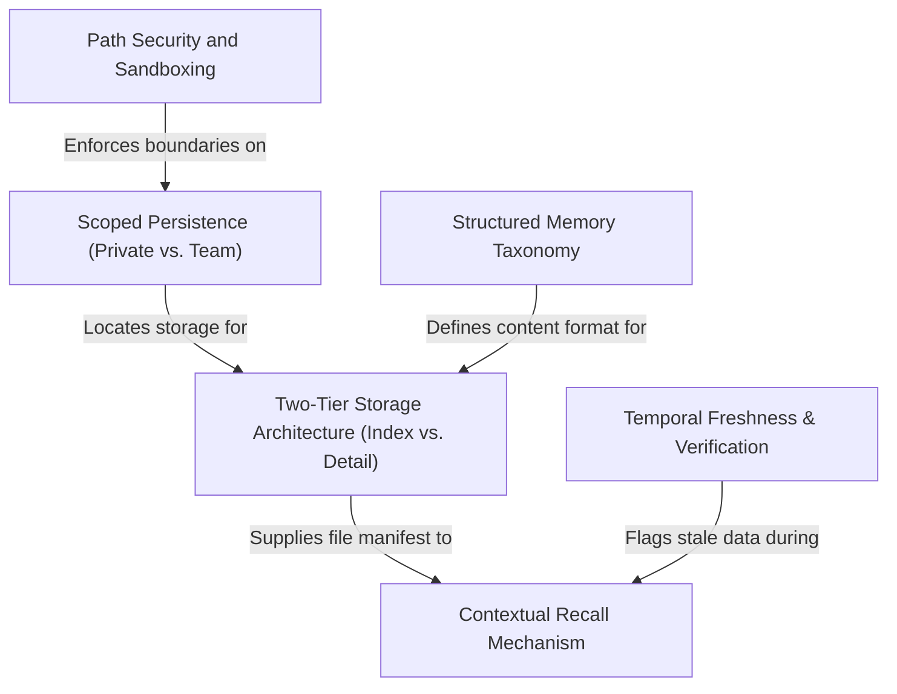

# Tutorial: memdir

This project implements a **persistent, file-based memory system** that allows an AI assistant to recall user preferences and project context across sessions. It uses a **Two-Tier Architecture**—keeping a lightweight index (`MEMORY.md`) in context while retrieving detailed topic files on demand—to manage token limits efficiently. The system enforces strict **security sandboxing** and distinguishes between *Private* (user-specific) and *Team* (shared) scopes, ensuring the AI respects boundaries while maintaining **temporal freshness** to avoid citing outdated code.

## Chapters

1. [Structured Memory Taxonomy](01_structured_memory_taxonomy.md)
2. [Scoped Persistence (Private vs. Team)](02_scoped_persistence__private_vs__team_.md)
3. [Two-Tier Storage Architecture (Index vs. Detail)](03_two_tier_storage_architecture__index_vs__detail_.md)
4. [Contextual Recall Mechanism](04_contextual_recall_mechanism.md)
5. [Temporal Freshness & Verification](05_temporal_freshness___verification.md)
6. [Path Security and Sandboxing](06_path_security_and_sandboxing.md)

---

Generated by [Code IQ](https://github.com/adityasoni99/Code-IQ)